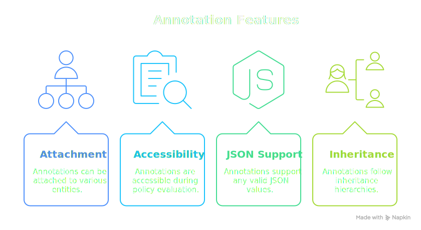
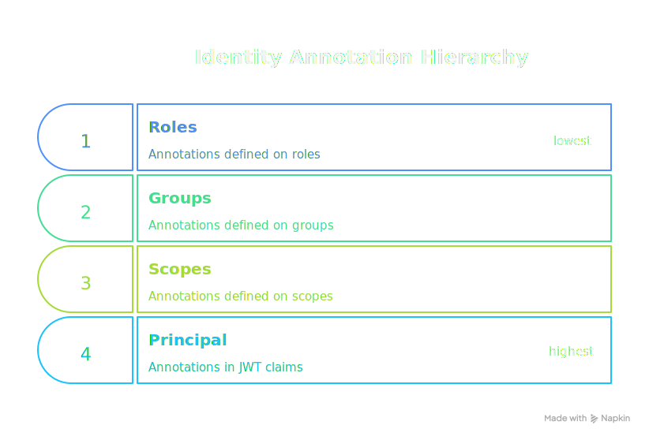

# Annotations

**Annotations** are key-value pairs that can be attached to various entities for custom metadata and policy decisions. They support inheritance hierarchies that allow general definitions to be overridden by more specific ones.

## Overview

<div class="centered-image">

</div> 

Annotations provide flexible metadata that:

- Can be attached to roles, groups, scopes, resource groups, resources, and principals
- Are accessible during policy evaluation via the PORC
- Support any valid JSON values
- Follow inheritance hierarchies where more specific definitions take precedence

## Parameterizing Policies

Annotations enable a powerful pattern: **generic policies that are parameterized by entity configuration**.

Consider this policy that checks if a principal's environment matches the resource's environment:

```rego
package authz

default allow = false

allow {
    input.principal.mannotations.environment == input.resource.annotations.environment
}
```

This policy is completely generic—it doesn't mention any specific environment. The **role** and **resource group** definitions parameterize it:

```yaml
roles:
  - mrn: "mrn:iam:role:finance-analyst"
    name: finance-analyst
    policy: "mrn:iam:policy:environment-match"
    annotations:
      - name: "environment"
        value: "\"finance\""      # This role grants access to "finance" resources

resource-groups:
  - mrn: "mrn:iam:resource-group:finance-data"
    name: finance-data
    policy: "mrn:iam:policy:resource-access"
    annotations:
      - name: "environment"
        value: "\"finance\""      # Resources in this group are tagged "finance"
```

When a principal with the `finance-analyst` role accesses a resource in the `finance-data` group:
- The role's `environment: "finance"` annotation flows into `input.principal.mannotations`
- The resource group's `environment: "finance"` annotation flows into `input.resource.annotations`
- The generic policy evaluates the match and grants access

This pattern is fundamental to the PolicyEngine architecture. Entities like [Roles](/concepts/roles), [Groups](/concepts/groups), [Scopes](/concepts/scopes), and [Resource Groups](/concepts/resource-groups) serve a dual purpose:

1. **Policy selection**: They link to a policy that contains the access control logic
2. **Policy parameterization**: They provide annotations that flow into the PORC, giving the policy context-specific values to evaluate

This separation means you can:
- **Write generic, reusable policies** that work across many contexts
- **Configure access through entity definitions** without modifying policy code
- **Create new access patterns** by defining new roles or resource groups with different annotations

## Where Annotations Apply

Annotations can be defined on multiple entity types:

| Entity         | Defined In                                                                                  | Description                |
|----------------|---------------------------------------------------------------------------------------------|----------------------------|
| Role           | PolicyDomain `spec.roles[].annotations`                                                     | Role-specific metadata     |
| Group          | PolicyDomain `spec.groups[].annotations`                                                    | Group-specific metadata    |
| Scope          | PolicyDomain `spec.scopes[].annotations`                                                    | Scope-specific metadata    |
| Resource Group | PolicyDomain `spec.resource-groups[].annotations`                                           | Resource group metadata    |
| Resource       | PolicyDomain `spec.resources[].annotations`, or external resource resolution <FeatureChip variant="premium" label="Premium Only" />| Resource-specific metadata |
| Principal      | JWT claims                                                                                  | Identity-level metadata    |

## Annotation Inheritance

Annotations follow inheritance hierarchies where conflicts are resolved by precedence rules. More specific or contextual definitions override more general ones.

### Identity Annotation Hierarchy

For identity-related annotations (available in `input.principal.mannotations`), the inheritance order from **least to most dominant** is:

<div class="centered-image">

</div>

**Example**: If the same annotation key `department` is defined on both a Role and a Group that apply to a request, the Group's value takes precedence. If also defined in the principal's JWT claims, that value wins.

```yaml
# Role definition
roles:
  - mrn: "mrn:iam:role:developer"
    annotations:
      - name: "department"
        value: "\"engineering\""   # Precedence 1
      - name: "access_level"
        value: "\"standard\""

# Group definition
groups:
  - mrn: "mrn:iam:group:platform-team"
    annotations:
      - name: "department"
        value: "\"platform\""      # Precedence 2 - overrides role
      - name: "team"
        value: "\"infrastructure\""

# Scope definition (if applicable)
scopes:
  - mrn: "mrn:iam:scope:elevated"
    annotations:
      - name: "access_level"
        value: "\"elevated\""      # Precedence 3 - overrides role

# Principal JWT claims
principal:
  mannotations:
    department: "security"         # Precedence 4 - overrides all others
```

**Resulting `input.principal.mannotations`**:
```json
{
  "department": "security",      // From principal (highest precedence)
  "access_level": "elevated",    // From scope
  "team": "infrastructure"       // From group (no conflict)
}
```

### Resource Annotation Hierarchy

For resource-related annotations (available in `input.resource.annotations`), the inheritance order from **least to most dominant** is:

<div class="centered-image">

</div>

**Example**: If a resource belongs to a resource group, annotations from the resource group are inherited, but any annotations defined directly on the resource take precedence.

```yaml
# Resource Group definition
resource-groups:
  - mrn: "mrn:iam:resource-group:customer-data"
    annotations:
      - name: "data_classification"
        value: "\"confidential\""
      - name: "retention_days"
        value: "365"
      - name: "requires_audit"
        value: "true"

# Resource with override
resource:
  id: "mrn:data:customer:12345"
  annotations:
    - name: "retention_days"
      value: "730"                 # Overrides resource group
    - name: "special_handling"
      value: "true"                # Additional annotation
```

**Resulting `input.resource.annotations`**:
```json
{
  "data_classification": "confidential",  // From resource group
  "retention_days": "730",                // From resource (overrides)
  "requires_audit": "true",               // From resource group
  "special_handling": "true"              // From resource (new)
}
```

## Merge Strategies

:::info[v1alpha4 Feature]
Merge strategies are available in PolicyDomain schema version `v1alpha4` and later.
:::

When annotation keys conflict across inheritance levels, merge strategies determine how values are combined. The default strategy is `deep`, which recursively merges arrays and objects while letting higher-priority scalar values win. You can specify different strategies to control this behavior precisely.

Merge strategies are particularly useful for:
- **Accumulating permissions**: Combining tags, capabilities, or allowed regions from multiple sources
- **Building configurations**: Merging objects where each level adds or overrides specific fields
- **Set operations**: Creating deduplicated lists from multiple sources

### Available Strategies

| Strategy  | Arrays                           | Objects                              | Scalars      |
|-----------|----------------------------------|--------------------------------------|--------------|
| `replace` | Higher replaces lower            | Higher replaces lower                | Higher wins  |
| `append`  | `[higher..., lower...]`          | Shallow merge, higher wins           | Higher wins  |
| `prepend` | `[lower..., higher...]`          | Shallow merge, lower wins            | Lower wins   |
| `deep`    | `[higher..., lower...]`          | Recursive merge, higher wins         | Higher wins  |
| `union`   | Deduplicated set, higher first   | Same as deep                         | Higher wins  |

The **default strategy** is `deep` when no strategy is specified.

### Specifying a Merge Strategy

Add the `merge` field to an annotation to control how it combines with values from lower-priority sources:

```yaml
roles:
  - mrn: "mrn:iam:role:developer"
    annotations:
      - name: "allowed_regions"
        value: '["us-west"]'
        merge: "union"           # Deduplicate when combined with other sources

groups:
  - mrn: "mrn:iam:group:global-team"
    annotations:
      - name: "allowed_regions"
        value: '["us-east", "eu-west"]'
        merge: "union"           # Combined result: ["us-east", "eu-west", "us-west"]
```

### Strategy Precedence

When merging annotations, the strategy is determined by priority:
1. **Higher-priority source's strategy** (if specified)
2. **Lower-priority source's strategy** (if higher has none)
3. **Default strategy** (`deep`)

### Merge Strategy Examples

#### Accumulating Tags with Union

Use `union` to collect unique values from all sources:

```yaml
roles:
  - mrn: "mrn:iam:role:developer"
    annotations:
      - name: "tags"
        value: '["dev", "internal"]'
        merge: "union"

groups:
  - mrn: "mrn:iam:group:platform-team"
    annotations:
      - name: "tags"
        value: '["platform", "internal"]'
        merge: "union"
```

**Result**: `["platform", "internal", "dev"]` (deduplicated, higher priority first)

#### Building Configuration Objects with Deep Merge

Use `deep` to recursively merge nested objects:

```yaml
roles:
  - mrn: "mrn:iam:role:developer"
    annotations:
      - name: "config"
        value: '{"timeouts": {"read": 30, "write": 60}, "retries": 3}'
        merge: "deep"

groups:
  - mrn: "mrn:iam:group:premium-users"
    annotations:
      - name: "config"
        value: '{"timeouts": {"write": 120}, "priority": "high"}'
        merge: "deep"
```

**Result**:
```json
{
  "timeouts": {"read": 30, "write": 120},
  "retries": 3,
  "priority": "high"
}
```

#### Preserving Order with Append/Prepend

Use `append` to add lower-priority elements after higher-priority ones:

```yaml
resource-groups:
  - mrn: "mrn:iam:resource-group:base"
    annotations:
      - name: "processing_steps"
        value: '["validate", "log"]'
        merge: "append"

resources:
  - selector: ["mrn:data:sensitive:.*"]
    group: "mrn:iam:resource-group:base"
    annotations:
      - name: "processing_steps"
        value: '["encrypt", "audit"]'
        merge: "append"
```

**Result**: `["encrypt", "audit", "validate", "log"]` (higher priority first)

Use `prepend` to add lower-priority elements before higher-priority ones:

```yaml
# Same as above but with prepend
annotations:
  - name: "processing_steps"
    value: '["encrypt", "audit"]'
    merge: "prepend"
```

**Result**: `["validate", "log", "encrypt", "audit"]` (lower priority first)

#### Replacing Values Explicitly

Use `replace` when you want to completely override a lower-priority value:

```yaml
roles:
  - mrn: "mrn:iam:role:standard-user"
    annotations:
      - name: "permissions"
        value: '["read", "list"]'

groups:
  - mrn: "mrn:iam:group:admin"
    annotations:
      - name: "permissions"
        value: '["read", "write", "delete", "admin"]'
        merge: "replace"          # Completely replaces role permissions
```

**Result**: `["read", "write", "delete", "admin"]` (role permissions ignored)

### Type Mismatch Behavior

When conflicting values have incompatible types (e.g., array vs. string), the higher-priority value always wins regardless of the merge strategy:

```yaml
roles:
  - mrn: "mrn:iam:role:basic"
    annotations:
      - name: "access"
        value: '["read"]'         # Array

groups:
  - mrn: "mrn:iam:group:special"
    annotations:
      - name: "access"
        value: '"full"'           # String (incompatible type)
        merge: "union"            # Strategy is ignored for type mismatch
```

**Result**: `"full"` (higher priority wins due to type mismatch)

### Inheritance Use Cases

#### Establishing Defaults with Overrides

Define baseline annotations at a general level and override for specific cases:

```yaml
# All developers get standard access
roles:
  - mrn: "mrn:iam:role:developer"
    annotations:
      - name: "max_data_size"
        value: "\"1GB\""
      - name: "can_export"
        value: "false"

# Platform team members can export
groups:
  - mrn: "mrn:iam:group:platform-team"
    annotations:
      - name: "can_export"
        value: "true"              # Override for this group
```

#### Layered Security Classifications

Apply cumulative security requirements:

```yaml
resource-groups:
  - mrn: "mrn:iam:resource-group:pii"
    annotations:
      - name: "classification"
        value: "\"PII\""
      - name: "encryption_required"
        value: "true"

# Specific high-value resource
resource:
  annotations:
    - name: "classification"
      value: "\"PII-HIGH\""        # More specific classification
    - name: "two_person_rule"
      value: "true"                # Additional requirement
```

## Annotation Structure

Annotations are defined as a list of objects with the following fields:

| Field   | Required | Description                                                                 |
|---------|----------|-----------------------------------------------------------------------------|
| `name`  | Yes      | The annotation key (string)                                                 |
| `value` | Yes      | The annotation value (JSON-encoded string)                                  |
| `merge` | No       | Merge strategy: `replace`, `append`, `prepend`, `deep`, or `union` (v1alpha4) |

Keys must be strings. Values must be **JSON-encoded strings**.

:::tip[Values Are JSON-Encoded]
The `value` field must contain a valid JSON value encoded as a string. This is a common source of confusion:

| Type    | Correct                                  | Incorrect           |
|---------|------------------------------------------|---------------------|
| String  | `"\"engineering\""`                      | `"engineering"`     |
| Number  | `"12345"`                                | `12345`             |
| Boolean | `"true"`                                 | `true`              |
| Array   | `'["read", "write"]'`                    | `["read", "write"]` |
| Object  | `'{"region": "us-west", "priority": 1}'` | `{region: us-west}` |

**String values require nested quotes.** The outer quotes are YAML string delimiters; the inner escaped quotes are the JSON string value. Without the inner quotes, a value like `"engineering"` would be interpreted as a JSON identifier (which is invalid) rather than a JSON string.

```yaml
# Correct - string value with nested quotes
annotations:
  - name: "department"
    value: "\"engineering\""    # Parsed as JSON string: "engineering"

# Incorrect - missing inner quotes
annotations:
  - name: "department"
    value: "engineering"        # Invalid JSON - not a string literal
```
:::

Values can be any valid JSON type:

```yaml
annotations:
  - name: "department"
    value: "\"engineering\""              # String (note the nested quotes)
  - name: "cost_center"
    value: "12345"                        # Number
  - name: "tags"
    value: '["production", "critical"]'   # Array
  - name: "metadata"
    value: '{"created_by": "admin", "version": 2}'  # Object
  - name: "enabled"
    value: "true"                         # Boolean
```

After parsing, these annotations are available in policies as native JSON values:

```json
{
  "department": "engineering",
  "cost_center": 12345,
  "tags": ["production", "critical"],
  "metadata": {
    "created_by": "admin",
    "version": 2
  },
  "enabled": true
}
```

## Using Annotations in Policies

### Simple Value Checks

```rego
package authz

default allow = false

# Check department
allow {
    input.principal.mannotations.department == "engineering"
}

# Check resource tag
allow {
    input.resource.annotations.environment == "production"
}
```

### Array Annotations

```rego
package authz

default allow = false

# Principal must have required capability
allow {
    "admin" in input.principal.mannotations.capabilities
}

# Resource must have a matching tag
allow {
    some tag in input.resource.annotations.tags
    tag in input.principal.mannotations.allowed_tags
}
```

### Nested Annotations

```rego
package authz

default allow = false

# Check nested value
allow {
    input.resource.annotations.metadata.level >= 2
}
```

### Matching Annotations

```rego
package authz

default allow = false

# Principal and resource department must match
allow {
    input.principal.mannotations.department == input.resource.annotations.department
}

# Principal must have access to the resource's region
allow {
    input.resource.annotations.region in input.principal.mannotations.allowed_regions
}
```

## Defining Annotations in PolicyDomain

### On Roles

```yaml
spec:
  roles:
    - mrn: "mrn:iam:role:regional-admin"
      name: regional-admin
      annotations:
        - name: "region"
          value: "\"us-west\""
        - name: "permissions"
          value: '["read", "write", "admin"]'
      policy: "mrn:iam:policy:regional-access"
```

### On Groups

```yaml
spec:
  groups:
    - mrn: "mrn:iam:group:finance"
      name: finance
      annotations:
        - name: "department"
          value: "\"finance\""
        - name: "cost_center"
          value: "12345"
      roles:
        - "mrn:iam:role:finance-user"
```

### On Resource Groups

```yaml
spec:
  resource-groups:
    - mrn: "mrn:iam:resource-group:pii-data"
      name: pii-data
      annotations:
        - name: "data_classification"
          value: "\"PII\""
        - name: "retention_days"
          value: "365"
        - name: "requires_audit"
          value: "true"
      policy: "mrn:iam:policy:pii-access"
```

## Common Annotation Patterns

### Department/Team Access

```rego
package authz

default allow = false

# Same department access
allow {
    input.principal.mannotations.department == input.resource.annotations.department
}
```

### Geographic Restrictions

```rego
package authz

default allow = false

# Principal's region must include the resource's region
allow {
    input.resource.annotations.region in input.principal.mannotations.allowed_regions
}
```

### Time-Based Annotations

```rego
package authz

default allow = false

# Check if access hasn't expired
allow {
    expires := time.parse_rfc3339_ns(input.resource.annotations.access_expires)
    expires > time.now_ns()
}
```

### Feature Flags

```rego
package authz

default allow = false

# Check feature flag
allow {
    input.principal.mannotations.beta_features == true
    startswith(input.operation, "beta:")
}
```

## Best Practices

1. **Use consistent keys**: Establish naming conventions across all entity types
2. **Keep values simple**: Prefer primitives over complex objects
3. **Don't store sensitive data**: Annotations are not encrypted
4. **Document annotations**: Maintain a reference of used annotations and their expected sources
5. **Validate at ingestion**: Ensure annotation values are valid before storage
6. **Design for inheritance**: Place default values at lower precedence levels (roles, resource groups) and overrides at higher levels
7. **Be explicit about precedence**: When the same key appears at multiple levels, document the intended override behavior
8. **Avoid deep nesting**: While nested objects are supported, flatter structures are easier to reason about in policies
9. **Choose merge strategies intentionally**: Use `union` for accumulating unique values, `deep` for configuration objects, and `replace` when you need complete override behavior
10. **Be consistent with strategies**: If an annotation key uses a specific merge strategy, use the same strategy at all inheritance levels to avoid confusion

## Related Concepts

- **[Roles](/concepts/roles)**: Can define annotations inherited by principals
- **[Groups](/concepts/groups)**: Can define annotations that override role annotations
- **[Scopes](/concepts/scopes)**: Can define annotations that override group annotations
- **[Resources](/concepts/resources)**: Can have annotations that override resource group defaults
