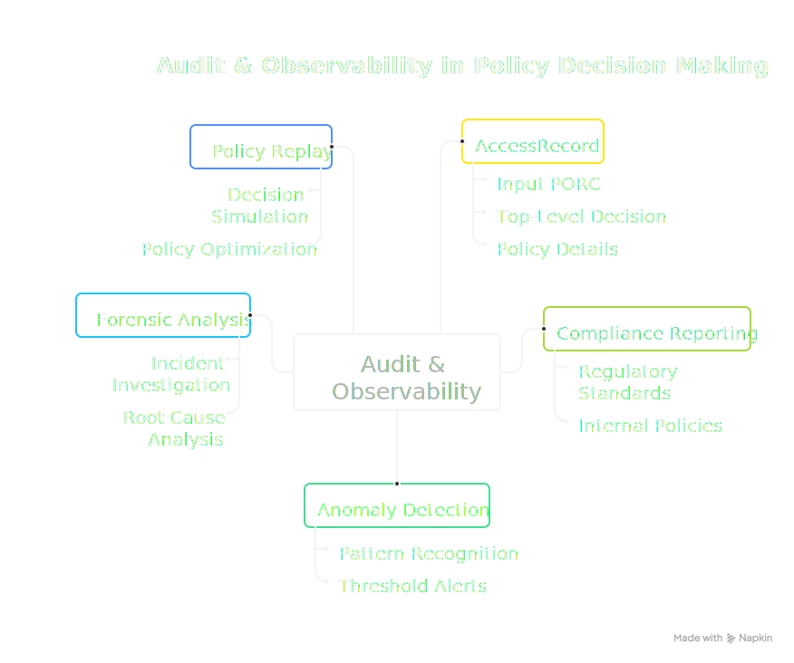

# Audit & Access Records

Every policy decision generates a normalized **AccessRecord** that captures the complete evaluation context. This audit trail is fundamental to understanding, debugging, and analyzing access control behavior across your system.

<div class="centered-image">

</div>

## Why Audit Matters

In distributed systems, access control decisions happen across many services, making it difficult to answer questions like:

- Why was this request denied?
- Which policies are being triggered most often?
- Are there unusual access patterns that might indicate a security issue?
- What would have happened if we had deployed a different policy version?

The AccessRecord stream solves these challenges by providing a consistent, structured record of every decision.

### Enabling the Principle of Least Privilege

The PolicyEngine's comprehensive audit capabilities are what make the **Principle of Least Privilege** practical at scale. Traditional systems often fail at least privilege because it's too difficult to know what access is actually needed—so administrators grant broad permissions "just in case."

With AccessRecords, you can take a different approach:

1. **Start with strict policies** that grant minimal access
2. **Observe denials** to understand what access is actually being requested
3. **Identify patterns** that reveal legitimate access needs
4. **Refine policies incrementally** with confidence, knowing exactly what will change

This transforms access control from guesswork into an evidence-based practice. See [Iterative Policy Refinement](#iterative-policy-refinement) for a detailed workflow.

## The AccessRecord

Just as [PORC](/concepts/porc) normalizes authorization **inputs**, the AccessRecord normalizes authorization **outputs**. This symmetry allows you to reason about access control decisions consistently, regardless of where they originated in your system.

Every AccessRecord contains:

| Field          | Description                                            |
|----------------|--------------------------------------------------------|
| **Metadata**   | Timestamp, unique ID, and optional environment context |
| **Principal**  | The subject and realm from the PORC                    |
| **Operation**  | The operation being attempted                          |
| **Resource**   | The resource MRN being accessed                        |
| **Decision**   | The top-level outcome: `GRANT` or `DENY`               |
| **References** | Details about each policy bundle evaluated             |
| **PORC**       | The complete PORC expression for replay/debugging      |

### Policy Bundle References

Each evaluated policy bundle is recorded with:

- **MRN**: The policy's Manetu Resource Notation identifier
- **Fingerprint**: A cryptographic hash of the policy content
- **Decision**: The outcome of this specific policy (`GRANT` or `DENY`)
- **Phase**: Which [conjunction phase](/concepts/policy-conjunction) (Operation, Identity, Resource, Scope)
- **Reason Code**: Success or specific error type
- **Reason**: Human-readable explanation (especially for errors)

The fingerprint is particularly valuable—it uniquely identifies the exact policy version evaluated, enabling precise forensic analysis even after policies are updated.

## Output Destinations

| Feature                   | Availability                        | Description                                             |
|---------------------------|-------------------------------------|---------------------------------------------------------|
| JSON to stdout            | <FeatureChip variant="community" /> | Stream AccessRecords as JSON for custom processing      |
| ElasticSearch Integration | <FeatureChip variant="premium" />   | Durable storage with indexing, dashboards, and alerting |

### JSON Output <FeatureChip variant="community" />

In the Community PolicyEngine, AccessRecords are emitted as JSON to stdout:

```json
{
  "metadata": {
    "timestamp": "2024-01-15T10:30:00Z",
    "id": "550e8400-e29b-41d4-a716-446655440000",
    "env": {
      "service": "api-gateway",
      "pod": "api-gw-7d9f8b6c4-x2m9k"
    }
  },
  "principal": {
    "subject": "alice@example.com",
    "realm": "employees"
  },
  "operation": "api:documents:read",
  "resource": "mrn:app:document:12345",
  "decision": "GRANT",
  "references": [
    {
      "id": "mrn:iam:policy:require-auth",
      "fingerprint": "a3f2b8c1...",
      "decision": "GRANT",
      "phase": "OPERATION",
      "reason_code": "POLICY_OUTCOME"
    },
    {
      "id": "mrn:iam:role:editor",
      "fingerprint": "d4e5f6a7...",
      "decision": "GRANT",
      "phase": "IDENTITY",
      "reason_code": "POLICY_OUTCOME"
    }
  ],
  "porc": "{...}"
}
```

You can pipe this output to your logging infrastructure, message queue, or analysis tools.

### ElasticSearch Integration <FeatureChip variant="premium" />

The Premium PolicyEngine integrates directly with ElasticSearch, providing:

- **Durable storage**: Historical records with configurable retention
- **Indexed search**: Query by principal, resource, decision, time range, and more
- **Built-in analytics**: Pre-configured dashboards for access patterns
- **Alerting**: Configure alerts for anomalous patterns

## Use Cases

### Compliance Reporting

AccessRecords provide the evidence trail required for compliance audits:

- Demonstrate that access controls are enforced
- Show who accessed what resources and when
- Prove that denied access attempts were properly blocked

### Debugging Access Issues

When users report access problems, AccessRecords reveal exactly what happened:

```bash
# Find recent denials for a specific user (Community example)
mpe serve ... 2>&1 | jq 'select(.principal.subject == "alice@example.com" and .decision == "DENY")'
```

The detailed policy references show which policy caused the denial and why.

### Anomaly Detection

Build alerting on unusual patterns:

- Spike in denials from a particular source
- Access attempts outside normal hours
- Unusual resource access patterns

### Policy Replay

Because AccessRecords include the complete PORC, you can replay decisions against different policy versions:

1. Capture AccessRecords from production
2. Load a candidate policy version
3. Replay the PORCs and compare decisions
4. Identify any changes in behavior before deploying

This enables safe policy updates by understanding the impact before deployment.

### Iterative Policy Refinement

The combination of comprehensive audit logging and policy replay creates a powerful workflow for implementing the **Principle of Least Privilege**:

#### The Recommended Workflow

**Phase 1: Deploy Strict Policies**

Start with policies that are intentionally restrictive. It's easier to safely expand access than to identify and close security gaps:

```yaml
# Start with deny-by-default policies that only grant essential access
roles:
  - mrn: "mrn:iam:role:new-service"
    name: new-service
    policy: "mrn:iam:policy:minimal-access"  # Only the operations you're certain are needed
```

**Phase 2: Observe Access Patterns**

Monitor AccessRecords to understand actual usage. Look for denied requests that represent legitimate access needs:

```bash
# Find denied requests for analysis (Community example)
mpe serve ... 2>&1 | jq 'select(.decision == "DENY")' > denied-requests.jsonl

# Analyze denial patterns by operation
cat denied-requests.jsonl | jq -r '.operation' | sort | uniq -c | sort -rn
```

**Phase 3: Validate Policy Changes**

Before expanding access, use policy replay to understand the impact of proposed changes:

1. Collect a sample of AccessRecords (including both grants and denials)
2. Create a candidate policy with expanded permissions
3. Replay the collected PORCs against the candidate policy
4. Review which denials would become grants—are these all legitimate?

**Phase 4: Deploy and Monitor**

After validating that the expanded policy only grants intended access:

1. Deploy the refined policy
2. Continue monitoring for new denial patterns
3. Iterate as needed

#### Why This Works

This approach is effective because:

- **Evidence-based decisions**: You expand access based on observed needs, not speculation
- **Minimal attack surface**: You never grant more access than demonstrated necessary
- **Safe iteration**: Policy replay lets you preview changes before they affect production
- **Continuous improvement**: The workflow supports ongoing refinement as needs evolve

#### Example: Onboarding a New Service

When onboarding a new service, rather than guessing what permissions it needs:

1. **Deploy with minimal access**: The service can authenticate but do very little
2. **Run integration tests**: Observe which operations are denied
3. **Analyze denials**: Determine which represent legitimate needs vs. unnecessary operations
4. **Expand precisely**: Grant only the specific operations that were legitimately denied
5. **Validate with replay**: Confirm the new policy would have allowed the test cases
6. **Deploy and monitor**: Watch for any additional denials in production

This evidence-based approach results in tightly scoped permissions that precisely match actual needs.

### Analytics

Aggregate AccessRecords to understand your access patterns:

- Most frequently accessed resources
- Policies with the highest denial rates
- Principal activity distributions
- Phase-specific decision patterns

## Best Practices

### Include Environment Context

Use the `audit.env` configuration option to capture deployment context in every AccessRecord. Configure it in your `mpe-config.yaml`:

```yaml
audit:
  env:
    - name: service
      type: env
      value: SERVICE_NAME
    - name: environment
      type: string
      value: production
    - name: region
      type: env
      value: AWS_REGION
    - name: pod
      type: env
      value: HOSTNAME
```

Each entry specifies:
- **name**: The key that will appear in the AccessRecord's `metadata.env` field
- **type**: How to resolve the value (`env`, `string`, `k8s-label`, or `k8s-annot`)
- **value**: Interpreted according to the type

Values are resolved once at PolicyEngine startup.

For example, with the above configuration and `SERVICE_NAME=api-gateway`, `AWS_REGION=us-east-1`, `HOSTNAME=api-gw-7d9f8b6c4-x2m9k`, every AccessRecord will include:

```json
{
  "metadata": {
    "env": {
      "service": "api-gateway",
      "environment": "production",
      "region": "us-east-1",
      "pod": "api-gw-7d9f8b6c4-x2m9k"
    }
  }
}
```

#### Kubernetes Metadata

You can include Kubernetes pod labels and annotations using the `k8s-label` and `k8s-annot` types. These read from the Kubernetes [Downward API](https://kubernetes.io/docs/concepts/workloads/pods/downward-api/) files:

```yaml
audit:
  env:
    - name: app
      type: k8s-label
      value: app.kubernetes.io/name
    - name: version
      type: k8s-annot
      value: deployment.kubernetes.io/revision
```

This requires a Downward API volume mount in your pod spec:

```yaml
volumes:
  - name: podinfo
    downwardAPI:
      items:
        - path: "labels"
          fieldRef:
            fieldPath: metadata.labels
        - path: "annotations"
          fieldRef:
            fieldPath: metadata.annotations
volumeMounts:
  - name: podinfo
    mountPath: /etc/podinfo
```

By default, the PolicyEngine reads from `/etc/podinfo`. If your volume is mounted elsewhere, set `audit.k8s.podinfo` in your config:

```yaml
audit:
  k8s:
    podinfo: /custom/path/podinfo
```

Outside of Kubernetes (or without the volume mount), `k8s-label` and `k8s-annot` entries resolve to empty strings.

See the [Configuration Reference](/reference/configuration#audit-environment-configuration) for complete details.

### Retain Appropriately

Balance storage costs with compliance and debugging needs:

- **Development**: Short retention (days) for debugging
- **Production**: Longer retention based on compliance requirements
- **Security-sensitive**: Consider extended retention for forensics

### Monitor Decision Rates

Track the ratio of GRANT to DENY decisions. Sudden changes may indicate:

- Policy misconfiguration
- Application bugs sending malformed requests
- Security incidents

## Schema Reference

For the complete AccessRecord schema including all fields, types, and enumeration values, see the [AccessRecord Schema Reference](/reference/access-record).

## Related Concepts

- **[PORC](/concepts/porc)**: The input format captured in AccessRecords
- **[Policy Conjunction](/concepts/policy-conjunction)**: The phases recorded in AccessRecords
- **[Policies](/concepts/policies)**: The policies referenced in AccessRecords
- **[Reading Access Records](/guides/reading-access-records)**: Step-by-step guide to interpreting AccessRecord output