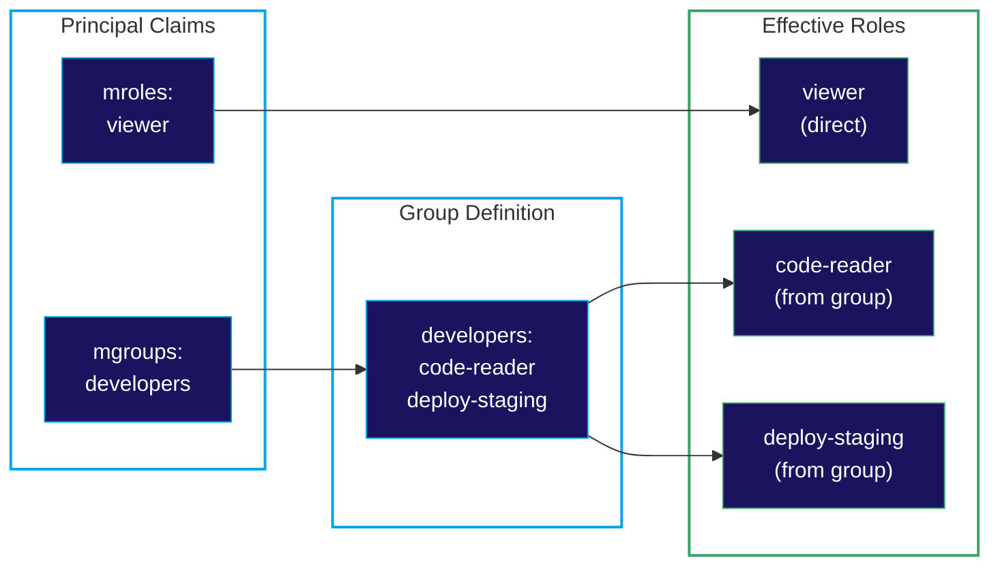
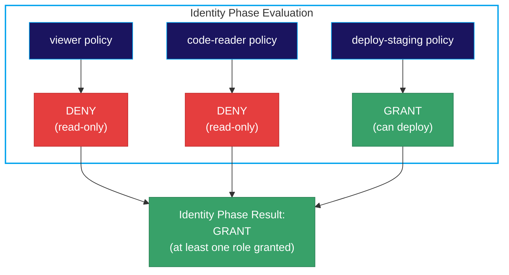

# Groups

**Groups** provide a mechanism to organize and assign multiple [Roles](/concepts/roles) to principals efficiently. Instead of assigning roles individually to each user or service, you can assign a group that bundles related roles together.

## Overview

A group is a named collection of roles. When a principal belongs to a group, they automatically inherit all the roles defined in that group. Groups simplify identity management by:

- **Reducing Administrative Overhead**: Assign one group instead of many individual roles
- **Ensuring Consistency**: All members of a group have the same set of roles
- **Enabling Organizational Alignment**: Map groups to teams, departments, or functions

### Key Characteristics

- **Role Aggregation**: Groups contain one or more roles
- **Inheritance**: Principals inherit all roles from their groups
- **Indirect Assignment**: Groups are assigned via the `mgroups` JWT claim
- **Complementary to Direct Roles**: Principals can have both direct roles and group-inherited roles

## How Groups Work

### Role Resolution

When a request is processed, the PolicyEngine resolves the principal's effective roles by:

1. Collecting roles from the `mroles` claim (directly assigned)
2. Expanding groups from the `mgroups` claim into their constituent roles
3. Evaluating all resolved roles in Phase 2 (Identity Phase)



### Phase 2 Evaluation

All effective roles—whether direct or group-inherited—are evaluated together in Phase 2:



## Defining Groups

Groups are defined in the PolicyDomain under `spec.groups`:

```yaml
spec:
  groups:
    - mrn: "mrn:iam:group:admins"
      name: admins
      description: "System administrators"
      roles:
        - "mrn:iam:role:admin"
        - "mrn:iam:role:audit-viewer"

    - mrn: "mrn:iam:group:developers"
      name: developers
      description: "Development team"
      roles:
        - "mrn:iam:role:code-reader"
        - "mrn:iam:role:code-writer"
        - "mrn:iam:role:deploy-staging"

    - mrn: "mrn:iam:group:viewers"
      name: viewers
      description: "Read-only users"
      roles:
        - "mrn:iam:role:viewer"
```

Each group requires:
- **mrn**: A unique identifier following the MRN format
- **name**: Human-readable name
- **roles**: List of role MRNs that members inherit

## Assigning Groups to Principals

Groups are assigned to principals via JWT claims. The PolicyEngine expects groups in the `mgroups` claim:

```yaml
# PORC expression showing group assignment
principal:
  sub: "user123"
  mgroups:
    - "mrn:iam:group:developers"
    - "mrn:iam:group:viewers"
```

Principals can belong to multiple groups, inheriting roles from all of them.

## Common Group Patterns

### Team-Based Groups

Align groups with organizational teams:

```yaml
groups:
  - mrn: "mrn:iam:group:engineering"
    name: engineering
    description: "Engineering team"
    roles:
      - "mrn:iam:role:code-access"
      - "mrn:iam:role:ci-access"

  - mrn: "mrn:iam:group:product"
    name: product
    description: "Product team"
    roles:
      - "mrn:iam:role:roadmap-editor"
      - "mrn:iam:role:analytics-viewer"

  - mrn: "mrn:iam:group:support"
    name: support
    description: "Customer support team"
    roles:
      - "mrn:iam:role:ticket-manager"
      - "mrn:iam:role:customer-viewer"
```

### Permission-Level Groups

Create groups based on access levels:

```yaml
groups:
  - mrn: "mrn:iam:group:read-only"
    name: read-only
    description: "Read-only access across the system"
    roles:
      - "mrn:iam:role:viewer"

  - mrn: "mrn:iam:group:contributors"
    name: contributors
    description: "Can read and write but not administer"
    roles:
      - "mrn:iam:role:viewer"
      - "mrn:iam:role:editor"

  - mrn: "mrn:iam:group:administrators"
    name: administrators
    description: "Full administrative access"
    roles:
      - "mrn:iam:role:viewer"
      - "mrn:iam:role:editor"
      - "mrn:iam:role:admin"
```

### Environment-Scoped Groups

Define groups for different environments:

```yaml
groups:
  - mrn: "mrn:iam:group:dev-team"
    name: dev-team
    description: "Access to development environment"
    roles:
      - "mrn:iam:role:dev-full-access"

  - mrn: "mrn:iam:group:staging-deployers"
    name: staging-deployers
    description: "Can deploy to staging"
    roles:
      - "mrn:iam:role:staging-deploy"
      - "mrn:iam:role:staging-viewer"

  - mrn: "mrn:iam:group:prod-ops"
    name: prod-ops
    description: "Production operations access"
    roles:
      - "mrn:iam:role:prod-viewer"
      - "mrn:iam:role:prod-deploy"
      - "mrn:iam:role:prod-rollback"
```

### Service Account Groups

Organize service accounts by function:

```yaml
groups:
  - mrn: "mrn:iam:group:batch-services"
    name: batch-services
    description: "Batch processing service accounts"
    roles:
      - "mrn:iam:role:batch-reader"
      - "mrn:iam:role:batch-writer"

  - mrn: "mrn:iam:group:monitoring-services"
    name: monitoring-services
    description: "Monitoring and alerting services"
    roles:
      - "mrn:iam:role:metrics-reader"
      - "mrn:iam:role:logs-reader"
```

## Groups vs. Direct Role Assignment

When should you use groups versus direct role assignment?

| Scenario | Recommendation |
|----------|---------------|
| Standard team member | Use groups aligned with team/function |
| Temporary elevated access | Direct role assignment (easier to audit/revoke) |
| Service accounts | Groups for common patterns, direct for unique needs |
| Cross-functional access | Multiple group memberships |
| One-off exceptions | Direct role assignment with documentation |

### Combining Groups and Direct Roles

Principals can have both:

```yaml
principal:
  sub: "user123"
  mroles:
    - "mrn:iam:role:special-project-access"  # Direct assignment
  mgroups:
    - "mrn:iam:group:developers"  # Group membership
```

This allows baseline access through groups with targeted additions via direct roles.

## Groups vs. Resource Groups

It's important to distinguish between identity groups and [Resource Groups](/reference/schema/resource-groups):

| Aspect | Groups (Identity)               | Resource Groups                  |
|--------|---------------------------------|----------------------------------|
| **Contains** | Roles                           | Resource patterns                |
| **Assigned to** | Principals                      | Resources                        |
| **Phase** | Phase 2 (Identity)              | Phase 3 (Resource)               |
| **Purpose** | What roles apply to an identity | What policies apply to resources |
| **Claim** | `principal.mgroups`             | `resource.group`                 |

## Best Practices

### 1. Align Groups with Organization

Map groups to real organizational structures:

```yaml
# Good: Reflects actual team structure
- name: platform-engineering
- name: data-science
- name: customer-success

# Avoid: Generic or confusing names
- name: group1
- name: misc-users
```

### 2. Keep Groups Focused

Each group should serve a clear purpose:

```yaml
# Good: Clear, single purpose
- mrn: "mrn:iam:group:security-auditors"
  roles:
    - "mrn:iam:role:audit-viewer"
    - "mrn:iam:role:compliance-viewer"

# Avoid: Kitchen-sink groups
- mrn: "mrn:iam:group:everything"
  roles:
    - "mrn:iam:role:admin"
    - "mrn:iam:role:finance"
    - "mrn:iam:role:hr"
    # ... many more unrelated roles
```

### 3. Document Group Purpose

Include descriptions to clarify group intent:

```yaml
groups:
  - mrn: "mrn:iam:group:incident-responders"
    name: incident-responders
    description: "On-call engineers with elevated access for incident response"
    roles:
      - "mrn:iam:role:prod-viewer"
      - "mrn:iam:role:prod-restart"
      - "mrn:iam:role:logs-viewer"
```

### 4. Leverage Annotations for Metadata

Groups can carry [annotations](/concepts/annotations) that flow to principals during evaluation. Group annotations override role annotations but are overridden by scope and principal annotations:

```yaml
groups:
  - mrn: "mrn:iam:group:finance"
    name: finance
    description: "Finance department"
    roles:
      - "mrn:iam:role:finance-user"
    annotations:
      - name: "department"
        value: "\"finance\""
      - name: "cost_center"
        value: "12345"
      - name: "data_access"
        value: "\"financial\""
```

This inheritance hierarchy (Roles → **Groups** → Scopes → Principal) makes groups ideal for team-level metadata that overrides role defaults but can still be specialized by scopes or individual principal claims.

### 5. Review Group Membership Regularly

Periodically audit:
- Which groups principals belong to
- Whether group role assignments are still appropriate
- Unused or redundant groups that can be consolidated

## Related Concepts

- **[Roles](/concepts/roles)**: The individual permissions that groups contain
- **[Annotations](/concepts/annotations)**: Metadata on groups (overrides role annotations, overridden by scopes/principal)
- **[Policy Conjunction](/concepts/policy-conjunction)**: How group-inherited roles fit into evaluation
- **[Scopes](/concepts/scopes)**: Access-method constraints with higher annotation precedence than groups

For schema details, see the [Groups Schema Reference](/reference/schema/groups).
