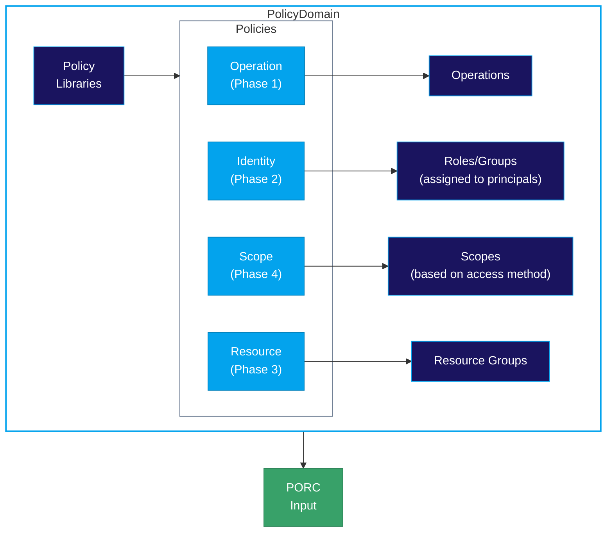

# Concepts Overview

This section covers the core concepts of the Manetu PolicyEngine. Understanding these concepts is essential to effectively design and implement access control policies.

## Foundation

These core concepts underpin everything in the PolicyEngine.

### Access Control Model

- **[Policy-Based Access Control (PBAC)](/concepts/pbac)**: The overarching access control paradigm
- **[Policy Conjunction](/concepts/policy-conjunction)**: How multiple policy phases combine to reach decisions

For integration guidance (PDP/PEP architecture, resource resolution), see the [Integration](/integration) section.

### Manetu Resource Notation (MRN)

- **[MRN](/concepts/mrn)**: Universal identifier scheme for all entities

**Manetu Resource Notation (MRN)** is the universal identifier format used throughout the PolicyEngine. Despite "Resource" in the name, MRNs identify all entity types: policies, roles, groups, resource groups, scopes, and resources. Understanding MRNs is fundamental to working with the PolicyEngine.

### PORC Expressions

- **[PORC](/concepts/porc)**: The standardized input format for policy evaluation

**PORC (Principal, Operation, Resource, Context)** is the universal language for expressing authorization requests. Every policy evaluation receives a PORC expression as input, regardless of the origin of the request. This standardized format decouples policy logic from application-specific request formats.

## The Four Phases

Policy evaluation happens in four phases, each addressing a different aspect of access control. See [Policy Conjunction](/concepts/policy-conjunction) for details on how phases combine.

### Phase 1: Operations

- **[Operations](/concepts/operations)**: Actions that can be performed in your system

Operations define the verbs of your access control model—the actions that principals attempt to perform. They serve as the starting point for policy evaluation and route requests to the appropriate policies. Operation policies can handle public endpoints, JWT validation, and bypass rules using [tri-level output](/concepts/policy-conjunction#operation-phase-tri-level-policies).

### Phase 2: Identity

- **[Roles](/concepts/roles)**: Define what principals can do based on their identity
- **[Groups](/concepts/groups)**: Organize roles for easier assignment to principals

Roles and groups form the identity layer of access control. Roles connect principals to policies, while groups bundle roles together for efficient management.

### Phase 3: Resources

- **[Resources](/concepts/resources)**: Entities that are accessed
- **[Resource Groups](/concepts/resource-groups)**: Associate policies with sets of resources

Resources represent the objects being protected—documents, APIs, data records, etc. **Resource Groups** are the mechanism that connects resources to policies—each resource belongs to a group, and each group references a policy that governs access.

### Phase 4: Scopes

- **[Scopes](/concepts/scopes)**: Additional constraints based on access method

Scopes provide an optional phase that can further constrain access based on how the principal is accessing the system (PATs, federation, OAuth tokens, etc.).

## Policy Artifacts

These are the files you author and deploy.

- **[PolicyDomains](/concepts/policy-domains)**: Self-contained policy bundles
- **[Policies](/concepts/policies)**: The Rego code that makes decisions
- **[Policy Libraries](/concepts/policy-libraries)**: Reusable code shared across policies

## Cross-Cutting Concepts

These features span multiple phases and entity types.

### Annotations

- **[Annotations](/concepts/annotations)**: Key-value metadata with inheritance

Annotations are flexible key-value pairs that can be attached to many entity types, including roles, groups, scopes, resource groups, and resources. They support an inheritance hierarchy where more specific definitions override less specific ones, enabling powerful attribute-based access control patterns.

## Audit & Observability

- **[Audit & Access Records](/concepts/audit)**: Every decision generates a normalized AccessRecord

Every PDP decision produces an **AccessRecord** that captures the input PORC, the top-level decision, and details about each policy evaluated (MRN, cryptographic fingerprint, outcome, and phase). This normalized output enables compliance reporting, anomaly detection, forensic analysis, and policy replay across distributed systems.

## Special-Purpose Features

- **[Mappers](/concepts/mappers)**: Transform external inputs to PORC expressions (only needed for Envoy/Istio integration or other fixed-protocol systems)

## How It All Fits Together

## Evaluation Flow

1. **Request arrives** at a Policy Enforcement Point (PEP)
2. **PEP constructs** a [PORC expression](/concepts/porc) from the request context
3. **Operation routing** selects the appropriate operation phase policy
4. **Policy evaluation** happens in multiple phases:
    - Phase 1: Operation policies (public endpoints, JWT validation, bypass rules) — uses [tri-level output](/concepts/policy-conjunction#operation-phase-tri-level-policies)
    - Phase 2: Identity policies (role-based via [Roles](/concepts/roles) and [Groups](/concepts/groups))
    - Phase 3: Resource policies (via [Resource Groups](/concepts/resource-groups) — each resource belongs to a group that determines which policy applies)
    - Phase 4: Scope policies (access-method constraints)
5. **[AccessRecord](/concepts/audit) written**: Captures PORC, decision, and all evaluated policies
6. **Decision returned**: GRANT or DENY

## Key Principles

### Least Privilege

The PolicyEngine defaults to **DENY**. Access must be explicitly granted by policies.

### Policy Conjunction

The PolicyEngine uses [multi-phase evaluation](/concepts/policy-conjunction) to combine policies from different phases (operation, identity, resource, scope) dynamically for each request. All mandatory phases must contribute at least one GRANT for access to be granted, while phases are evaluated in parallel for performance. See [Policy Conjunction](/concepts/policy-conjunction) for complete details.

### Separation of Concerns

- **Operation policies** handle request-level concerns (public endpoints, JWT validation)
- **Identity policies** handle who can do what
- **Resource policies** handle what can be done to resources
- **Scope policies** handle access-method constraints (tokens, federation, etc.)