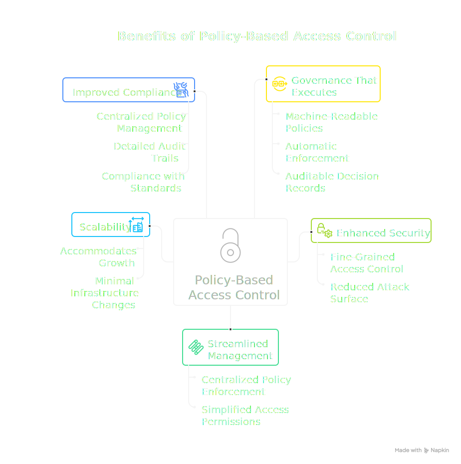

# Policy-Based Access Control (PBAC)

Policy-Based Access Control (PBAC) is an advanced access control model that enables organizations to create and enforce security policies that dictate who can access specific resources and under what circumstances.

## Introduction

PBAC focuses on the dynamic evaluation of policies and attributes to determine access permissions. Unlike simpler models such as Role-Based Access Control (RBAC), PBAC enables fine-grained, context-aware decisions based on multiple factors.

PBAC allows organizations to manage access to resources by defining policies that consider:

- **Subject attributes**: User roles, groups, clearance levels
- **Object attributes**: Resource classification, ownership, metadata
- **Environmental factors**: Time of day, location, request context

## Benefits of PBAC

### Governance That Executes

Unlike traditional governance approaches that document policies in prose, PBAC implements governance as executable code. Policies are machine-readable, automatically enforced, and produce auditable decision records. This transforms governance from a compliance exercise into an operational capability.

### Enhanced Security

PBAC enables organizations to create fine-grained access control policies considering various attributes. This level of control minimizes the risk of unauthorized access and reduces the attack surface.

### Streamlined Management

PBAC simplifies access control management by centralizing policy enforcement and administration. Organizations can manage access permissions from a single location, reducing complexity.

### Scalability

PBAC is highly scalable and can accommodate organizational growth without requiring significant changes to the underlying infrastructure.

### Improved Compliance

By centralizing access control policy management and providing detailed audit trails, PBAC enables organizations to demonstrate compliance with various industry standards and regulations (GDPR, HIPAA, SOX).

## Main Components

### Policy Decision Point (PDP)

The **Policy Decision Point** is responsible for evaluating access control policies and making access decisions. It processes requests and evaluates them against defined policies.

In the Manetu PolicyEngine, the PDP is the core engine that:
- Receives PORC expressions
- Evaluates policies using OPA/Rego
- Returns <DecisionChip decision="grant" /> or <DecisionChip decision="deny" /> decisions

### Policy Enforcement Point (PEP)

The **Policy Enforcement Point** intercepts access requests, gathers relevant attributes, and forwards requests to the PDP for evaluation. Based on the PDP's decision, the PEP either grants or denies access.

Examples of PEPs:
- API gateways
- Service mesh sidecars (Envoy)
- Application middleware

### Policy Administration Point (PAP)

The **Policy Administration Point** manages access control policies, including their creation, modification, and deletion. It allows administrators to define and update policies in a centralized location.

In the Manetu PolicyEngine, policies are defined using PolicyDomain YAML files and the `mpe` CLI for building and validation. The deployment model differs by offering:

**Community Edition**: Policies are deployed directly using the `mpe` CLI or Go API.

**Premium Offering**: A centralized PAP service orchestrates policy configuration across distributed PDPs, including stand-alone PolicyEngine services and operator-managed sidecars in Kubernetes environments.

## PBAC vs Other Models

| Model    | Description                                   | Limitations                  |
|----------|-----------------------------------------------|------------------------------|
| **DAC**  | Discretionary - owner controls access         | No central control           |
| **MAC**  | Mandatory - system enforces levels            | Rigid, hard to change        |
| **RBAC** | Role-Based - roles grant permissions          | Role explosion, no context   |
| **ABAC** | Attribute-Based - attributes determine access | Complex attribute management |
| **PBAC** | Policy-Based - policies make decisions        | Requires policy expertise    |

:::tip
PBAC combines the best aspects of RBAC and ABAC while adding the flexibility of programmable policies.
:::

## PBAC in the Manetu PolicyEngine

The Manetu PolicyEngine implements PBAC using:

1. **[Open Policy Agent (OPA)](https://www.openpolicyagent.org/)**: Industry-standard policy engine
2. **[Rego](https://www.openpolicyagent.org/docs/latest/policy-language/)**: Declarative policy language
3. **[PORC](/concepts/porc)**: Normalized input format (Principal, Operation, Resource, Context)
4. **[Policy Conjunction](/concepts/policy-conjunction)**: Multi-phase evaluation that combines operation, identity, resource, and scope policies dynamically for each request

## Related Concepts

- **[PolicyDomains](/concepts/policy-domains)**: Self-contained bundles that organize policies and related entities
- **[Policies](/concepts/policies)**: The Rego code that implements access control decisions
- **[Audit & Access Records](/concepts/audit)**: The auditable decision records that PBAC produces
