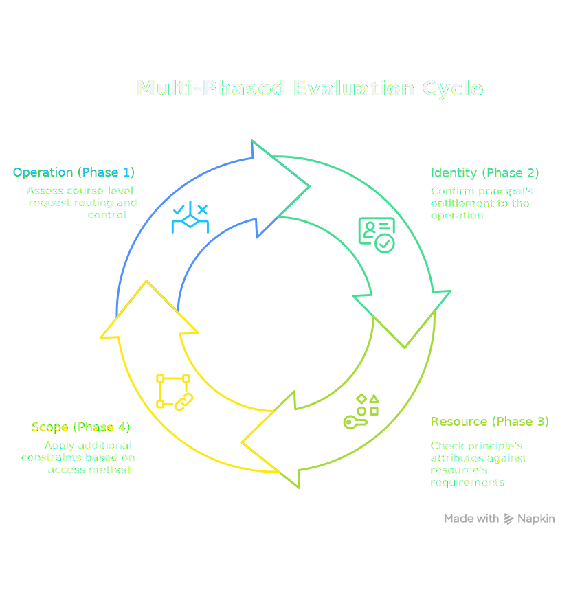
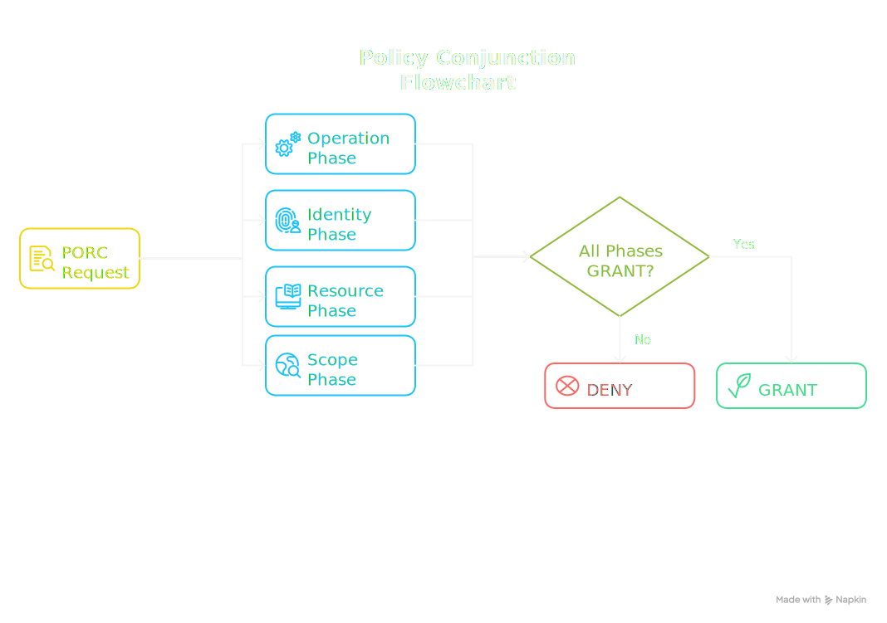

# Policy Conjunction

**Policy Conjunction** is the mechanism by which the Manetu PolicyEngine combines multiple policy phases together dynamically on a request-by-request basis to reach a final access decision.

<div class="centered-image">

</div>

## Overview

Rather than relying on a single policy to make all access decisions, the PolicyEngine evaluates policies across four distinct phases:

1. **Operation** - Coarse-grained request control (public endpoints, JWT validation) - see [Operations](/concepts/operations)
2. **Identity** - Who the principal is and what they can do - see [Roles](/concepts/roles) and [Groups](/concepts/groups)
3. **Resource** - What can be done to the target resource - see [Resources](/concepts/resources) and [Resource Groups](/concepts/resource-groups)
4. **Scope** - Access-method constraints (tokens, federation, etc.) - see [Scopes](/concepts/scopes)

Each phase represents a different aspect of the access decision, and all phases must agree for access to be granted. This separation provides the following benefits:

- It enables different teams or systems to manage their respective concerns independently while maintaining a coherent overall access control posture.
- It allows the respective policies to remain small and focused since they are brought together dynamically on a request-by-request basis.  This is easier than maintaining a single policy that covers every possible situation.

## How Phases Are Combined

The PolicyEngine processes all phases in **parallel** for maximum performance. However, the final decision requires **at least one GRANT vote from each phase** for the top-level decision to be GRANT.

<div class="centered-image">

</div>

### Phase Requirements

| Phase | Mandatory | Default if Missing |
|-------|-----------|-------------------|
| Operation | Yes | <DecisionChip decision="deny" /> |
| Identity | Yes | <DecisionChip decision="deny" /> |
| Resource | Yes | <DecisionChip decision="deny" /> |
| Scope | No | <DecisionChip decision="grant" /> |

:::warning Important
If a PORC expression is missing references to any mandatory phase (operation, identity, or resource), that phase votes DENY implicitly. The scope phase is the exception: if no scopes are present in the PORC, it defaults to GRANT. However, once at least one scope is present in the PORC, the scope phase behaves like the others and requires at least one policy to vote GRANT.
:::

## Multiple Policies Within a Phase

Some phases, particularly **identity** and **scope**, can have multiple policies associated with a single request. Within a phase:

- Each policy votes independently (GRANT or DENY)
- **Only one GRANT is needed** for the entire phase to vote GRANT
- This is an OR relationship within the phase

For example, if a user has three roles, and each role has an associated identity policy:

```
Identity Phase:
├── Policy for Role A → DENY
├── Policy for Role B → GRANT  ← One GRANT is sufficient
└── Policy for Role C → DENY

Identity Phase Result: GRANT
```

## GRANT Override

The operation phase has a unique capability: it can issue a **GRANT Override** that immediately grants access, bypassing the identity, resource, and scope phases entirely.

This solves an important problem for public endpoints. Consider a health-check endpoint that requires no authentication—without a JWT, there are no roles, so the identity phase would vote DENY. GRANT Override allows the operation phase to short-circuit the evaluation and grant access without requiring the other phases to participate.

For implementation details on how to express GRANT Override in operation phase policies, see [Tri-Level Policies](/concepts/policies#tri-level).

## Policy Evaluation Failures

Each policy gets a vote for GRANT or DENY. However, if a policy **cannot be evaluated** due to:

- Policy not found
- Network errors
- Timeout
- Runtime errors

The policy is treated as if it evaluated to **DENY**. This fail-closed behavior ensures that system failures don't inadvertently grant access.

### Audit Trail Visibility

While failures are treated as DENY for decision purposes, the **audit record captures the distinction**:

| Vote Type | Decision Impact | Audit Reason Code |
|-----------|-----------------|-------------------|
| GRANT | Contributes GRANT | Policy evaluated to GRANT |
| DENY | Contributes DENY | Policy evaluated to DENY |
| Not Found | Treated as DENY | Policy not found |
| Error | Treated as DENY | Evaluation error (with details) |
| Timeout | Treated as DENY | Evaluation timeout |

This separation allows auditors to distinguish between:
- A policy that explicitly denied access
- A policy that failed to evaluate

## Example: Complete Evaluation

Consider a request with the following PORC:

```yaml
principal:
  sub: "user123"
  mroles:
    - "mrn:iam:role:editor"
    - "mrn:iam:role:viewer"
  scopes:
    - "mrn:iam:scope:write"
operation: "api:documents:update"
resource:
  id: "mrn:data:document:doc456"
  owner: "user123"
  group: "mrn:iam:resource-group:owner-exclusive"
```

The PolicyEngine evaluates:

1. **Operation Phase** (1 policy)
    - Policy votes GRANT — authenticated request, proceed normally
    - Phase result: **GRANT**

2. **Identity Phase** (2 policies, one per role)
    - Editor role policy → GRANT (can update documents)
    - Viewer role policy → DENY (read-only)
    - Phase result: **GRANT** (at least one GRANT)

3. **Resource Phase** (1 policy)
    - Document policy → GRANT (user is owner)
    - Phase result: **GRANT**

4. **Scope Phase** (1 policy, scope present)
    - Write scope policy → GRANT (write operation allowed)
    - Phase result: **GRANT**

**Final Decision: GRANT** (all phases agreed)

## Example: Partial Failure

Now consider if the resource policy fails to load:

1. **Operation Phase** → GRANT
2. **Identity Phase** → GRANT
3. **Resource Phase** → **DENY** (policy not found, treated as DENY)
4. **Scope Phase** → GRANT

**Final Decision: DENY** (resource phase did not GRANT)

The audit record shows that the resource phase's outcome was DENY, not because of policy logic, but because the policy could not be found—enabling operators to identify and fix the issue.

## Design Rationale

Policy conjunction provides several benefits:

### Separation of Concerns

Different teams can own different phases:
- Platform team manages operation policies (public endpoints, JWT validation, IP allowlists)
- IAM team manages identity policies (role permissions)
- Data team manages resource policies (data classification)
- Security team manages scope policies (access-method constraints)

### Policy Simplification

Conjunction enables each policy to remain small and focused on a single concern. Without conjunction, policies must account for every possible combination of principal, operation, resource, and context—leading to complex, unwieldy code that is difficult to debug and maintain.

With conjunction, the PolicyEngine dynamically assembles only the relevant policy fragments for each request. This provides several advantages:

- **Targeted evaluation**: Each policy addresses a specific aspect of authorization without needing to handle unrelated scenarios
- **Faster execution**: Irrelevant policies are never loaded or evaluated, reducing overhead
- **Easier design**: Authors can reason about a single concern (e.g., "what can editors do?") without considering the full matrix of possibilities
- **Clearer auditing**: When reviewing a decision, auditors see only the policies that were actually relevant to that specific request, making it straightforward to understand what happened and why

### Defense in Depth

Multiple layers must all agree, reducing the impact of a misconfigured policy in any single phase.

### Fail-Closed Security

Missing or broken policies result in DENY, preventing errors from creating security holes.

### Auditability

The phase-based structure provides clear visibility into why access was granted or denied, making compliance and debugging easier.

## Best Practices

1. **Ensure all mandatory phases are defined**: Missing operation, identity, or resource policies will result in DENY.

2. **Handle scope intentionally**: Decide whether your application uses scopes (for PATs, federation, etc.). If not, omit them from the PORC for implicit GRANT.

3. **Monitor for evaluation failures**: Use audit logs to detect policies that fail to evaluate, as these may indicate configuration or infrastructure issues.

4. **Test each phase independently**: Verify that each phase grants access appropriately before combining them.

5. **Document phase ownership**: Clearly assign responsibility for each phase to avoid gaps in policy coverage.

## Related Concepts

- **[Operations](/concepts/operations)**: Request routing to operation phase policies (Phase 1)
- **[Roles](/concepts/roles)**: Identity assignments that connect principals to policies (Phase 2)
- **[Groups](/concepts/groups)**: Collections of roles for easier identity management (Phase 2)
- **[Resources](/concepts/resources)**: Entities being protected (Phase 3)
- **[Scopes](/concepts/scopes)**: Access-method constraints (Phase 4)
- **[Policies](/concepts/policies)**: The Rego code evaluated in each phase
