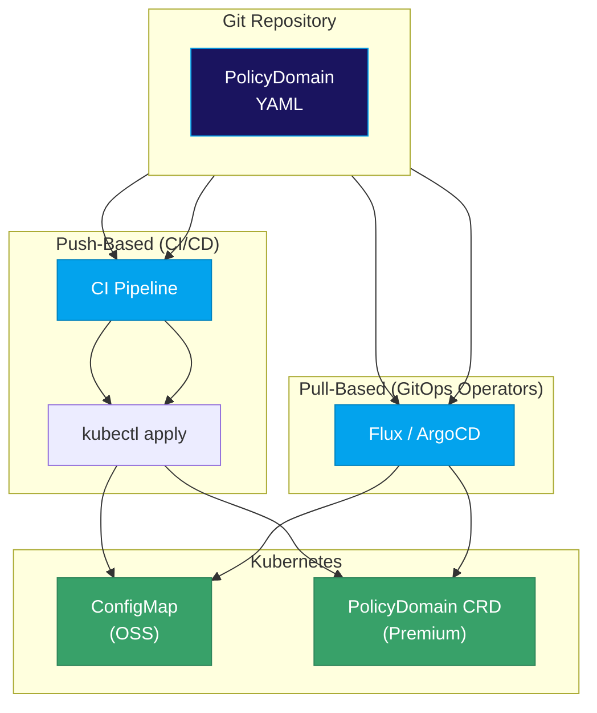

# PolicyDomains

A **PolicyDomain** is a self-contained bundle that defines all policy-related artifacts for a specific domain or service.


## Overview

PolicyDomains provide:

- **Modularity**: Package related policies together
- **Portability**: Deploy policies as a single unit
- **Reusability**: Share libraries across policies within a domain
- **Versioning**: Track changes to policy bundles

## PolicyDomain Structure

```yaml
apiVersion: iamlite.manetu.io/v1alpha4
kind: PolicyDomain
metadata:
  name: my-domain
spec:
  policy-libraries: []   # Reusable Rego code
  policies: []           # Access control policies
  roles: []              # Role-to-policy mappings
  groups: []             # Group-to-role mappings
  resource-groups: []    # Resource-to-policy mappings
  resources: []          # Resource selector routing (v1alpha4+)
  scopes: []             # Access-method constraint policies
  operations: []         # Operation routing
  mappers: []            # Input transformation
```

## API Version and Kind

Every PolicyDomain document must specify an API version and kind:

```yaml
apiVersion: iamlite.manetu.io/v1alpha4
kind: PolicyDomain  # or PolicyDomainReference
```

**Supported API versions**: `v1alpha3`, `v1alpha4`

**Supported kinds**:

| Kind | Description |
|------|-------------|
| `PolicyDomain` | Deployment format with inline Rego code |
| `PolicyDomainReference` | Development format that can reference external `.rego` files |

See [PolicyDomain vs PolicyDomainReference](#policydomain-vs-policydomainreference) for detailed guidance on when to use each format.

## Metadata

```yaml
metadata:
  name: my-service-policies
```

The `name` uniquely identifies the domain. It's used for:
- Cross-domain references
- Logging and debugging
- Bundle identification

## Components Overview

### Policy Libraries

Reusable Rego code shared across policies:

```yaml
spec:
  policy-libraries:
    - mrn: "mrn:iam:library:helpers"
      name: helpers
      rego: |
        package helpers
        # Shared functions...
```

### Policies

The Rego code that makes access decisions:

```yaml
spec:
  policies:
    - mrn: "mrn:iam:policy:main"
      name: main
      dependencies:
        - "mrn:iam:library:helpers"
      rego: |
        package authz
        # Policy logic...
```

### Roles, Groups, Resource Groups, Resources, Scopes

Identity and resource mappings:

```yaml
spec:
  roles:
    - mrn: "mrn:iam:role:admin"
      name: admin
      policy: "mrn:iam:policy:allow-all"

  groups:
    - mrn: "mrn:iam:group:admins"
      name: admins
      roles:
        - "mrn:iam:role:admin"

  resource-groups:
    - mrn: "mrn:iam:resource-group:default"
      name: default
      default: true
      policy: "mrn:iam:policy:allow-all"

  # v1alpha4+: Route resources to groups by MRN pattern
  resources:
    - name: sensitive-data
      selector:
        - "mrn:data:sensitive:.*"
      group: "mrn:iam:resource-group:restricted"

  scopes:
    - mrn: "mrn:iam:scope:api"
      name: api
      policy: "mrn:iam:policy:allow-all"
```

### Operations and Mappers

Request routing and transformation:

```yaml
spec:
  operations:
    - name: api
      selector: [".*"]
      policy: "mrn:iam:policy:main"

  mappers:
    - name: http-mapper
      selector: [".*"]
      rego: |
        package mapper
        # Transform input to PORC...
```

## Using YAML Anchors

YAML anchors increase PolicyDomain maintainability:

```yaml
spec:
  policies:
    - mrn: &allow-all "mrn:iam:policy:allow-all"
      name: allow-all
      rego: |
        package authz
        default allow = true

  roles:
    - mrn: "mrn:iam:role:admin"
      name: admin
      policy: *allow-all  # Reference the anchor
```

## PolicyDomain vs PolicyDomainReference

The PolicyEngine supports two document formats that serve different purposes in the development and deployment workflow.

### Key Differences

| Aspect | PolicyDomain | PolicyDomainReference |
|--------|--------------|----------------------|
| **Rego code** | Inline `rego` field only | Either `rego` (inline) or `rego_filename` (external file) |
| **Primary use** | Deployment, runtime evaluation | Development, source control |
| **Kubernetes Operator** | Supported (Premium) | Must convert with `mpe build` first |
| **OSS tooling** | Fully supported | Fully supported |

### PolicyDomainReference Format

`PolicyDomainReference` is a superset of `PolicyDomain` that allows referencing external `.rego` files instead of embedding Rego code inline. This is the recommended format for development because:

- **IDE support**: Separate `.rego` files get proper syntax highlighting
- **Easier testing**: Test individual Rego files with standard OPA tooling
- **Cleaner diffs**: Policy logic changes are isolated from YAML structure
- **Better organization**: Keep complex policies in dedicated files

```yaml
apiVersion: iamlite.manetu.io/v1alpha4
kind: PolicyDomainReference
metadata:
  name: my-domain
spec:
  policy-libraries:
    - mrn: "mrn:iam:library:helpers"
      name: helpers
      rego_filename: lib/helpers.rego    # External file

  policies:
    - mrn: "mrn:iam:policy:main"
      name: main
      dependencies:
        - "mrn:iam:library:helpers"
      rego_filename: policies/main.rego  # External file

    - mrn: "mrn:iam:policy:simple"
      name: simple
      rego: |                            # Inline is also allowed
        package authz
        default allow = true
```

The `rego_filename` field is supported on:
- `policies`
- `policy-libraries`
- `mappers`

### Converting to PolicyDomain

Use `mpe build` to convert `PolicyDomainReference` to `PolicyDomain`:

```bash
# Convert for deployment
mpe build -f my-domain-ref.yaml -o my-domain.yaml
```

The build process:
1. Reads each `rego_filename` reference
2. Loads the external `.rego` file content
3. Replaces `rego_filename` with inline `rego`
4. Changes `kind` from `PolicyDomainReference` to `PolicyDomain`

### Which Format Should I Use?

**OSS Users**: All tooling (`mpe test`, `mpe serve`, Go API) accepts both formats interchangeably. Choose based on your preference:
- Use `PolicyDomainReference` if you prefer separate `.rego` files
- Use `PolicyDomain` if you prefer everything in one file

**Premium Users**: The Kubernetes Operator only accepts `PolicyDomain` format. You can:
- Develop using `PolicyDomainReference` for better IDE support
- Run `mpe build` as part of your CI/CD pipeline before deployment
- Or develop directly in `PolicyDomain` format if you prefer

### Development Workflow Example

```
my-policies/
├── domain.yaml              # PolicyDomainReference
├── lib/
│   └── helpers.rego         # Shared library code
├── policies/
│   ├── identity.rego        # Identity phase policy
│   └── resource.rego        # Resource phase policy
└── build/
    └── domain-built.yaml    # Generated PolicyDomain (git-ignored)
```

Build command in CI/CD:
```bash
mpe build -f domain.yaml -o build/domain-built.yaml
```

## Multiple Domains

You can load multiple PolicyDomains together:

```bash
mpe test decision \
  -b base-policies.yml \
  -b service-policies.yml \
  -i input.json
```

Cross-domain library references use the format:

```yaml
dependencies:
  - "other-domain/library-name"
```

## GitOps-Friendly Design

PolicyDomains are fundamentally GitOps-friendly because they are plain files—YAML documents that can be version-controlled, reviewed, tested, and deployed through any standard GitOps workflow.

### Why Plain Files Matter

- **Human-readable**: Easy to review in pull requests
- **Diff-friendly**: Changes are clearly visible in version control
- **Declarative**: Describes the desired state, not imperative steps
- **Tooling support**: Standard YAML linting, formatting, and validation
- **Portable**: Deploy through any file-based workflow

### Deployment Patterns

Because PolicyDomains are just files, they integrate with any GitOps-oriented deployment flow:



| Pattern | Description |
|---------|-------------|
| **Push-based** | Git → CI pipeline → `kubectl apply` to Kubernetes |
| **Pull-based** | GitOps operators (Flux, ArgoCD) continuously sync from Git |

### Delivery by Edition

**ConfigMap-based delivery** <FeatureChip variant="oss" label="Open Source" />

In the open source edition, PolicyDomains are typically delivered as Kubernetes ConfigMaps. Configure your PDP pods (for HTTP API integration) or application pods (for embedded Go) to trigger a rolling restart when the ConfigMap changes:

```yaml
apiVersion: v1
kind: ConfigMap
metadata:
  name: policy-domain
data:
  domain.yaml: |
    apiVersion: iamlite.manetu.io/v1alpha4
    kind: PolicyDomain
    metadata:
      name: my-service
    spec:
      # ... PolicyDomain content
---
apiVersion: apps/v1
kind: Deployment
metadata:
  name: mpe-pdp
spec:
  template:
    metadata:
      annotations:
        # Trigger rollout when ConfigMap changes
        checksum/config: "{{ sha256sum .Values.policyDomain }}"
```

**CRD-based delivery with dynamic updates** <FeatureChip variant="premium" label="Premium" />

The Premium Edition provides a Kubernetes Custom Resource Definition (CRD) for PolicyDomain resources. When a PolicyDomain CRD instance is created or updated—whether through CI push or a GitOps operator pull—the Policy Administration Point (PAP) automatically distributes the new policies to all PDPs through the cache-coherency mechanism. No pod restarts required.

```yaml
apiVersion: iamlite.manetu.io/v1alpha4
kind: PolicyDomain
metadata:
  name: my-service
spec:
  # ... PolicyDomain content
```

### Example CI Pipeline

```yaml
# .github/workflows/policy-ci.yml
name: Policy CI

on:
  push:
    paths:
      - 'policies/**'
  pull_request:
    paths:
      - 'policies/**'

jobs:
  validate:
    runs-on: ubuntu-latest
    steps:
      - uses: actions/checkout@v4

      - name: Install MPE
        run: |
          curl -L https://github.com/manetu/policyengine/releases/latest/download/mpe-linux-amd64 -o mpe
          chmod +x mpe
          sudo mv mpe /usr/local/bin/

      - name: Lint policies
        run: mpe lint -f policies/domain.yaml

      - name: Run policy tests
        run: |
          for test in policies/tests/*.json; do
            echo "Running test: $test"
            mpe test decision -b policies/domain.yaml -i "$test" | \
              jq 'if .decision == "DENY" then "Test failed: access denied" | halt_error(1) else . end'
          done

      - name: Build for deployment
        run: mpe build -f policies/domain.yaml -o dist/domain.yaml

      - name: Upload artifact
        uses: actions/upload-artifact@v4
        with:
          name: policy-bundle
          path: dist/domain.yaml
```

### Pull Request Reviews

Because PolicyDomains are YAML, policy changes follow standard code review practices:

1. **Author** creates a branch with policy changes
2. **CI** automatically validates syntax and runs tests
3. **Reviewers** examine the diff—changes are clear and auditable
4. **Merge** triggers deployment to staging/production

This approach provides:
- **Audit trail**: Git history shows who changed what and when
- **Rollback**: Revert to any previous policy version instantly
- **Collaboration**: Multiple team members can work on policies
- **Testing**: Automated validation before deployment

## Best Practices

1. **One domain per service**: Keep domains focused
2. **Use libraries**: Extract common code into libraries
3. **Use anchors**: Avoid duplicating MRNs
4. **Use references**: Keep Rego in external files for better editing
5. **Validate early**: Run `mpe lint` frequently during development
6. **Version control**: Store PolicyDomains in Git with your application code or in a dedicated policy repository
7. **Automate testing**: Include policy tests in your CI/CD pipeline

## Related Concepts

- **[Policies](/concepts/policies)**: Authorization policies defined in domains
- **[Policy Libraries](/concepts/policy-libraries)**: Reusable Rego code shared across policies
- **[Operations](/concepts/operations)**: Route requests to operation phase policies
- **[Roles](/concepts/roles)**: Connect principals to identity phase policies
- **[Groups](/concepts/groups)**: Bundle roles for easier assignment
- **[Resource Groups](/concepts/resource-groups)**: Connect resources to resource phase policies
- **[Scopes](/concepts/scopes)**: Define access-method constraints
- **[Resources](/concepts/resources)**: Define resource routing patterns
- **[Mappers](/concepts/mappers)**: Transform non-PORC inputs
