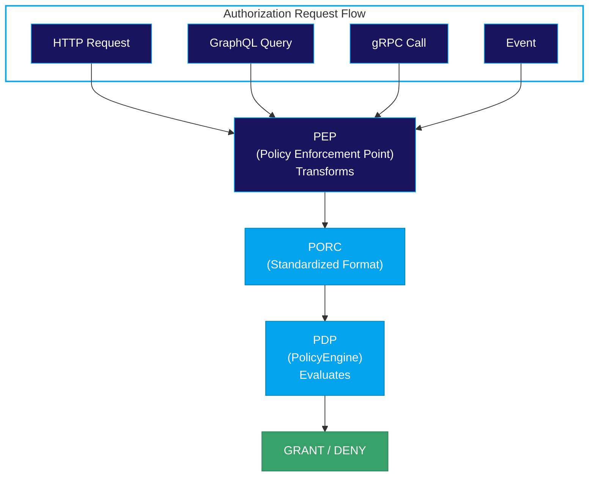
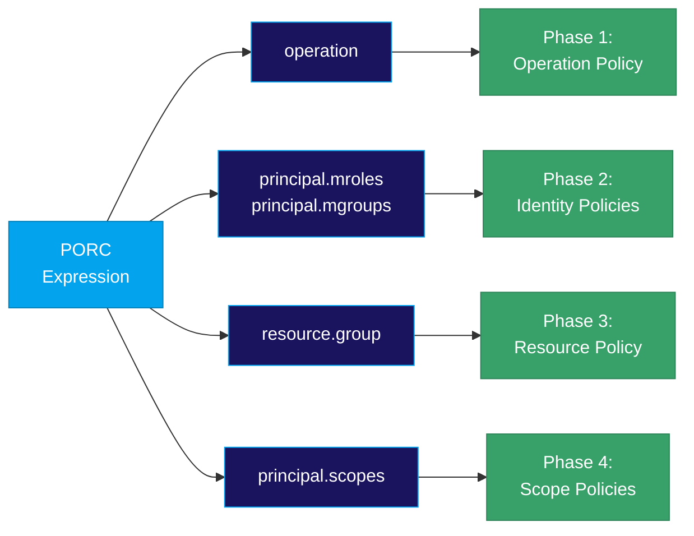

# PORC Expressions

A **PORC Expression** is the normalized input format for policy evaluation. PORC stands for:

- **P**rincipal - Who is making the request
- **O**peration - What action is being performed
- **R**esource - What entity is being accessed
- **C**ontext - Additional contextual information

## Overview

PORC is the universal language for expressing authorization requests in the PolicyEngine. Every policy evaluation receives a PORC expression as input, regardless of where the request originated. This standardized format makes it possible to:

- Write policies that work across different enforcement points
- Reuse policy logic regardless of the original request format
- Create consistent audit trails
- Decouple policy logic from application-specific request formats



## PORC Structure

```json
{
  "principal": {
    "sub": "user@example.com",
    "mroles": ["mrn:iam:role:admin"],
    "mgroups": ["mrn:iam:group:developers"],
    "scopes": ["mrn:iam:scope:full-access"],
    "mclearance": "HIGH",
    "mannotations": {
      "department": "engineering"
    }
  },
  "operation": "api:users:create",
  "resource": "mrn:app:users:12345",
  "context": {
    "timestamp": "2024-01-15T10:30:00Z",
    "source_ip": "192.168.1.100"
  }
}
```

## Principal

The **Principal** represents who is making the request. This typically comes from JWT claims or other authentication tokens.

| Field | Description |
|-------|-------------|
| `sub` | Subject identifier (user ID, service account) |
| `mroles` | Array of [role](/concepts/roles) MRNs assigned to the principal |
| `mgroups` | Array of [group](/concepts/groups) MRNs the principal belongs to |
| `scopes` | Array of [scope](/concepts/scopes) MRNs from the access method |
| `mclearance` | Security clearance level (LOW, MODERATE, HIGH, MAXIMUM) |
| `mannotations` | Key-value metadata about the principal |

### Principal in Policies

Access principal fields in Rego via `input.principal`:

```rego
package authz

default allow = false

# Check if principal has admin role
allow {
    "mrn:iam:role:admin" in input.principal.mroles
}

# Check security clearance
allow {
    input.principal.mclearance == "HIGH"
}

# Check department annotation
allow {
    input.principal.mannotations.department == "engineering"
}
```

## Operation

The **Operation** identifies what action is being performed. Operations follow a consistent naming convention:

```
<subsystem>:<resource-class>:<verb>
```

### Examples

| Operation | Description |
|-----------|-------------|
| `iam:identity:create` | Create an identity |
| `vault:attributes:read` | Read vault attributes |
| `api:users:list` | List users via API |
| `admin:settings:update` | Update admin settings |

See [Operations](/concepts/operations) for details on how operations route requests to policies.

### Operation in Policies

```rego
package authz

default allow = false

# Allow specific operations
allow {
    input.operation in {"api:users:read", "api:users:list"}
}

# Pattern matching with glob
allow {
    glob.match("*:*:read", [], input.operation)
}

# Parse operation components
allow {
    parts := split(input.operation, ":")
    parts[0] == "api"
    parts[2] == "read"
}
```

## Resource

The **Resource** identifies the entity being accessed. Resources can be specified in two formats:

### MRN String (Simple)

For resources that don't need additional metadata:

```json
{
  "resource": "mrn:app:myservice:document:12345"
}
```

### Fully-Qualified Descriptor

For resources with ownership, classification, or other metadata:

```json
{
  "resource": {
    "id": "mrn:app:myservice:document:12345",
    "owner": "user@example.com",
    "group": "mrn:iam:resource-group:documents",
    "classification": "MODERATE",
    "annotations": {"department": "engineering"}
  }
}
```

See [Resources](/concepts/resources) and [Resource Groups](/concepts/resource-groups) for details. For integration guidance on when to use each format, see [Resource Resolution](/integration/resource-resolution).

### Resource in Policies

```rego
package authz

default allow = false

# Check if principal owns the resource
allow {
    input.principal.sub == input.resource.owner
}

# Check resource classification against clearance
allow {
    clearance_levels := {"LOW": 1, "MODERATE": 2, "HIGH": 3, "MAXIMUM": 4}
    clearance_levels[input.principal.mclearance] >= clearance_levels[input.resource.classification]
}

# Check resource annotations
allow {
    input.resource.annotations.department == input.principal.mannotations.department
}
```

## Context

The **Context** contains additional information about the request environment. This is free-form and depends on the enforcement point.

### Common Context Fields

```json
{
  "context": {
    "timestamp": "2024-01-15T10:30:00Z",
    "source_ip": "10.0.0.1",
    "user_agent": "Mozilla/5.0...",
    "request_id": "abc-123",
    "method": "POST",
    "path": "/api/users"
  }
}
```

### Context in Policies

```rego
package authz

default allow = false

# Allow if all conditions pass
allow {
    trusted_network(input.context.source_ip)
    not weekend_restricted
}

# Helper: Check trusted network
trusted_network(ip) {
    net.cidr_contains("10.0.0.0/8", ip)
}

# Helper: Weekend access restriction
weekend_restricted {
    time.weekday(time.now_ns()) == "Saturday"
    not "mrn:iam:role:weekend-access" in input.principal.mroles
}
```

## How PORC Connects to Policy Phases

The PORC expression drives the [Policy Conjunction](/concepts/policy-conjunction) evaluation:

| PORC Component | Used By |
|----------------|---------|
| `operation` | Phase 1 - Routes to operation policy |
| `principal.mroles` | Phase 2 - Selects identity policies via roles |
| `principal.mgroups` | Phase 2 - Expands to additional roles |
| `resource.group` | Phase 3 - Selects resource policy |
| `principal.scopes` | Phase 4 - Selects scope policies |



## Complete PORC Example

Here's a fully-populated PORC expression showing all components:

```json
{
  "principal": {
    "sub": "alice@acme.com",
    "mrealm": "acme.com",
    "mroles": [
      "mrn:iam:acme.com:role:editor",
      "mrn:iam:acme.com:role:viewer"
    ],
    "mgroups": [
      "mrn:iam:acme.com:group:content-team"
    ],
    "scopes": [
      "mrn:iam:acme.com:scope:full-access"
    ],
    "mclearance": "MODERATE",
    "mannotations": {
      "department": "marketing",
      "employee_id": "12345"
    }
  },
  "operation": "documents:article:update",
  "resource": {
    "id": "mrn:content:acme.com:article:summer-campaign",
    "owner": "bob@acme.com",
    "group": "mrn:iam:acme.com:resource-group:marketing-content",
    "classification": "LOW",
    "annotations": {
      "campaign": "summer-2024",
      "status": "draft"
    }
  },
  "context": {
    "timestamp": "2024-06-15T14:30:00Z",
    "source_ip": "10.0.1.50",
    "user_agent": "ContentEditor/2.0",
    "request_id": "req-abc-123",
    "correlation_id": "corr-xyz-789"
  }
}
```

## Related Concepts

- **[Policy Conjunction](/concepts/policy-conjunction)**: How PORC drives multi-phase evaluation
- **[MRN](/concepts/mrn)**: The identifier format used in PORC
- **[Operations](/concepts/operations)**: How the operation field routes to policies
- **[Roles](/concepts/roles)**: Identity policies selected by `mroles`
- **[Groups](/concepts/groups)**: Role bundles referenced by `mgroups`
- **[Resources](/concepts/resources)**: The resource field and its metadata
- **[Resource Groups](/concepts/resource-groups)**: Resource policy selection
- **[Scopes](/concepts/scopes)**: Access-method constraints via `scopes`

## Integration

For implementation details on building PORC expressions in your application:

- **[Integration Overview](/integration)**: PDP/PEP architecture
- **[Resource Resolution](/integration/resource-resolution)**: When to use MRN strings vs fully-qualified descriptors
- **[Go Library](/integration/go-library)**: Building PORC in Go applications
- **[HTTP API](/integration/http-api)**: Sending PORC via HTTP
