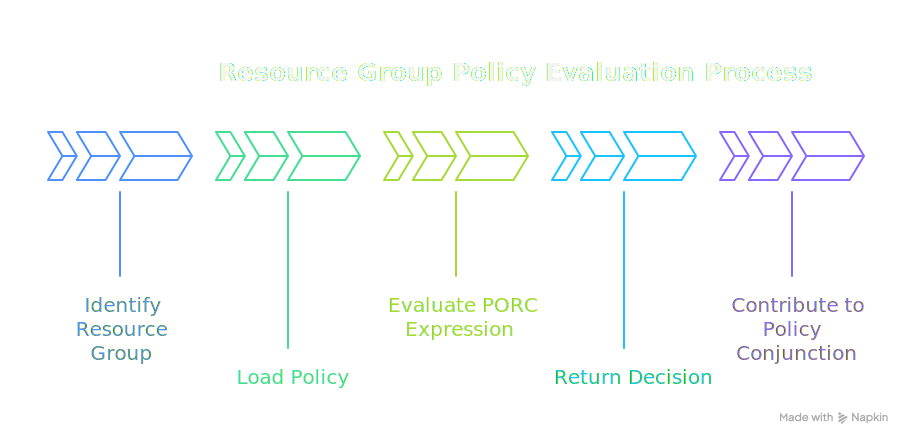

# Resource Groups

**Resource Groups** are the mechanism for associating policies with sets of resources. They enable resource-level access control by defining which policy governs access to resources within each group.

See also: [Resources](/concepts/resources)

## Overview

Resource Groups serve as the bridge between resources and policies:

- Every resource belongs to exactly one Resource Group
- Each Resource Group references exactly one policy
- The policy determines access control for all resources in that group
- A default group can be designated for resources that don't specify a group

Like identity entities ([Roles](/concepts/roles), [Groups](/concepts/groups), [Scopes](/concepts/scopes)), resource groups serve a dual purpose: they link to a policy for access evaluation, and they can carry [annotations](/concepts/annotations) that parameterize policy decisions. Resource group annotations flow into `input.resource.annotations`, providing default metadata for all resources in the group. Individual [Resources](/concepts/resources) can override these defaults with their own annotations (see [Parameterizing Policies](/concepts/annotations#parameterizing-policies)).

## How Resource Groups Work

When a request involves a resource:

<div class="centered-image">

</div> 

1. The PolicyEngine identifies which Resource Group the resource belongs to
2. The group's associated policy is loaded for Phase 3 (Resource Phase) evaluation
3. The policy evaluates the PORC expression and returns <DecisionChip decision="grant" /> or <DecisionChip decision="deny" />
4. This decision contributes to the overall [Policy Conjunction](/concepts/policy-conjunction)

## Defining Resource Groups

Resource Groups are defined in the `spec.resource-groups` section of a PolicyDomain:

```yaml
spec:
  resource-groups:
    - mrn: "mrn:iam:resource-group:public"
      name: public
      description: "Publicly accessible resources"
      policy: "mrn:iam:policy:allow-all"

    - mrn: "mrn:iam:resource-group:internal"
      name: internal
      description: "Internal resources requiring authentication"
      default: true  # Default group for unassigned resources
      policy: "mrn:iam:policy:authenticated-only"

    - mrn: "mrn:iam:resource-group:sensitive"
      name: sensitive
      description: "Sensitive resources with strict access controls"
      policy: "mrn:iam:policy:clearance-required"
```

### Fields

| Field         | Type    | Required | Description                                    |
|---------------|---------|----------|------------------------------------------------|
| `mrn`         | string  | Yes      | Unique MRN identifier for the group            |
| `name`        | string  | Yes      | Human-readable name                            |
| `description` | string  | No       | Description of the group's purpose             |
| `default`     | boolean | No       | Use as default for unassigned resources        |
| `policy`      | string  | Yes      | MRN of the policy to apply                     |
| `annotations` | array   | No       | List of name/value objects for custom metadata |

## Default Resource Group

One Resource Group can be marked as `default: true`. This group applies to any resource that doesn't explicitly specify a group:

```yaml
resource-groups:
  - mrn: "mrn:iam:resource-group:default"
    name: default
    description: "Default access policy for all resources"
    default: true
    policy: "mrn:iam:policy:authenticated-only"
```

If no default is specified and a resource doesn't have a group, the request will be denied (fail-closed behavior).

## Resource Group Annotations

Annotations on Resource Groups provide metadata that:
- Can be accessed by policies
- Are inherited by resources in the group (resource-level annotations override group-level)

```yaml
resource-groups:
  - mrn: "mrn:iam:resource-group:pii-data"
    name: pii-data
    description: "Personally identifiable information"
    policy: "mrn:iam:policy:pii-access"
    annotations:
      - name: "compliance"
        value: "\"GDPR\""
      - name: "audit_required"
        value: "true"
      - name: "retention_days"
        value: "365"
```

Use annotations in policies:

```rego
package authz

default allow = false

# Require audit for resources in groups marked audit_required
allow {
    input.resource.annotations.audit_required == "true"
    input.principal.mroles[_] == "mrn:iam:role:auditor"
}
```

## Assigning Resources to Groups

Resources are assigned to groups in two ways:

### 1. At Request Time

The calling application specifies the group in the PORC expression:

```json
{
  "principal": { ... },
  "operation": "data:read",
  "resource": {
    "id": "mrn:data:document:12345",
    "group": "mrn:iam:resource-group:sensitive"
  },
  "context": { ... }
}
```

### 2. Via Resource Routing (v1alpha4+)

Define patterns in the `resources` section to automatically route resources to groups based on their MRN:

```yaml
spec:
  resources:
    - name: sensitive-data
      description: "Route sensitive data to restricted group"
      selector:
        - "mrn:data:sensitive:.*"
        - "mrn:secret:.*"
      group: "mrn:iam:resource-group:sensitive"

    - name: public-assets
      description: "Route public assets to public group"
      selector:
        - "mrn:assets:public:.*"
      group: "mrn:iam:resource-group:public"
```

When a resource MRN matches a selector pattern, it's automatically assigned to the corresponding group. See [Resources](/concepts/resources) for more details on resource routing.

## Example: Tiered Access Model

A common pattern is tiered resource groups based on sensitivity:

```yaml
spec:
  # Define policies for each tier
  policies:
    - mrn: "mrn:iam:policy:public-access"
      name: public-access
      rego: |
        package authz
        default allow = true  # Anyone can access

    - mrn: "mrn:iam:policy:authenticated-access"
      name: authenticated-access
      rego: |
        package authz
        default allow = false
        allow { input.principal.sub != "" }

    - mrn: "mrn:iam:policy:clearance-access"
      name: clearance-access
      rego: |
        package authz
        default allow = false
        ratings := {"LOW": 1, "MODERATE": 2, "HIGH": 3, "MAXIMUM": 4}
        allow {
          ratings[input.principal.mclearance] >= ratings[input.resource.classification]
        }

  # Define resource groups using those policies
  resource-groups:
    - mrn: "mrn:iam:resource-group:public"
      name: public
      description: "Public resources - no auth required"
      policy: "mrn:iam:policy:public-access"

    - mrn: "mrn:iam:resource-group:internal"
      name: internal
      description: "Internal resources - auth required"
      default: true
      policy: "mrn:iam:policy:authenticated-access"

    - mrn: "mrn:iam:resource-group:classified"
      name: classified
      description: "Classified resources - clearance required"
      policy: "mrn:iam:policy:clearance-access"
```

## Resource Groups vs. Groups

It's important to distinguish between Resource Groups and identity [Groups](/concepts/groups):

| Aspect          | Resource Groups                  | Groups (Identity)               |
|-----------------|----------------------------------|---------------------------------|
| **Contains**    | Resource patterns                | Roles                           |
| **Assigned to** | Resources                        | Principals                      |
| **Phase**       | Phase 3 (Resource)               | Phase 2 (Identity)              |
| **Purpose**     | What policies apply to resources | What roles apply to an identity |
| **PORC field**  | `resource.group`                 | `principal.mgroups`             |

## Best Practices

1. **Always define a default group**: Ensures fail-closed behavior for resources without explicit group assignment

2. **Use meaningful names**: Group names should clearly indicate the access policy (e.g., "public", "internal", "sensitive")

3. **Keep policies focused**: Each resource group policy should handle one access pattern

4. **Leverage annotations**: Use group-level annotations for shared metadata across resources

5. **Document groups**: Use the description field to explain when resources belong in each group

6. **Use resource routing**: For large systems, use MRN patterns to automatically assign resources to groups rather than relying on callers to specify groups

## Related Concepts

- **[Resources](/concepts/resources)**: The entities that belong to resource groups
- **[Policies](/concepts/policies)**: The Rego code referenced by resource groups
- **[Policy Conjunction](/concepts/policy-conjunction)**: How resource policies (Phase 3) combine with other phases
- **[Annotations](/concepts/annotations)**: Metadata inheritance from groups to resources
