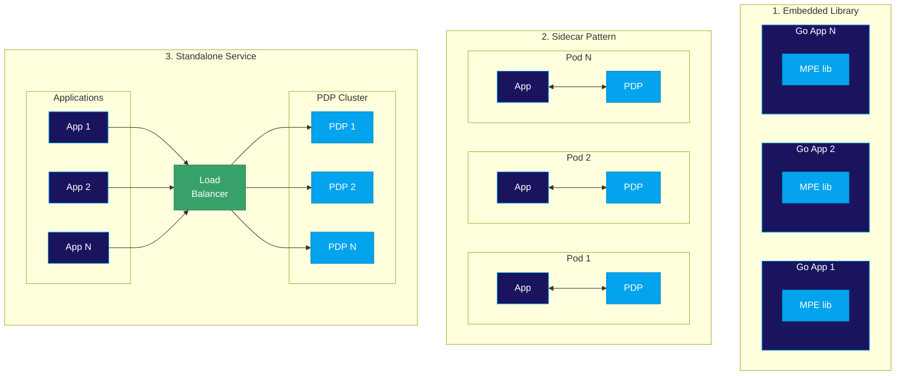
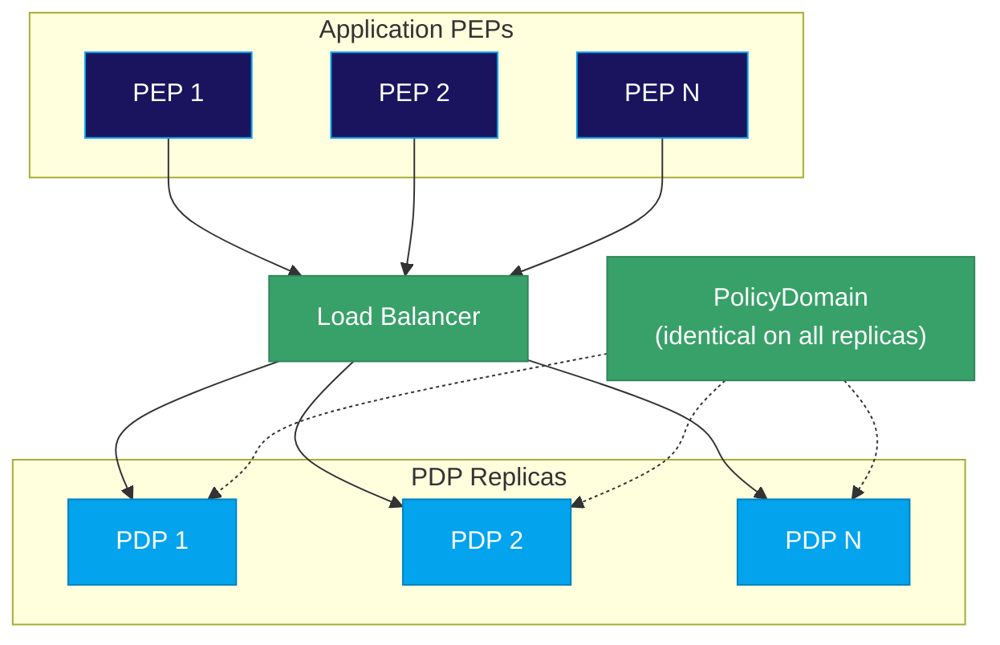
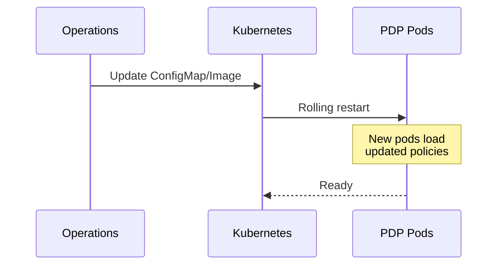
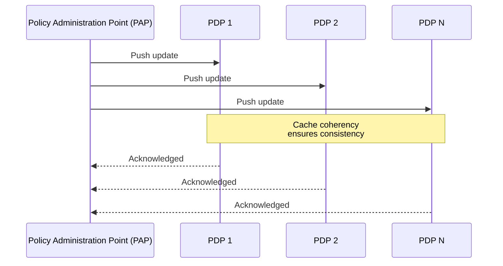
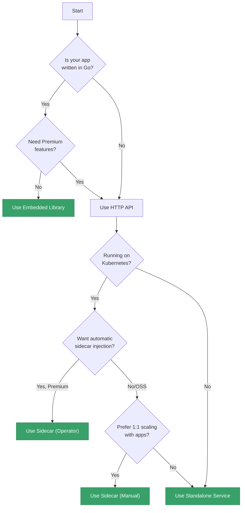

# Deployment Architecture

This page covers the architectural patterns for deploying the Manetu PolicyEngine in production environments. Understanding these patterns helps you choose the right deployment strategy for your needs.

## Deployment Form Factors

The PolicyEngine PDP can be deployed in three primary configurations, each with different trade-offs:



### 1. Embedded Library <FeatureChip variant="oss" label="OSS Only" />

The embedded Go library compiles the PolicyEngine directly into your application binary.

**Characteristics:**
- **Latency**: Lowest possible (in-process function calls)
- **Deployment**: Single artifact containing both app and policy engine
- **Scaling**: PDP scales automatically with your application
- **Language**: Go only

**When to use:**
- Your application is written in Go
- You need absolute minimum latency
- You prefer single-artifact deployments
- You don't need Premium Edition features

```go
import "github.com/manetu/policyengine/pkg/core"

// Create a PolicyEngine from local domain files
pe, err := core.NewLocalPolicyEngine([]string{"domain.yaml"})
if err != nil {
    log.Fatal(err)
}

// Make authorization decisions
allowed, err := pe.Authorize(ctx, porc)
```

See [Embedded Go Library](/integration/go-library) for complete usage details and configuration options.

:::info
The embedded library is available only in the Open Source Edition. Premium Edition features require the HTTP API integration.
:::

### 2. Sidecar Pattern

Deploy the PDP as a sidecar container alongside each application pod.

**Characteristics:**
- **Latency**: Very low (localhost network call)
- **Deployment**: Two containers per pod
- **Scaling**: PDP scales 1:1 with your application
- **Language**: Any (via HTTP API)

**When to use:**
- Kubernetes environments
- You want consistent enforcement without managing PDP infrastructure
- Natural scaling with application pods
- Premium Edition with automatic sidecar injection

```yaml
apiVersion: v1
kind: Pod
metadata:
  name: my-app
spec:
  containers:
  - name: app
    image: my-app:latest
    env:
    - name: PDP_URL
      value: "http://localhost:9000"

  - name: mpe-sidecar
    image: ghcr.io/manetu/policyengine:latest
    command: ["serve", "-b", "/policies/domain.yml", "--port", "9000"]
    ports:
    - containerPort: 9000
    volumeMounts:
    - name: policies
      mountPath: /policies

  volumes:
  - name: policies
    configMap:
      name: policy-domain
```

:::tip Premium Feature: Kubernetes Operator
The **Premium Edition** includes a Kubernetes Operator that automatically injects PDP sidecars into your pods. This eliminates manual sidecar configuration and ensures consistent enforcement across your cluster.
:::

### 3. Standalone Service

Deploy the PDP as a separate service that multiple applications share.

**Characteristics:**
- **Latency**: Low (network hop to service)
- **Deployment**: Separate from applications
- **Scaling**: Independent of applications
- **Language**: Any (via HTTP API)

**When to use:**
- Multi-language environments sharing policies
- You want to scale PDP independently
- Non-Kubernetes environments
- Centralized policy decision service

```yaml
apiVersion: apps/v1
kind: Deployment
metadata:
  name: mpe-service
spec:
  replicas: 3
  selector:
    matchLabels:
      app: mpe-pdp
  template:
    spec:
      containers:
      - name: mpe
        image: ghcr.io/manetu/policyengine:latest
        command: ["serve", "-b", "/policies/domain.yml", "--port", "9000"]
        resources:
          requests:
            memory: "64Mi"
            cpu: "100m"
          limits:
            memory: "256Mi"
            cpu: "500m"
---
apiVersion: v1
kind: Service
metadata:
  name: mpe-pdp
spec:
  selector:
    app: mpe-pdp
  ports:
  - port: 9000
```

### Comparison Summary

| Aspect | Embedded | Sidecar | Standalone |
|--------|----------|---------|------------|
| **Latency** | Lowest | Very Low | Low |
| **Language Support** | Go only | Any | Any |
| **Scaling** | With app | 1:1 with app | Independent |
| **Operational Overhead** | Lowest | Medium | Higher |
| **Premium Compatible** | No | Yes | Yes |
| **Resource Efficiency** | Best | Good | Variable |

## Horizontal Scaling

The PolicyEngine PDP is **stateless by design**—it maintains no per-request state and makes decisions based solely on the input PORC expression. This architecture enables straightforward horizontal scaling.

### Scaling Patterns



### Why Stateless Matters

- **No coordination overhead**: Replicas don't need to communicate with each other
- **Simple load balancing**: Any replica can handle any request
- **Easy recovery**: Failed replicas can be replaced without state migration
- **Predictable performance**: No cache warming or state synchronization delays

### Scaling Strategies

**For sidecar deployments:**
- PDPs scale automatically as you scale your application
- No additional configuration needed
- Each pod gets its own PDP with consistent policies

**For standalone deployments:**
- Use Kubernetes HPA (Horizontal Pod Autoscaler) based on CPU or custom metrics
- Configure appropriate replica counts for your baseline load
- Use pod anti-affinity for high availability across nodes

```yaml
apiVersion: autoscaling/v2
kind: HorizontalPodAutoscaler
metadata:
  name: mpe-pdp-hpa
spec:
  scaleTargetRef:
    apiVersion: apps/v1
    kind: Deployment
    name: mpe-pdp
  minReplicas: 3
  maxReplicas: 10
  metrics:
  - type: Resource
    resource:
      name: cpu
      target:
        type: Utilization
        averageUtilization: 70
```

## Policy Updates

### Static Reload <FeatureChip variant="oss" label="Open Source" />

In the open source edition, PDPs load policies at startup:



To update policies:
1. Update the PolicyDomain ConfigMap or container image
2. Trigger a rolling restart of PDP pods
3. New pods load the updated policies

This approach ensures zero-downtime updates when using proper rolling deployment strategies.

### Dynamic Reload <FeatureChip variant="premium" label="Premium" />

The Premium Edition eliminates the need for restarts:



:::tip Premium Feature: Cache Coherency
The Premium Edition uses a sophisticated cache-coherency algorithm to propagate policy updates to all PDPs in real-time. This keeps policy management centralized while allowing decisions to scale out to the edge of your network—without any restarts or service interruptions.
:::

**Benefits of dynamic reload:**
- **Zero downtime**: No pod restarts required
- **Instant propagation**: Policies update across all PDPs simultaneously
- **Centralized management**: Single source of truth for policy versions
- **Audit trail**: Track which policy version was active for any decision

## Multi-Architecture Support

The PolicyEngine is built for modern infrastructure and provides native binaries for multiple architectures:

| Architecture | Container Image | Binary |
|--------------|-----------------|--------|
| **amd64** (x86_64) | `ghcr.io/manetu/policyengine:latest` | `mpe-linux-amd64` |
| **arm64** (Apple Silicon, AWS Graviton) | `ghcr.io/manetu/policyengine:latest` | `mpe-linux-arm64` |

The container images are multi-architecture manifests—Kubernetes and Docker automatically select the appropriate image for your node architecture.

## Choosing Your Architecture

Use this decision tree to select the right deployment pattern:



## Related Topics

- [Deployment Overview](/deployment) — Basic deployment options and examples
- [Envoy Integration](/deployment/envoy-integration) — Using MPE with Envoy proxy
- [Integration Overview](/integration) — PDP and PEP architecture details
- [HTTP API](/integration/http-api) — Language-agnostic integration guide
