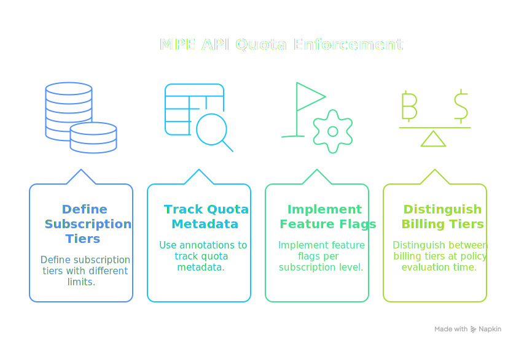
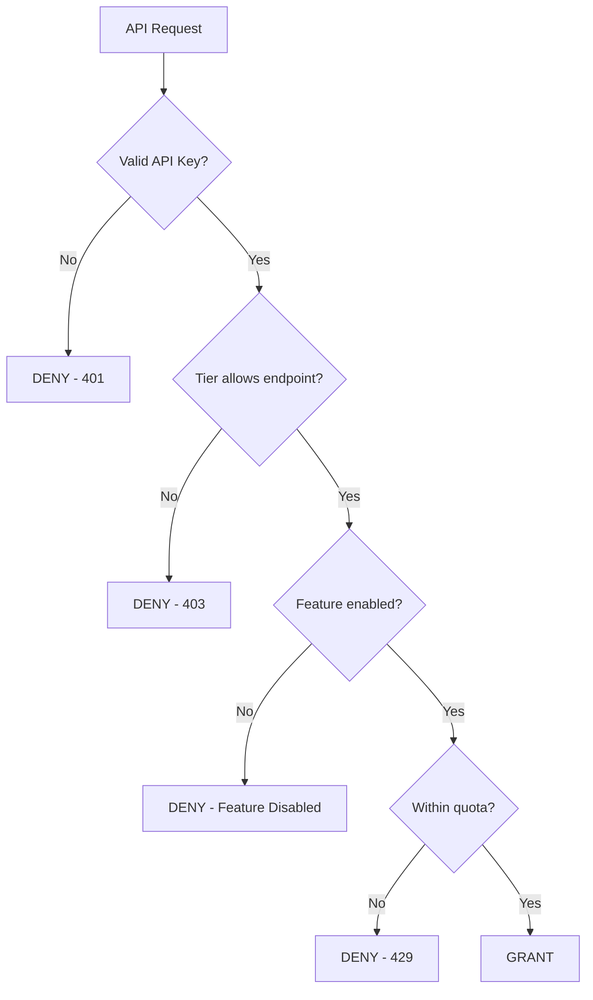

# API Quotas and Rate Limiting

This example demonstrates how to use MPE for API subscription tier enforcement, feature flags, and quota-based access control. While MPE doesn't perform real-time rate limiting (that's typically done at the gateway level), it can enforce policy-level access based on subscription tiers, quotas, and feature entitlements.

<div class="centered-image">

</div>

<SectionHeader icon="version" level={2}>Overview</SectionHeader>

Modern APIs often have tiered access levels:

| Tier | Features | Use Case |
|------|----------|----------|
| **Free** | Basic endpoints, low quotas | Testing, hobby projects |
| **Pro** | More endpoints, higher quotas | Small businesses |
| **Enterprise** | All endpoints, custom quotas | Large organizations |

This PolicyDomain enforces:

- <IconText icon="layers">**Tier-based endpoint access**: Some endpoints only available to paid tiers</IconText>
- <IconText icon="tune">**Feature flags**: Enable/disable features per subscription</IconText>
- <IconText icon="api">**Quota visibility**: Pass quota information to policies</IconText>
- <IconText icon="security">**API key scopes**: Limit what API keys can do</IconText>

<SectionHeader icon="settings" level={2}>Design</SectionHeader>

### Subscription Model

Each API consumer has a subscription with:

- <IconText icon="layers">**Tier**: free, pro, or enterprise</IconText>
- <IconText icon="tune">**Features**: List of enabled feature flags</IconText>
- <IconText icon="api">**Quotas**: Limits for various operations</IconText>
- <IconText icon="security">**API Key Scopes**: Restrictions on individual API keys</IconText>



<SectionHeader icon="security" level={2}>Complete PolicyDomain</SectionHeader>

**[Download PolicyDomain](/examples/api-quotas/policydomain.yml)** | **[Download Test Input](/examples/api-quotas/input.json)**

```yaml
apiVersion: iamlite.manetu.io/v1alpha4
kind: PolicyDomain
metadata:
  name: api-quotas
spec:
  # ============================================================
  # Policy Libraries
  # ============================================================
  policy-libraries:
    - mrn: &lib-tier-helpers "mrn:iam:library:tier-helpers"
      name: tier-helpers
      description: "Subscription tier helper functions"
      rego: |
        package tier_helpers

        import rego.v1

        # Tier hierarchy (higher = more access)
        tier_level("free") := 1
        tier_level("pro") := 2
        tier_level("enterprise") := 3

        # Get principal's tier level
        principal_tier_level(principal) := level if {
            tier := principal.mannotations.subscription_tier
            level := tier_level(tier)
        }

        principal_tier_level(principal) := 0 if {
            not principal.mannotations.subscription_tier
        }

        # Check if principal's tier meets minimum requirement
        has_tier(principal, required_tier) if {
            principal_tier_level(principal) >= tier_level(required_tier)
        }

        # Check if a feature is enabled for this principal
        has_feature(principal, feature_name) if {
            feature_name in principal.mannotations.enabled_features
        }

        # Check quota limits
        within_quota(principal, resource_type, current_usage) if {
            quotas := principal.mannotations.quotas
            limit := quotas[resource_type]
            current_usage < limit
        }

        # For resources without quota tracking
        within_quota(principal, resource_type, current_usage) if {
            not principal.mannotations.quotas[resource_type]
        }

        # Get required tier for an operation based on endpoint patterns
        required_tier_for_operation(operation) := "free" if {
            glob.match("api:basic:*", [], operation)
        }

        required_tier_for_operation(operation) := "pro" if {
            some pattern in {"api:advanced:*", "api:export:*", "api:analytics:*"}
            glob.match(pattern, [], operation)
        }

        required_tier_for_operation(operation) := "enterprise" if {
            some pattern in {"api:enterprise:*", "api:admin:*", "api:bulk:*"}
            glob.match(pattern, [], operation)
        }

        # Default to free tier if no pattern matches
        default required_tier_for_operation(_) := "free"

        # Feature requirements for specific operations
        required_feature("api:export:csv") := "export_csv"
        required_feature("api:export:pdf") := "export_pdf"
        required_feature("api:analytics:realtime") := "realtime_analytics"
        required_feature("api:bulk:import") := "bulk_import"
        required_feature("api:bulk:export") := "bulk_export"

        # Check if operation requires a feature
        requires_feature(operation) if {
            required_feature(operation)
        }

  # ============================================================
  # Policies
  # ============================================================
  policies:
    # Operation phase - validate API key and basic access
    - mrn: &policy-api-auth "mrn:iam:policy:api-auth"
      name: api-auth
      description: "Validate API key presence"
      rego: |
        package authz

        import rego.v1

        # Tri-level: negative=DENY, 0=GRANT, positive=GRANT Override
        # Default deny - only grant if authenticated or public
        default allow = -1

        # Helper: check if this is a public endpoint
        is_public if {
            glob.match("api:public:.*", [], input.operation)
        }

        # Helper: check if request has a valid principal
        has_principal if {
            input.principal != {}
            input.principal.sub != ""
        }

        # Public endpoints bypass auth (grant-override)
        allow = 1 if is_public

        # Grant authenticated requests
        allow = 0 if has_principal

    # Identity phase - check tier access
    - mrn: &policy-tier-access "mrn:iam:policy:tier-access"
      name: tier-access
      description: "Check subscription tier allows endpoint"
      dependencies:
        - *lib-tier-helpers
      rego: |
        package authz

        import rego.v1
        import data.tier_helpers

        default allow = false

        # Allow if principal's tier meets endpoint requirement
        allow if {
            required := tier_helpers.required_tier_for_operation(input.operation)
            tier_helpers.has_tier(input.principal, required)
        }

    # Resource phase - check features and quotas
    - mrn: &policy-feature-check "mrn:iam:policy:feature-check"
      name: feature-check
      description: "Check feature flags and quotas"
      dependencies:
        - *lib-tier-helpers
      rego: |
        package authz

        import rego.v1
        import data.tier_helpers

        default allow = false

        # Allow if operation doesn't require a feature
        allow if {
            not tier_helpers.requires_feature(input.operation)
            check_quota
        }

        # Allow if required feature is enabled
        allow if {
            tier_helpers.requires_feature(input.operation)
            feature := tier_helpers.required_feature(input.operation)
            tier_helpers.has_feature(input.principal, feature)
            check_quota
        }

        # Quota check helper
        check_quota if {
            resource_type := input.resource.annotations.resource_type
            current_usage := input.context.current_usage
            tier_helpers.within_quota(input.principal, resource_type, current_usage)
        }

        check_quota if {
            not input.resource.annotations.resource_type
        }

        check_quota if {
            not input.context.current_usage
        }

    # Scope phase - API key restrictions
    - mrn: &policy-api-key-scope "mrn:iam:policy:api-key-scope"
      name: api-key-scope
      description: "Enforce API key scope restrictions"
      rego: |
        package authz

        import rego.v1

        default allow = false

        # Helper: check if operation is read-only
        is_read_only if {
            some pattern in {"*:read", "*:list", "*:get"}
            glob.match(pattern, [], input.operation)
        }

        # Read-only scope allows read operations
        allow if is_read_only

    # Full access scope policy
    - mrn: &policy-full-access-scope "mrn:iam:policy:full-access-scope"
      name: full-access-scope
      description: "Full API access scope"
      rego: |
        package authz
        default allow = true

  # ============================================================
  # Roles - Subscription tiers
  # ============================================================
  roles:
    - mrn: &role-free-tier "mrn:iam:role:free-tier"
      name: free-tier
      description: "Free tier subscriber"
      policy: *policy-tier-access
      annotations:
        - name: "subscription_tier"
          value: "\"free\""
        - name: "enabled_features"
          value: "[]"
        - name: "quotas"
          value: '{"api_calls": 1000, "storage_mb": 100}'

    - mrn: &role-pro-tier "mrn:iam:role:pro-tier"
      name: pro-tier
      description: "Pro tier subscriber"
      policy: *policy-tier-access
      annotations:
        - name: "subscription_tier"
          value: "\"pro\""
        - name: "enabled_features"
          value: '["export_csv", "realtime_analytics"]'
        - name: "quotas"
          value: '{"api_calls": 100000, "storage_mb": 10000}'

    - mrn: &role-enterprise-tier "mrn:iam:role:enterprise-tier"
      name: enterprise-tier
      description: "Enterprise tier subscriber"
      policy: *policy-tier-access
      annotations:
        - name: "subscription_tier"
          value: "\"enterprise\""
        - name: "enabled_features"
          value: '["export_csv", "export_pdf", "realtime_analytics", "bulk_import", "bulk_export"]'
        - name: "quotas"
          value: '{"api_calls": 10000000, "storage_mb": 1000000}'

  # ============================================================
  # Groups - Example organizations
  # ============================================================
  groups:
    - mrn: "mrn:iam:group:hobby-developers"
      name: hobby-developers
      description: "Hobby/free tier users"
      roles:
        - *role-free-tier

    - mrn: "mrn:iam:group:small-business"
      name: small-business
      description: "Small business pro tier"
      roles:
        - *role-pro-tier
      annotations:
        # Override default quotas for this specific customer
        - name: "quotas"
          value: '{"api_calls": 200000, "storage_mb": 20000}'

    - mrn: "mrn:iam:group:enterprise-customer"
      name: enterprise-customer
      description: "Enterprise tier customer"
      roles:
        - *role-enterprise-tier
      annotations:
        # Enterprise gets custom quota
        - name: "quotas"
          value: '{"api_calls": -1, "storage_mb": -1}'  # -1 = unlimited

  # ============================================================
  # Scopes - API key restrictions
  # ============================================================
  scopes:
    - mrn: "mrn:iam:scope:read-only"
      name: read-only
      description: "Read-only API access"
      policy: *policy-api-key-scope

    - mrn: "mrn:iam:scope:full-access"
      name: full-access
      description: "Full API access"
      policy: *policy-full-access-scope

  # ============================================================
  # Resource Groups
  # ============================================================
  resource-groups:
    - mrn: "mrn:iam:resource-group:api-resources"
      name: api-resources
      description: "Standard API resources"
      default: true
      policy: *policy-feature-check

  # ============================================================
  # Operations
  # ============================================================
  operations:
    - name: all-api-operations
      selector:
        - "api:.*"
      policy: *policy-api-auth
```

<SectionHeader icon="test" level={2}>Test Cases</SectionHeader>

### Test 1: Free Tier Basic Access

A free tier user can access basic endpoints:

```json
{
  "principal": {
    "sub": "user-free-123",
    "mroles": ["mrn:iam:role:free-tier"],
    "mgroups": ["mrn:iam:group:hobby-developers"],
    "mannotations": {
      "subscription_tier": "free",
      "enabled_features": [],
      "quotas": {"api_calls": 1000, "storage_mb": 100}
    }
  },
  "operation": "api:basic:users:list",
  "resource": {
    "id": "mrn:api:users",
    "group": "mrn:iam:resource-group:api-resources"
  },
  "context": {}
}
```

**Expected**: GRANT

### Test 2: Free Tier Advanced Endpoint Denied

A free tier user cannot access pro endpoints:

```json
{
  "principal": {
    "sub": "user-free-123",
    "mroles": ["mrn:iam:role:free-tier"],
    "mgroups": ["mrn:iam:group:hobby-developers"],
    "mannotations": {
      "subscription_tier": "free",
      "enabled_features": [],
      "quotas": {"api_calls": 1000, "storage_mb": 100}
    }
  },
  "operation": "api:advanced:reports:generate",
  "resource": {
    "id": "mrn:api:reports",
    "group": "mrn:iam:resource-group:api-resources"
  },
  "context": {}
}
```

**Expected**: DENY (advanced requires pro tier)

### Test 3: Pro Tier Advanced Access

A pro tier user can access advanced endpoints:

```json
{
  "principal": {
    "sub": "user-pro-456",
    "mroles": ["mrn:iam:role:pro-tier"],
    "mgroups": ["mrn:iam:group:small-business"],
    "mannotations": {
      "subscription_tier": "pro",
      "enabled_features": ["export_csv", "realtime_analytics"],
      "quotas": {"api_calls": 200000, "storage_mb": 20000}
    }
  },
  "operation": "api:advanced:reports:generate",
  "resource": {
    "id": "mrn:api:reports",
    "group": "mrn:iam:resource-group:api-resources"
  },
  "context": {}
}
```

**Expected**: GRANT

### Test 4: Pro Tier Enterprise Endpoint Denied

A pro tier user cannot access enterprise endpoints:

```json
{
  "principal": {
    "sub": "user-pro-456",
    "mroles": ["mrn:iam:role:pro-tier"],
    "mgroups": ["mrn:iam:group:small-business"],
    "mannotations": {
      "subscription_tier": "pro",
      "enabled_features": ["export_csv", "realtime_analytics"],
      "quotas": {"api_calls": 200000, "storage_mb": 20000}
    }
  },
  "operation": "api:admin:users:create",
  "resource": {
    "id": "mrn:api:admin:users",
    "group": "mrn:iam:resource-group:api-resources"
  },
  "context": {}
}
```

**Expected**: DENY (admin requires enterprise tier)

### Test 5: Feature Flag Enabled

A pro user with CSV export feature can export:

```json
{
  "principal": {
    "sub": "user-pro-456",
    "mroles": ["mrn:iam:role:pro-tier"],
    "mgroups": ["mrn:iam:group:small-business"],
    "mannotations": {
      "subscription_tier": "pro",
      "enabled_features": ["export_csv", "realtime_analytics"],
      "quotas": {"api_calls": 200000}
    }
  },
  "operation": "api:export:csv",
  "resource": {
    "id": "mrn:api:export",
    "group": "mrn:iam:resource-group:api-resources"
  },
  "context": {}
}
```

**Expected**: GRANT (export_csv feature is enabled)

### Test 6: Feature Flag Disabled

A pro user without PDF export feature cannot export PDF:

```json
{
  "principal": {
    "sub": "user-pro-456",
    "mroles": ["mrn:iam:role:pro-tier"],
    "mgroups": ["mrn:iam:group:small-business"],
    "mannotations": {
      "subscription_tier": "pro",
      "enabled_features": ["export_csv", "realtime_analytics"],
      "quotas": {"api_calls": 200000}
    }
  },
  "operation": "api:export:pdf",
  "resource": {
    "id": "mrn:api:export",
    "group": "mrn:iam:resource-group:api-resources"
  },
  "context": {}
}
```

**Expected**: DENY (export_pdf feature not enabled for pro)

### Test 7: Within Quota

A user within their quota can proceed:

```json
{
  "principal": {
    "sub": "user-pro-456",
    "mroles": ["mrn:iam:role:pro-tier"],
    "mgroups": ["mrn:iam:group:small-business"],
    "mannotations": {
      "subscription_tier": "pro",
      "enabled_features": ["export_csv"],
      "quotas": {"api_calls": 200000, "storage_mb": 20000}
    }
  },
  "operation": "api:basic:data:read",
  "resource": {
    "id": "mrn:api:data",
    "group": "mrn:iam:resource-group:api-resources",
    "annotations": {
      "resource_type": "api_calls"
    }
  },
  "context": {
    "current_usage": 50000
  }
}
```

**Expected**: GRANT (50000 < 200000 quota)

### Test 8: Over Quota

A user over their quota is denied:

```json
{
  "principal": {
    "sub": "user-free-123",
    "mroles": ["mrn:iam:role:free-tier"],
    "mgroups": ["mrn:iam:group:hobby-developers"],
    "mannotations": {
      "subscription_tier": "free",
      "enabled_features": [],
      "quotas": {"api_calls": 1000, "storage_mb": 100}
    }
  },
  "operation": "api:basic:data:read",
  "resource": {
    "id": "mrn:api:data",
    "group": "mrn:iam:resource-group:api-resources",
    "annotations": {
      "resource_type": "api_calls"
    }
  },
  "context": {
    "current_usage": 1500
  }
}
```

**Expected**: DENY (1500 >= 1000 quota)

### Test 9: Enterprise Full Access

An enterprise user has access to everything:

```json
{
  "principal": {
    "sub": "user-enterprise-789",
    "mroles": ["mrn:iam:role:enterprise-tier"],
    "mgroups": ["mrn:iam:group:enterprise-customer"],
    "mannotations": {
      "subscription_tier": "enterprise",
      "enabled_features": ["export_csv", "export_pdf", "realtime_analytics", "bulk_import", "bulk_export"],
      "quotas": {"api_calls": -1, "storage_mb": -1}
    }
  },
  "operation": "api:admin:users:create",
  "resource": {
    "id": "mrn:api:admin:users",
    "group": "mrn:iam:resource-group:api-resources"
  },
  "context": {}
}
```

**Expected**: GRANT (enterprise has access to all endpoints)

### Test 10: Public Endpoint No Auth

Public endpoints work without authentication:

```json
{
  "principal": {},
  "operation": "api:public:health:check",
  "resource": {
    "id": "mrn:api:health",
    "group": "mrn:iam:resource-group:api-resources"
  },
  "context": {}
}
```

**Expected**: GRANT (public endpoints use tri-level override)

### Test 11: Read-Only API Key Scope

An API key with read-only scope cannot write:

```json
{
  "principal": {
    "sub": "user-pro-456",
    "mroles": ["mrn:iam:role:pro-tier"],
    "mgroups": ["mrn:iam:group:small-business"],
    "scopes": ["mrn:iam:scope:read-only"],
    "mannotations": {
      "subscription_tier": "pro",
      "enabled_features": ["export_csv"],
      "quotas": {"api_calls": 200000}
    }
  },
  "operation": "api:basic:data:create",
  "resource": {
    "id": "mrn:api:data",
    "group": "mrn:iam:resource-group:api-resources"
  },
  "context": {}
}
```

**Expected**: DENY (read-only scope blocks write operations)

<SectionHeader icon="version" level={2}>Key Concepts Demonstrated</SectionHeader>

### <IconText icon="layers">1. Tier-Based Endpoint Access</IconText>

Operations are mapped to minimum tier requirements using individual rules:

```rego
required_tier_for_operation(operation) := "free" if {
    glob.match("api:basic:*", [], operation)
}

required_tier_for_operation(operation) := "pro" if {
    some pattern in {"api:advanced:*", "api:export:*", "api:analytics:*"}
    glob.match(pattern, [], operation)
}

required_tier_for_operation(operation) := "enterprise" if {
    some pattern in {"api:enterprise:*", "api:admin:*", "api:bulk:*"}
    glob.match(pattern, [], operation)
}

# Default to free tier if no pattern matches
default required_tier_for_operation(_) := "free"
```

### <IconText icon="tune">2. Feature Flags</IconText>

Specific operations require specific features to be enabled:

```rego
required_feature("api:export:pdf") := "export_pdf"
required_feature("api:export:csv") := "export_csv"
```

The policy checks if the feature is in the principal's enabled_features list.

### <IconText icon="api">3. Quota Checking</IconText>

Usage is passed in the context and compared against limits:

```rego
within_quota(principal, resource_type, current_usage) if {
    quotas := principal.mannotations.quotas
    limit := quotas[resource_type]
    current_usage < limit
}
```

### <IconText icon="security">4. API Key Scopes</IconText>

Scopes provide an additional restriction layer with DRY helper functions:

```rego
# Helper: check if operation is read-only
is_read_only if {
    some pattern in {"*:read", "*:list", "*:get"}
    glob.match(pattern, [], input.operation)
}

# Read-only scope allows read operations
allow if is_read_only
```

### <IconText icon="inventory">5. Annotation Inheritance</IconText>

Groups can override role-level quotas:

```yaml
groups:
  - mrn: "mrn:iam:group:small-business"
    annotations:
      - name: "quotas"
        value: '{"api_calls": 200000}'  # Overrides role default
```

<SectionHeader icon="build" level={2}>Extending This Example</SectionHeader>

### Adding Burst Limits

Incorporate burst limit checking into your quota policy:

```rego
within_burst_limit(principal, context) if {
    burst_limit := principal.mannotations.burst_limit
    context.requests_last_minute < burst_limit
}

# Then use in your allow rule:
allow if {
    # ... other checks ...
    within_burst_limit(input.principal, input.context)
}
```

### Soft Quota Warnings

To warn users approaching their quota limit, handle this at the application layer. The policy can enforce a hard limit, while your API gateway or application tracks usage and returns warning headers (e.g., `X-RateLimit-Remaining`) before the policy denies access.
