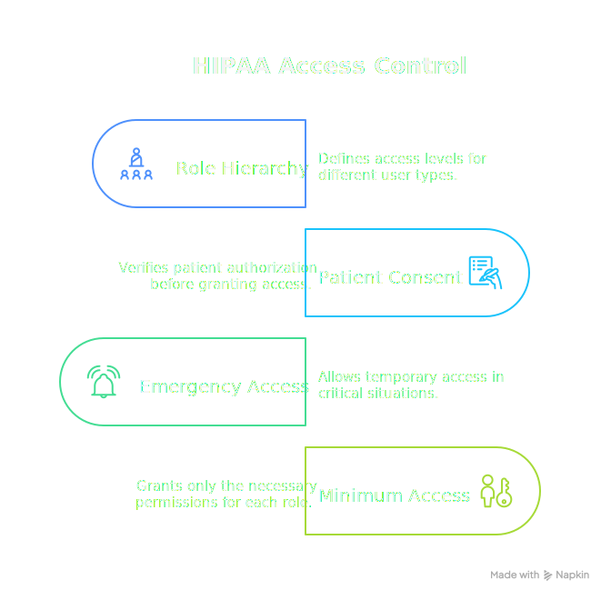
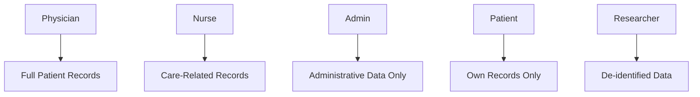

# Healthcare Data Access (HIPAA)

This example models HIPAA-compliant access control for electronic health records (EHR). It demonstrates role-based access, patient consent management, the minimum necessary principle, and break-glass emergency procedures.

<div class="centered-image">

</div>

<SectionHeader icon="version" level={2}>Overview</SectionHeader>

HIPAA (Health Insurance Portability and Accountability Act) requires healthcare organizations to implement strict access controls:

| HIPAA Requirement | Implementation |
|-------------------|----------------|
| **Minimum Necessary** | Only access data required for job function |
| **Role-Based Access** | Physicians, nurses, admins have different access |
| **Patient Consent** | Patients can restrict access to their records |
| **Break-Glass** | Emergency access with audit trail |
| **Audit Trail** | All access decisions logged |

<SectionHeader icon="settings" level={2}>Design</SectionHeader>

### Healthcare Role Hierarchy



### Record Sensitivity Levels

| Level | Examples | Who Can Access |
|-------|----------|----------------|
| **Administrative** | Demographics, insurance | Admin, Nurse, Physician |
| **Clinical** | Vitals, medications | Nurse, Physician |
| **Sensitive** | Mental health, HIV, substance abuse | Physician (with consent) |
| **Restricted** | Psychiatric notes, genetic data | Attending physician only |

<SectionHeader icon="security" level={2}>Complete PolicyDomain <a href="healthcare-hipaa/policydomain.yml" download title="Download policydomain.yml"><IconText icon="download" /></a></SectionHeader>

```yaml
apiVersion: iamlite.manetu.io/v1alpha4
kind: PolicyDomain
metadata:
  name: healthcare-hipaa
spec:
  # ============================================================
  # Policy Libraries
  # ============================================================
  policy-libraries:
    - mrn: &lib-utils "mrn:iam:library:utils"
      name: utils
      description: "Common utility functions"
      rego: |
        package utils

        import rego.v1

        # Check if request has a valid principal (authenticated)
        has_principal if {
            input.principal != {}
            input.principal.sub != ""
        }

    - mrn: &lib-hipaa-helpers "mrn:iam:library:hipaa-helpers"
      name: hipaa-helpers
      description: "HIPAA compliance helper functions"
      rego: |
        package hipaa_helpers

        import rego.v1

        # Sensitivity levels (higher = more restricted)
        sensitivity_level("administrative") := 1
        sensitivity_level("clinical") := 2
        sensitivity_level("sensitive") := 3
        sensitivity_level("restricted") := 4

        # Role clearance levels
        role_clearance("patient") := 0           # Own records only
        role_clearance("admin") := 1             # Administrative only
        role_clearance("researcher") := 1        # De-identified only
        role_clearance("nurse") := 2             # Up to clinical
        role_clearance("physician") := 3         # Up to sensitive (with consent)
        role_clearance("attending-physician") := 4  # Full access to assigned patients

        # Get highest clearance from principal's roles
        max_clearance(principal) := max_level if {
            levels := [level |
                some role in principal.mroles
                # Extract role name from MRN
                parts := split(role, ":")
                role_name := parts[count(parts) - 1]
                level := role_clearance(role_name)
            ]
            max_level := max(levels)
        }

        # Default if no roles match
        max_clearance(principal) := 0 if {
            count([role |
                some role in principal.mroles
                parts := split(role, ":")
                role_name := parts[count(parts) - 1]
                role_clearance(role_name)
            ]) == 0
        }

        # Check if principal is the patient (accessing own records)
        is_own_record(principal, resource) if {
            principal.mannotations.patient_id == resource.annotations.patient_id
        }

        # Check if principal is the attending physician
        is_attending_physician(principal, resource) if {
            principal.sub in resource.annotations.attending_physicians
        }

        # Check if principal is on the care team
        is_care_team_member(principal, resource) if {
            principal.sub in resource.annotations.care_team
        }

        # Check if patient has consented to this access
        has_patient_consent(principal, resource) if {
            # No consent restrictions on this record
            not resource.annotations.consent_required
        }

        has_patient_consent(principal, resource) if {
            # Consent is required and granted
            resource.annotations.consent_required == true
            principal.sub in resource.annotations.consented_providers
        }

        has_patient_consent(principal, resource) if {
            # Patient accessing own records doesn't need consent
            is_own_record(principal, resource)
        }

        # Check if this is a break-glass emergency access
        is_break_glass(context) if {
            context.break_glass == true
            context.emergency_reason != ""
        }

        # Determine required operation type
        is_read_operation(operation) if {
            endswith(operation, ":read")
        }

        is_read_operation(operation) if {
            endswith(operation, ":view")
        }

        is_read_operation(operation) if {
            endswith(operation, ":list")
        }

        is_write_operation(operation) if {
            endswith(operation, ":update")
        }

        is_write_operation(operation) if {
            endswith(operation, ":create")
        }

        is_write_operation(operation) if {
            endswith(operation, ":amend")
        }

  # ============================================================
  # Policies
  # ============================================================
  policies:
    # Operation phase - require authentication and log access
    - mrn: &policy-require-auth "mrn:iam:policy:require-auth"
      name: require-auth
      description: "Require authentication for PHI access"
      dependencies:
        - *lib-utils
      rego: |
        package authz

        import rego.v1
        import data.utils

        # Tri-level: negative=DENY, 0=GRANT, positive=GRANT Override
        # Default deny - only grant if authenticated
        default allow = -1

        # Grant authenticated requests
        allow = 0 if utils.has_principal

    # Identity phase - healthcare staff access
    - mrn: &policy-healthcare-staff "mrn:iam:policy:healthcare-staff"
      name: healthcare-staff
      description: "Allow healthcare staff to proceed"
      dependencies:
        - *lib-utils
      rego: |
        package authz

        import rego.v1
        import data.utils

        default allow = false

        # Allow authenticated healthcare staff
        allow if utils.has_principal

    # Resource phase - patient records access with HIPAA rules
    - mrn: &policy-phi-access "mrn:iam:policy:phi-access"
      name: phi-access
      description: "HIPAA-compliant PHI access control"
      dependencies:
        - *lib-hipaa-helpers
      rego: |
        package authz

        import rego.v1
        import data.hipaa_helpers

        default allow = false

        # Rule 1: Patients can always access their own records
        allow if {
            hipaa_helpers.is_own_record(input.principal, input.resource)
            hipaa_helpers.is_read_operation(input.operation)
        }

        # Rule 2: Break-glass emergency access (logged separately)
        allow if {
            hipaa_helpers.is_break_glass(input.context)
            hipaa_helpers.is_read_operation(input.operation)
            # Any licensed provider can use break-glass
            hipaa_helpers.max_clearance(input.principal) >= 2
        }

        # Rule 3: Attending physician has full access to assigned patients
        allow if {
            hipaa_helpers.is_attending_physician(input.principal, input.resource)
        }

        # Rule 4: Care team access based on sensitivity
        allow if {
            hipaa_helpers.is_care_team_member(input.principal, input.resource)
            clearance := hipaa_helpers.max_clearance(input.principal)
            record_sensitivity := hipaa_helpers.sensitivity_level(input.resource.annotations.sensitivity)
            clearance >= record_sensitivity
            hipaa_helpers.has_patient_consent(input.principal, input.resource)
        }

        # Rule 5: Standard access based on role clearance (non-care-team)
        allow if {
            not hipaa_helpers.is_care_team_member(input.principal, input.resource)
            clearance := hipaa_helpers.max_clearance(input.principal)
            record_sensitivity := hipaa_helpers.sensitivity_level(input.resource.annotations.sensitivity)
            # Non-care-team can only access administrative data
            record_sensitivity <= 1
            clearance >= record_sensitivity
        }

    # Resource phase - administrative records (less restricted)
    - mrn: &policy-admin-records "mrn:iam:policy:admin-records"
      name: admin-records
      description: "Administrative record access"
      rego: |
        package authz

        import rego.v1

        default allow = false

        # Admin staff can access administrative records
        allow if {
            "mrn:iam:role:admin" in input.principal.mroles
        }

        # Clinical staff can also read admin records
        allow if {
            some role in input.principal.mroles
            role in {"mrn:iam:role:nurse", "mrn:iam:role:physician", "mrn:iam:role:attending-physician"}
        }

    # Resource phase - de-identified research data
    - mrn: &policy-research-data "mrn:iam:policy:research-data"
      name: research-data
      description: "De-identified research data access"
      rego: |
        package authz

        import rego.v1

        default allow = false

        # Researchers can access de-identified data
        allow if {
            "mrn:iam:role:researcher" in input.principal.mroles
            input.resource.annotations.de_identified == true
        }

        # IRB-approved research with patient consent
        allow if {
            "mrn:iam:role:researcher" in input.principal.mroles
            input.principal.mannotations.irb_approved == true
            input.resource.annotations.research_consent == true
        }

    # Resource phase - prescription/medication access
    - mrn: &policy-prescription-access "mrn:iam:policy:prescription-access"
      name: prescription-access
      description: "Prescription and medication access"
      dependencies:
        - *lib-hipaa-helpers
      rego: |
        package authz

        import rego.v1
        import data.hipaa_helpers

        default allow = false

        # Physicians can read and write prescriptions for their patients
        allow if {
            "mrn:iam:role:physician" in input.principal.mroles
            hipaa_helpers.is_care_team_member(input.principal, input.resource)
        }

        allow if {
            "mrn:iam:role:attending-physician" in input.principal.mroles
            hipaa_helpers.is_attending_physician(input.principal, input.resource)
        }

        # Nurses can read prescriptions for care team patients
        allow if {
            "mrn:iam:role:nurse" in input.principal.mroles
            hipaa_helpers.is_care_team_member(input.principal, input.resource)
            hipaa_helpers.is_read_operation(input.operation)
        }

        # Pharmacists can read prescriptions
        allow if {
            "mrn:iam:role:pharmacist" in input.principal.mroles
            hipaa_helpers.is_read_operation(input.operation)
        }

  # ============================================================
  # Roles
  # ============================================================
  roles:
    - mrn: &role-patient "mrn:iam:role:patient"
      name: patient
      description: "Patient accessing own records"
      policy: *policy-healthcare-staff

    - mrn: &role-admin "mrn:iam:role:admin"
      name: admin
      description: "Administrative staff"
      policy: *policy-healthcare-staff

    - mrn: &role-nurse "mrn:iam:role:nurse"
      name: nurse
      description: "Registered nurse"
      policy: *policy-healthcare-staff

    - mrn: &role-physician "mrn:iam:role:physician"
      name: physician
      description: "Licensed physician"
      policy: *policy-healthcare-staff

    - mrn: &role-attending-physician "mrn:iam:role:attending-physician"
      name: attending-physician
      description: "Attending physician with full patient responsibility"
      policy: *policy-healthcare-staff

    - mrn: &role-researcher "mrn:iam:role:researcher"
      name: researcher
      description: "Medical researcher"
      policy: *policy-healthcare-staff

    - mrn: &role-pharmacist "mrn:iam:role:pharmacist"
      name: pharmacist
      description: "Licensed pharmacist"
      policy: *policy-healthcare-staff

  # ============================================================
  # Groups
  # ============================================================
  groups:
    - mrn: "mrn:iam:group:clinical-staff"
      name: clinical-staff
      description: "All clinical staff"
      roles:
        - *role-nurse
        - *role-physician

    - mrn: "mrn:iam:group:attending-physicians"
      name: attending-physicians
      description: "Attending physicians"
      roles:
        - *role-attending-physician
        - *role-physician

    - mrn: "mrn:iam:group:research-team"
      name: research-team
      description: "Research department"
      roles:
        - *role-researcher
      annotations:
        - name: "irb_approved"
          value: "true"

  # ============================================================
  # Resource Groups
  # ============================================================
  resource-groups:
    - mrn: "mrn:iam:resource-group:phi"
      name: phi
      description: "Protected Health Information"
      default: true
      policy: *policy-phi-access

    - mrn: "mrn:iam:resource-group:admin-records"
      name: admin-records
      description: "Administrative records"
      policy: *policy-admin-records

    - mrn: "mrn:iam:resource-group:research-data"
      name: research-data
      description: "Research datasets"
      policy: *policy-research-data

    - mrn: "mrn:iam:resource-group:prescriptions"
      name: prescriptions
      description: "Prescription records"
      policy: *policy-prescription-access

  # ============================================================
  # Resources - Route by type
  # ============================================================
  resources:
    - name: administrative
      selector:
        - "mrn:ehr:.*:demographics:.*"
        - "mrn:ehr:.*:insurance:.*"
        - "mrn:ehr:.*:scheduling:.*"
      group: "mrn:iam:resource-group:admin-records"

    - name: prescriptions
      selector:
        - "mrn:ehr:.*:prescription:.*"
        - "mrn:ehr:.*:medication:.*"
      group: "mrn:iam:resource-group:prescriptions"

    - name: research
      selector:
        - "mrn:research:.*"
      group: "mrn:iam:resource-group:research-data"

  # ============================================================
  # Operations
  # ============================================================
  operations:
    - name: all-operations
      selector:
        - ".*"
      policy: *policy-require-auth
```

<SectionHeader icon="test" level={2}>Test Cases</SectionHeader>

### Test 1: Patient Can Read Own Records <a href="healthcare-hipaa/input-1-patient-own.json" download title="Download input-1-patient-own.json"><IconText icon="download" /></a>

A patient can view their own medical records:

```json
{
  "principal": {
    "sub": "patient-12345",
    "mroles": ["mrn:iam:role:patient"],
    "mgroups": [],
    "mannotations": {
      "patient_id": "patient-12345"
    }
  },
  "operation": "record:read",
  "resource": {
    "id": "mrn:ehr:hospital:record:patient-12345:lab-results",
    "group": "mrn:iam:resource-group:phi",
    "annotations": {
      "patient_id": "patient-12345",
      "sensitivity": "clinical",
      "care_team": ["dr-smith", "nurse-jones"],
      "attending_physicians": ["dr-smith"]
    }
  },
  "context": {}
}
```

**Expected**: <DecisionChip decision="grant" /> (patient accessing own records)

### Test 2: Attending Physician Full Access <a href="healthcare-hipaa/input-2-attending-full.json" download title="Download input-2-attending-full.json"><IconText icon="download" /></a>

The attending physician can access all patient data:

```json
{
  "principal": {
    "sub": "dr-smith",
    "mroles": ["mrn:iam:role:attending-physician"],
    "mgroups": ["mrn:iam:group:attending-physicians"],
    "mannotations": {}
  },
  "operation": "record:read",
  "resource": {
    "id": "mrn:ehr:hospital:record:patient-12345:psychiatric-notes",
    "group": "mrn:iam:resource-group:phi",
    "annotations": {
      "patient_id": "patient-12345",
      "sensitivity": "restricted",
      "care_team": ["dr-smith", "nurse-jones"],
      "attending_physicians": ["dr-smith"]
    }
  },
  "context": {}
}
```

**Expected**: <DecisionChip decision="grant" /> (attending physician has full access)

### Test 3: Nurse Care Team Clinical Access <a href="healthcare-hipaa/input-3-nurse-clinical.json" download title="Download input-3-nurse-clinical.json"><IconText icon="download" /></a>

A nurse on the care team can access clinical records:

```json
{
  "principal": {
    "sub": "nurse-jones",
    "mroles": ["mrn:iam:role:nurse"],
    "mgroups": ["mrn:iam:group:clinical-staff"],
    "mannotations": {}
  },
  "operation": "vitals:read",
  "resource": {
    "id": "mrn:ehr:hospital:record:patient-12345:vitals",
    "group": "mrn:iam:resource-group:phi",
    "annotations": {
      "patient_id": "patient-12345",
      "sensitivity": "clinical",
      "care_team": ["dr-smith", "nurse-jones"],
      "attending_physicians": ["dr-smith"]
    }
  },
  "context": {}
}
```

**Expected**: <DecisionChip decision="grant" /> (nurse has clinical clearance)

### Test 4: Nurse Cannot Access Sensitive Records <a href="healthcare-hipaa/input-4-nurse-sensitive-denied.json" download title="Download input-4-nurse-sensitive-denied.json"><IconText icon="download" /></a>

A nurse cannot access sensitive records without consent:

```json
{
  "principal": {
    "sub": "nurse-jones",
    "mroles": ["mrn:iam:role:nurse"],
    "mgroups": ["mrn:iam:group:clinical-staff"],
    "mannotations": {}
  },
  "operation": "record:read",
  "resource": {
    "id": "mrn:ehr:hospital:record:patient-12345:mental-health",
    "group": "mrn:iam:resource-group:phi",
    "annotations": {
      "patient_id": "patient-12345",
      "sensitivity": "sensitive",
      "care_team": ["dr-smith", "nurse-jones"],
      "attending_physicians": ["dr-smith"],
      "consent_required": true,
      "consented_providers": ["dr-smith"]
    }
  },
  "context": {}
}
```

**Expected**: <DecisionChip decision="deny" /> (nurse clearance < sensitive, and no consent)

### Test 5: Non-Care-Team Physician Limited Access <a href="healthcare-hipaa/input-5-non-careteam-denied.json" download title="Download input-5-non-careteam-denied.json"><IconText icon="download" /></a>

A physician not on the care team can only access administrative data:

```json
{
  "principal": {
    "sub": "dr-other",
    "mroles": ["mrn:iam:role:physician"],
    "mgroups": ["mrn:iam:group:clinical-staff"],
    "mannotations": {}
  },
  "operation": "record:read",
  "resource": {
    "id": "mrn:ehr:hospital:record:patient-12345:lab-results",
    "group": "mrn:iam:resource-group:phi",
    "annotations": {
      "patient_id": "patient-12345",
      "sensitivity": "clinical",
      "care_team": ["dr-smith", "nurse-jones"],
      "attending_physicians": ["dr-smith"]
    }
  },
  "context": {}
}
```

**Expected**: <DecisionChip decision="deny" /> (not on care team, record is clinical not administrative)

### Test 6: Break-Glass Emergency Access <a href="healthcare-hipaa/input-6-break-glass.json" download title="Download input-6-break-glass.json"><IconText icon="download" /></a>

Any licensed provider can use break-glass access:

```json
{
  "principal": {
    "sub": "dr-emergency",
    "mroles": ["mrn:iam:role:physician"],
    "mgroups": ["mrn:iam:group:clinical-staff"],
    "mannotations": {}
  },
  "operation": "record:read",
  "resource": {
    "id": "mrn:ehr:hospital:record:patient-12345:allergies",
    "group": "mrn:iam:resource-group:phi",
    "annotations": {
      "patient_id": "patient-12345",
      "sensitivity": "clinical",
      "care_team": ["dr-smith"],
      "attending_physicians": ["dr-smith"]
    }
  },
  "context": {
    "break_glass": true,
    "emergency_reason": "Patient unconscious in ER, need allergy history"
  }
}
```

**Expected**: <DecisionChip decision="grant" /> (break-glass access for emergency)

### Test 7: Researcher De-identified Access <a href="healthcare-hipaa/input-7-researcher-deidentified.json" download title="Download input-7-researcher-deidentified.json"><IconText icon="download" /></a>

A researcher can access de-identified data:

```json
{
  "principal": {
    "sub": "researcher-jane",
    "mroles": ["mrn:iam:role:researcher"],
    "mgroups": ["mrn:iam:group:research-team"],
    "mannotations": {
      "irb_approved": true
    }
  },
  "operation": "dataset:read",
  "resource": {
    "id": "mrn:research:study-123:dataset:outcomes",
    "group": "mrn:iam:resource-group:research-data",
    "annotations": {
      "de_identified": true
    }
  },
  "context": {}
}
```

**Expected**: <DecisionChip decision="grant" /> (researcher accessing de-identified data)

### Test 8: Researcher Cannot Access Identified Data <a href="healthcare-hipaa/input-8-researcher-phi-denied.json" download title="Download input-8-researcher-phi-denied.json"><IconText icon="download" /></a>

A researcher cannot access identified patient data:

```json
{
  "principal": {
    "sub": "researcher-jane",
    "mroles": ["mrn:iam:role:researcher"],
    "mgroups": ["mrn:iam:group:research-team"],
    "mannotations": {
      "irb_approved": true
    }
  },
  "operation": "record:read",
  "resource": {
    "id": "mrn:ehr:hospital:record:patient-12345:lab-results",
    "group": "mrn:iam:resource-group:phi",
    "annotations": {
      "patient_id": "patient-12345",
      "sensitivity": "clinical",
      "care_team": ["dr-smith"],
      "attending_physicians": ["dr-smith"]
    }
  },
  "context": {}
}
```

**Expected**: <DecisionChip decision="deny" /> (researcher cannot access PHI)

### Test 9: Admin Can Access Demographics <a href="healthcare-hipaa/input-9-admin-demographics.json" download title="Download input-9-admin-demographics.json"><IconText icon="download" /></a>

An admin can access administrative records:

```json
{
  "principal": {
    "sub": "admin-mary",
    "mroles": ["mrn:iam:role:admin"],
    "mgroups": [],
    "mannotations": {}
  },
  "operation": "demographics:read",
  "resource": {
    "id": "mrn:ehr:hospital:demographics:patient-12345",
    "group": "mrn:iam:resource-group:admin-records",
    "annotations": {
      "patient_id": "patient-12345"
    }
  },
  "context": {}
}
```

**Expected**: <DecisionChip decision="grant" /> (admin accessing administrative records)

<SectionHeader icon="version" level={2}>Key Concepts Demonstrated</SectionHeader>

### <IconText icon="layers">1. Sensitivity-Based Clearance</IconText>

Records have sensitivity levels, and roles have clearance levels. Access is granted when clearance >= sensitivity:

```rego
clearance := hipaa_helpers.max_clearance(input.principal)
record_sensitivity := hipaa_helpers.sensitivity_level(input.resource.annotations.sensitivity)
clearance >= record_sensitivity
```

### <IconText icon="group">2. Care Team Relationship</IconText>

Access decisions consider whether the provider is on the patient's care team:

```rego
is_care_team_member(principal, resource) if {
    principal.sub in resource.annotations.care_team
}
```

### <IconText icon="gavel">3. Patient Consent Tracking</IconText>

Sensitive records require explicit patient consent:

```rego
has_patient_consent(principal, resource) if {
    resource.annotations.consent_required == true
    principal.sub in resource.annotations.consented_providers
}
```

### <IconText icon="flash">4. Break-Glass Emergency Override</IconText>

Emergency access bypasses normal rules but requires documentation:

```rego
allow if {
    hipaa_helpers.is_break_glass(input.context)
    hipaa_helpers.is_read_operation(input.operation)
    hipaa_helpers.max_clearance(input.principal) >= 2
}
```

### <IconText icon="lock">5. Minimum Necessary Principle</IconText>

Non-care-team members can only access administrative data, enforcing minimum necessary access.

<SectionHeader icon="build" level={2}>Extending This Example</SectionHeader>

### Adding Audit Annotations

Track access for compliance reporting:

```rego
audit_metadata := {
    "access_type": access_type,
    "break_glass": hipaa_helpers.is_break_glass(input.context),
    "care_team_member": hipaa_helpers.is_care_team_member(input.principal, input.resource),
    "sensitivity_level": input.resource.annotations.sensitivity
}
```

### Adding Time-Based Consent

Implement consent expiration:

```rego
consent_valid if {
    consent_expires := time.parse_rfc3339_ns(input.resource.annotations.consent_expires)
    consent_expires > time.now_ns()
}
```

### Adding Purpose of Use

Require providers to specify why they need access:

```rego
valid_purpose if {
    input.context.purpose_of_use in {"treatment", "payment", "operations"}
}
```
