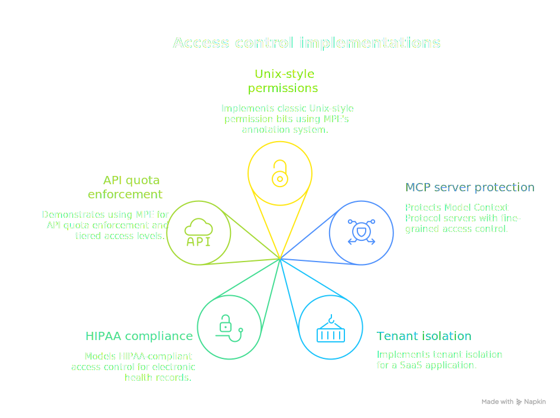

# Examples

This section contains complete, production-ready examples demonstrating the power and flexibility of the Manetu PolicyEngine. Each example includes:

- <IconText icon="gavel">A **complete PolicyDomain** definition with all necessary policies, roles, groups, and resource groups</IconText>
- <IconText icon="test">**Test cases** that you can run with `mpe test decision` to verify behavior</IconText>
- <IconText icon="school">**Detailed explanations** of the design decisions and patterns used</IconText>

<SectionHeader icon="storage" level={2}>Featured Examples</SectionHeader>

<div class="centered-image">

</div>

### <IconText icon="folder">[Unix Filesystem Permissions](/examples/unix-filesystem)</IconText>

Implements classic Unix-style permission bits (read/write for owner/group/other) using MPE's annotation system. Demonstrates how to:

- <IconText icon="inventory">Use resource annotations to store permission bits</IconText>
- <IconText icon="badge">Compare principal identity against resource ownership</IconText>
- <IconText icon="group">Check group membership for group-level permissions</IconText>
- <IconText icon="layers">Fall back to "other" permissions for unrelated principals</IconText>

### <IconText icon="extension">[MCP Server Access Control](/examples/mcp-server)</IconText>

Protects Model Context Protocol (MCP) servers with fine-grained access control for both metadata operations (`tool:list`, `prompt:list`) and data-path operations (`tool:call`, `resource:read`). Demonstrates:

- <IconText icon="play">Operation-based routing for different API endpoints</IconText>
- <IconText icon="tune">Tool-level permissions using annotations</IconText>
- <IconText icon="settings">Server registration and discovery controls</IconText>

### <IconText icon="business">[Multi-Tenant SaaS](/examples/multi-tenant-saas)</IconText>

Implements tenant isolation for a SaaS application where users belong to organizations and can only access resources within their tenant. Features:

- <IconText icon="security">Strict tenant boundary enforcement</IconText>
- <IconText icon="badge">Cross-tenant admin access for support teams</IconText>
- <IconText icon="group">Organization-based group membership</IconText>
- <IconText icon="folder">Tenant-scoped resource groups</IconText>

### <IconText icon="security">[Healthcare Data Access (HIPAA)](/examples/healthcare-hipaa)</IconText>

Models HIPAA-compliant access control for electronic health records (EHR) with role-based access, patient consent, and break-glass emergency procedures. Includes:

- <IconText icon="layers">Role hierarchy (physician, nurse, admin, patient)</IconText>
- <IconText icon="gavel">Patient consent checking via resource annotations</IconText>
- <IconText icon="flash">Break-glass emergency access with audit flags</IconText>
- <IconText icon="lock">Minimum necessary access principle</IconText>

### <IconText icon="api">[API Quotas and Rate Limiting](/examples/api-quotas)</IconText>

Demonstrates using MPE for API quota enforcement and tiered access levels. Shows how to:

- <IconText icon="layers">Define subscription tiers with different limits</IconText>
- <IconText icon="inventory">Use annotations to track quota metadata</IconText>
- <IconText icon="tune">Implement feature flags per subscription level</IconText>
- <IconText icon="test">Distinguish between billing tiers at policy evaluation time</IconText>

<SectionHeader icon="terminal" level={2}>Running the Examples</SectionHeader>

Each example includes a complete PolicyDomain YAML file and test input. Download links are available on each example page.

### <IconText icon="lint">1. Validate the PolicyDomain</IconText>

```bash
mpe lint -f policydomain.yml
```

### <IconText icon="test">2. Test Policy Decisions</IconText>

```bash
# Test a specific scenario
mpe test decision -b policydomain.yml -i input.json

# Check just the decision
mpe test decision -b policydomain.yml -i input.json | jq .decision
```

### <IconText icon="code">3. Explore the Full Access Record</IconText>

```bash
# See all policy references and phase evaluations
mpe test decision -b policydomain.yml -i input.json | jq .
```

<SectionHeader icon="build" level={2}>Building Your Own</SectionHeader>

These examples are designed to be starting points. Feel free to:

1. <IconText icon="transform">**Copy and modify** any example to fit your use case</IconText>
2. <IconText icon="extension">**Combine patterns** from multiple examples</IconText>
3. <IconText icon="library">**Extract reusable logic** into [Policy Libraries](/concepts/policy-libraries)</IconText>

For more information on building PolicyDomains, see:

- <IconText icon="rocket">[Creating Your First PolicyDomain](/quick-start/first-policy-domain)</IconText>
- <IconText icon="book">[PolicyDomain Schema Reference](/reference/schema)</IconText>
- <IconText icon="school">[Best Practices](/integration/best-practices)</IconText>
