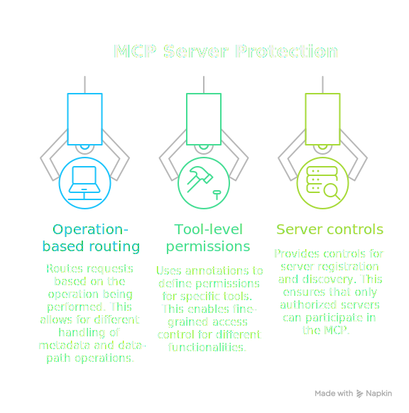
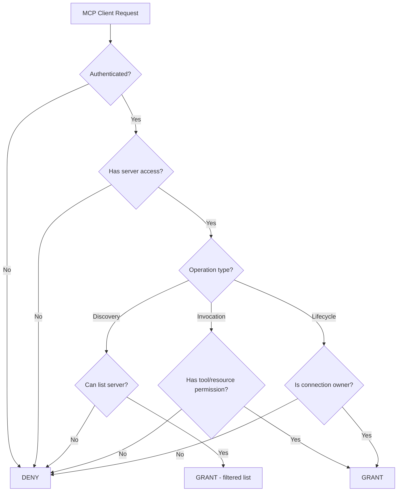

# MCP Server Access Control

This example demonstrates how to implement fine-grained access control for [Model Context Protocol (MCP)](https://modelcontextprotocol.io/) servers. MCP enables AI assistants to interact with external tools and resources, making proper access control essential.

<div class="centered-image">

</div>

<SectionHeader icon="version" level={2}>Overview</SectionHeader>

MCP servers expose several types of operations:

| Category | Operations | Description |
|----------|------------|-------------|
| **Discovery** | `mcp:tool:list`, `mcp:prompt:list`, `mcp:resource:list` | List available capabilities |
| **Invocation** | `mcp:tool:call`, `mcp:prompt:get`, `mcp:resource:read` | Execute tools or read resources |
| **Subscription** | `mcp:resource:subscribe`, `mcp:resource:unsubscribe` | Real-time updates |
| **Lifecycle** | `mcp:server:ping`, `mcp:server:initialize` | Connection management |

This PolicyDomain implements:

- <IconText icon="settings">**Server-level access**: Control which principals can connect to which MCP servers</IconText>
- <IconText icon="tune">**Tool-level permissions**: Fine-grained control over individual tool invocations</IconText>
- <IconText icon="folder">**Resource access**: Control which MCP resources a principal can read</IconText>
- <IconText icon="test">**Discovery restrictions**: Limit what capabilities are visible during listing</IconText>

<SectionHeader icon="settings" level={2}>Design</SectionHeader>

### MCP Resource Naming

We use MRNs to identify MCP entities:

```
mrn:mcp:<server-id>:tool:<tool-name>
mrn:mcp:<server-id>:prompt:<prompt-name>
mrn:mcp:<server-id>:resource:<resource-uri>
```

Examples:
- `mrn:mcp:github:tool:create-issue` — GitHub server's create-issue tool
- `mrn:mcp:filesystem:resource:file:///home/user/docs` — Filesystem resource
- `mrn:mcp:database:tool:query` — Database server's query tool

### Access Model



<SectionHeader icon="security" level={2}>Complete PolicyDomain <a href="mcp-server/policydomain.yml" download title="Download policydomain.yml"><IconText icon="download" /></a></SectionHeader>

```yaml
apiVersion: iamlite.manetu.io/v1alpha4
kind: PolicyDomain
metadata:
  name: mcp-server
spec:
  # ============================================================
  # Policy Libraries
  # ============================================================
  policy-libraries:
    - mrn: &lib-utils "mrn:iam:library:utils"
      name: utils
      description: "Common utility functions"
      rego: |
        package utils

        import rego.v1

        # Check if request has a valid principal (authenticated)
        has_principal if {
            input.principal != {}
            input.principal.sub != ""
        }

    - mrn: &lib-mcp-helpers "mrn:iam:library:mcp-helpers"
      name: mcp-helpers
      description: "MCP access control helper functions"
      rego: |
        package mcp_helpers

        import rego.v1

        # Extract server ID from an MCP MRN
        # mrn:mcp:github:tool:create-issue -> github
        extract_server(mrn) := server if {
            parts := split(mrn, ":")
            parts[0] == "mrn"
            parts[1] == "mcp"
            server := parts[2]
        }

        # Extract entity type from an MCP MRN
        # mrn:mcp:github:tool:create-issue -> tool
        extract_type(mrn) := type if {
            parts := split(mrn, ":")
            parts[0] == "mrn"
            parts[1] == "mcp"
            type := parts[3]
        }

        # Extract entity name from an MCP MRN
        # mrn:mcp:github:tool:create-issue -> create-issue
        extract_name(mrn) := name if {
            parts := split(mrn, ":")
            parts[0] == "mrn"
            parts[1] == "mcp"
            # Join everything after the type
            name := concat(":", array.slice(parts, 4, count(parts)))
        }

        # Check if a principal has access to a specific server
        has_server_access(principal, server_id) if {
            server_mrn := sprintf("mrn:mcp:server:%s", [server_id])
            server_mrn in principal.mannotations.mcp_servers
        }

        # Check if a principal can use a specific tool
        has_tool_access(principal, server_id, tool_name) if {
            # Check wildcard access to all tools on this server
            wildcard := sprintf("mrn:mcp:%s:tool:*", [server_id])
            wildcard in principal.mannotations.mcp_tools
        }

        has_tool_access(principal, server_id, tool_name) if {
            # Check specific tool access
            tool_mrn := sprintf("mrn:mcp:%s:tool:%s", [server_id, tool_name])
            tool_mrn in principal.mannotations.mcp_tools
        }

        # Check if operation is an MCP operation
        is_mcp_operation(operation) if {
            startswith(operation, "mcp:")
        }

        # Check if operation is discovery (listing)
        is_discovery_operation(operation) if {
            endswith(operation, ":list")
        }

        # Check if operation is invocation
        is_invocation_operation(operation) if {
            operation in {"mcp:tool:call", "mcp:prompt:get", "mcp:resource:read", "mcp:resource:subscribe"}
        }

        # Check if operation is lifecycle
        is_lifecycle_operation(operation) if {
            startswith(operation, "mcp:server:")
        }

  # ============================================================
  # Policies
  # ============================================================
  policies:
    # Operation phase - require authentication, allow public server ping
    - mrn: &policy-mcp-operation "mrn:iam:policy:mcp-operation"
      name: mcp-operation
      description: "MCP operation phase policy"
      dependencies:
        - *lib-utils
      rego: |
        package authz

        import rego.v1
        import data.utils

        # Tri-level: negative=DENY, 0=GRANT, positive=GRANT Override
        # Default deny - only grant if authenticated or health check
        default allow = -1

        # Helper: check if this is a public health check
        is_health_check if {
            input.operation == "mcp:server:ping"
        }

        # Health check bypasses auth (grant-override)
        allow = 1 if is_health_check

        # Grant authenticated requests
        allow = 0 if utils.has_principal

    # Identity phase - check principal has MCP access
    - mrn: &policy-mcp-user "mrn:iam:policy:mcp-user"
      name: mcp-user
      description: "Allow principals accessing MCP operations"
      rego: |
        package authz

        import rego.v1

        default allow = false

        # Helper: check if this is an MCP operation
        is_mcp_operation if {
            startswith(input.operation, "mcp:")
        }

        # Allow MCP operations for authenticated users
        # (Authentication was verified in operation phase)
        allow if is_mcp_operation

    # Resource phase - server-level access for discovery
    - mrn: &policy-mcp-server-access "mrn:iam:policy:mcp-server-access"
      name: mcp-server-access
      description: "Check server-level access for MCP discovery operations"
      dependencies:
        - *lib-mcp-helpers
      rego: |
        package authz

        import rego.v1
        import data.mcp_helpers

        default allow = false

        # Allow if principal has access to this server
        allow if {
            server_id := mcp_helpers.extract_server(input.resource.id)
            mcp_helpers.has_server_access(input.principal, server_id)
        }

        # Admin can access any server
        allow if {
            "mrn:iam:role:mcp-admin" in input.principal.mroles
        }

    # Resource phase - tool invocation access
    - mrn: &policy-mcp-tool-access "mrn:iam:policy:mcp-tool-access"
      name: mcp-tool-access
      description: "Check tool-level access for MCP invocations"
      dependencies:
        - *lib-mcp-helpers
      rego: |
        package authz

        import rego.v1
        import data.mcp_helpers

        default allow = false

        # Check specific tool access
        allow if {
            input.operation == "mcp:tool:call"
            server_id := mcp_helpers.extract_server(input.resource.id)
            tool_name := mcp_helpers.extract_name(input.resource.id)
            mcp_helpers.has_tool_access(input.principal, server_id, tool_name)
        }

        # Check resource access for resource operations
        allow if {
            input.operation in {"mcp:resource:read", "mcp:resource:subscribe"}
            server_id := mcp_helpers.extract_server(input.resource.id)
            mcp_helpers.has_server_access(input.principal, server_id)
        }

        # Prompt access follows server access for now
        allow if {
            input.operation == "mcp:prompt:get"
            server_id := mcp_helpers.extract_server(input.resource.id)
            mcp_helpers.has_server_access(input.principal, server_id)
        }

        # Admin can invoke any tool
        allow if {
            "mrn:iam:role:mcp-admin" in input.principal.mroles
        }

    # Resource phase - lifecycle operations
    - mrn: &policy-mcp-lifecycle "mrn:iam:policy:mcp-lifecycle"
      name: mcp-lifecycle
      description: "Check access for MCP lifecycle operations"
      dependencies:
        - *lib-mcp-helpers
      rego: |
        package authz

        import rego.v1
        import data.mcp_helpers

        default allow = false

        # Allow initialize if principal has server access
        allow if {
            input.operation == "mcp:server:initialize"
            server_id := mcp_helpers.extract_server(input.resource.id)
            mcp_helpers.has_server_access(input.principal, server_id)
        }

        # Allow ping for any authenticated user (checked at operation phase)
        allow if {
            input.operation == "mcp:server:ping"
        }

        # Admin can perform any lifecycle operation
        allow if {
            "mrn:iam:role:mcp-admin" in input.principal.mroles
        }

  # ============================================================
  # Roles
  # ============================================================
  roles:
    # Basic MCP user - can access assigned servers and tools
    - mrn: &role-mcp-user "mrn:iam:role:mcp-user"
      name: mcp-user
      description: "Basic MCP access - servers and tools controlled by annotations"
      policy: *policy-mcp-user

    # MCP admin - full access to all servers and tools
    - mrn: &role-mcp-admin "mrn:iam:role:mcp-admin"
      name: mcp-admin
      description: "Full MCP administrative access"
      policy: *policy-mcp-user

    # Read-only MCP user - discovery only
    - mrn: &role-mcp-viewer "mrn:iam:role:mcp-viewer"
      name: mcp-viewer
      description: "Read-only access to MCP servers"
      policy: *policy-mcp-user

  # ============================================================
  # Groups - Organized by team/function
  # ============================================================
  groups:
    # Developers get access to common development tools
    - mrn: "mrn:iam:group:developers"
      name: developers
      description: "Development team with access to dev tools"
      roles:
        - *role-mcp-user
      annotations:
        - name: "mcp_servers"
          value: '["mrn:mcp:server:github", "mrn:mcp:server:filesystem", "mrn:mcp:server:git"]'
        - name: "mcp_tools"
          value: '["mrn:mcp:github:tool:*", "mrn:mcp:filesystem:tool:read_file", "mrn:mcp:filesystem:tool:list_directory", "mrn:mcp:git:tool:*"]'

    # Data analysts get database access
    - mrn: "mrn:iam:group:data-analysts"
      name: data-analysts
      description: "Data team with database access"
      roles:
        - *role-mcp-user
      annotations:
        - name: "mcp_servers"
          value: '["mrn:mcp:server:database", "mrn:mcp:server:analytics"]'
        - name: "mcp_tools"
          value: '["mrn:mcp:database:tool:query", "mrn:mcp:analytics:tool:*"]'

    # Platform team gets full admin access
    - mrn: "mrn:iam:group:platform"
      name: platform
      description: "Platform team with full MCP access"
      roles:
        - *role-mcp-admin
      annotations:
        - name: "mcp_servers"
          value: '["mrn:mcp:server:*"]'
        - name: "mcp_tools"
          value: '["mrn:mcp:*:tool:*"]'

    # Auditors get read-only access
    - mrn: "mrn:iam:group:auditors"
      name: auditors
      description: "Auditors with read-only MCP access"
      roles:
        - *role-mcp-viewer
      annotations:
        - name: "mcp_servers"
          value: '["mrn:mcp:server:github", "mrn:mcp:server:database"]'
        - name: "mcp_tools"
          value: '[]'

  # ============================================================
  # Resource Groups - Categorize MCP entities
  # ============================================================
  resource-groups:
    - mrn: "mrn:iam:resource-group:mcp-tools"
      name: mcp-tools
      description: "MCP tool resources"
      policy: *policy-mcp-tool-access

    - mrn: "mrn:iam:resource-group:mcp-servers"
      name: mcp-servers
      description: "MCP server resources"
      default: true
      policy: *policy-mcp-server-access

    - mrn: "mrn:iam:resource-group:mcp-lifecycle"
      name: mcp-lifecycle
      description: "MCP lifecycle operations"
      policy: *policy-mcp-lifecycle

  # ============================================================
  # Resources - Route MCP entities to resource groups
  # ============================================================
  resources:
    - name: mcp-tools
      description: "Route tool resources"
      selector:
        - "mrn:mcp:.*:tool:.*"
      group: "mrn:iam:resource-group:mcp-tools"

    - name: mcp-prompts
      description: "Route prompt resources"
      selector:
        - "mrn:mcp:.*:prompt:.*"
      group: "mrn:iam:resource-group:mcp-tools"

    - name: mcp-resources
      description: "Route MCP resources"
      selector:
        - "mrn:mcp:.*:resource:.*"
      group: "mrn:iam:resource-group:mcp-tools"

    - name: mcp-lifecycle
      description: "Route lifecycle operations"
      selector:
        - "mrn:mcp:.*:server"
      group: "mrn:iam:resource-group:mcp-lifecycle"

  # ============================================================
  # Operations - Route MCP operations
  # ============================================================
  operations:
    - name: mcp-discovery
      selector:
        - "mcp:tool:list"
        - "mcp:prompt:list"
        - "mcp:resource:list"
      policy: *policy-mcp-operation

    - name: mcp-invocation
      selector:
        - "mcp:tool:call"
        - "mcp:prompt:get"
        - "mcp:resource:read"
        - "mcp:resource:subscribe"
        - "mcp:resource:unsubscribe"
      policy: *policy-mcp-operation

    - name: mcp-lifecycle
      selector:
        - "mcp:server:.*"
      policy: *policy-mcp-operation
```

<SectionHeader icon="test" level={2}>Test Cases</SectionHeader>

### Test 1: Developer Can List GitHub Tools <a href="mcp-server/input-1-list-tools.json" download title="Download input-1-list-tools.json"><IconText icon="download" /></a>

A developer can discover available tools on the GitHub server:

```json
{
  "principal": {
    "sub": "dev@example.com",
    "mroles": ["mrn:iam:role:mcp-user"],
    "mgroups": ["mrn:iam:group:developers"],
    "mannotations": {
      "mcp_servers": ["mrn:mcp:server:github", "mrn:mcp:server:filesystem"],
      "mcp_tools": ["mrn:mcp:github:tool:*", "mrn:mcp:filesystem:tool:read_file"]
    }
  },
  "operation": "mcp:tool:list",
  "resource": {
    "id": "mrn:mcp:github:server",
    "group": "mrn:iam:resource-group:mcp-servers"
  }
}
```

**Expected**: <DecisionChip decision="grant" />

### Test 2: Developer Can Call GitHub Tool <a href="mcp-server/input-2-call-tool.json" download title="Download input-2-call-tool.json"><IconText icon="download" /></a>

A developer can invoke the create-issue tool:

```json
{
  "principal": {
    "sub": "dev@example.com",
    "mroles": ["mrn:iam:role:mcp-user"],
    "mgroups": ["mrn:iam:group:developers"],
    "mannotations": {
      "mcp_servers": ["mrn:mcp:server:github"],
      "mcp_tools": ["mrn:mcp:github:tool:*"]
    }
  },
  "operation": "mcp:tool:call",
  "resource": {
    "id": "mrn:mcp:github:tool:create-issue",
    "group": "mrn:iam:resource-group:mcp-tools"
  }
}
```

**Expected**: <DecisionChip decision="grant" /> (developer has wildcard tool access)

### Test 3: Developer Cannot Access Database Tools <a href="mcp-server/input-3-no-access.json" download title="Download input-3-no-access.json"><IconText icon="download" /></a>

A developer cannot access database tools they're not assigned:

```json
{
  "principal": {
    "sub": "dev@example.com",
    "mroles": ["mrn:iam:role:mcp-user"],
    "mgroups": ["mrn:iam:group:developers"],
    "mannotations": {
      "mcp_servers": ["mrn:mcp:server:github"],
      "mcp_tools": ["mrn:mcp:github:tool:*"]
    }
  },
  "operation": "mcp:tool:call",
  "resource": {
    "id": "mrn:mcp:database:tool:query",
    "group": "mrn:iam:resource-group:mcp-tools"
  }
}
```

**Expected**: <DecisionChip decision="deny" /> (developer lacks database server access)

### Test 4: Data Analyst Can Query Database <a href="mcp-server/input-4-analyst-query.json" download title="Download input-4-analyst-query.json"><IconText icon="download" /></a>

A data analyst can use the database query tool:

```json
{
  "principal": {
    "sub": "analyst@example.com",
    "mroles": ["mrn:iam:role:mcp-user"],
    "mgroups": ["mrn:iam:group:data-analysts"],
    "mannotations": {
      "mcp_servers": ["mrn:mcp:server:database", "mrn:mcp:server:analytics"],
      "mcp_tools": ["mrn:mcp:database:tool:query", "mrn:mcp:analytics:tool:*"]
    }
  },
  "operation": "mcp:tool:call",
  "resource": {
    "id": "mrn:mcp:database:tool:query",
    "group": "mrn:iam:resource-group:mcp-tools"
  }
}
```

**Expected**: <DecisionChip decision="grant" />

### Test 5: Analyst Cannot Delete Database Entries <a href="mcp-server/input-5-analyst-no-delete.json" download title="Download input-5-analyst-no-delete.json"><IconText icon="download" /></a>

An analyst has query access but not delete access:

```json
{
  "principal": {
    "sub": "analyst@example.com",
    "mroles": ["mrn:iam:role:mcp-user"],
    "mgroups": ["mrn:iam:group:data-analysts"],
    "mannotations": {
      "mcp_servers": ["mrn:mcp:server:database"],
      "mcp_tools": ["mrn:mcp:database:tool:query"]
    }
  },
  "operation": "mcp:tool:call",
  "resource": {
    "id": "mrn:mcp:database:tool:delete",
    "group": "mrn:iam:resource-group:mcp-tools"
  }
}
```

**Expected**: <DecisionChip decision="deny" /> (analyst only has query tool access)

### Test 6: Admin Can Access Any Tool <a href="mcp-server/input-6-admin-any.json" download title="Download input-6-admin-any.json"><IconText icon="download" /></a>

A platform admin can access any MCP tool:

```json
{
  "principal": {
    "sub": "admin@example.com",
    "mroles": ["mrn:iam:role:mcp-admin"],
    "mgroups": ["mrn:iam:group:platform"],
    "mannotations": {
      "mcp_servers": ["mrn:mcp:server:*"],
      "mcp_tools": ["mrn:mcp:*:tool:*"]
    }
  },
  "operation": "mcp:tool:call",
  "resource": {
    "id": "mrn:mcp:secret-server:tool:dangerous-operation",
    "group": "mrn:iam:resource-group:mcp-tools"
  }
}
```

**Expected**: <DecisionChip decision="grant" /> (admin role bypasses tool-level checks)

### Test 7: Unauthenticated Ping Allowed <a href="mcp-server/input-7-unauth-ping.json" download title="Download input-7-unauth-ping.json"><IconText icon="download" /></a>

Health checks work without authentication:

```json
{
  "principal": {},
  "operation": "mcp:server:ping",
  "resource": {
    "id": "mrn:mcp:github:server",
    "group": "mrn:iam:resource-group:mcp-lifecycle"
  }
}
```

**Expected**: <DecisionChip decision="grant" /> (ping uses tri-level override)

### Test 8: Unauthenticated Tool Call Denied <a href="mcp-server/input-8-unauth-denied.json" download title="Download input-8-unauth-denied.json"><IconText icon="download" /></a>

Tool calls require authentication:

```json
{
  "principal": {},
  "operation": "mcp:tool:call",
  "resource": {
    "id": "mrn:mcp:github:tool:list-repos",
    "group": "mrn:iam:resource-group:mcp-tools"
  }
}
```

**Expected**: <DecisionChip decision="deny" /> (no authentication)

<SectionHeader icon="version" level={2}>Key Concepts Demonstrated</SectionHeader>

### <IconText icon="layers">1. Hierarchical Resource Naming</IconText>

MCP entities follow a clear naming convention that embeds both the server and entity type:

```
mrn:mcp:<server>:<type>:<name>
```

This enables pattern-based routing and access checks.

### <IconText icon="inventory">2. Annotation-Based Entitlements</IconText>

Rather than creating a role for every tool combination, we use annotations to specify which servers and tools a group can access:

```yaml
annotations:
  - name: "mcp_servers"
    value: '["mrn:mcp:server:github"]'
  - name: "mcp_tools"
    value: '["mrn:mcp:github:tool:*"]'
```

### <IconText icon="tune">3. Wildcard Permissions</IconText>

The policy supports wildcards like `mrn:mcp:github:tool:*` to grant access to all tools on a server, reducing configuration complexity.

### <IconText icon="play">4. Operation-Based Routing</IconText>

Different MCP operations route to different policies:
- Discovery operations check server-level access
- Invocations check tool-level access
- Lifecycle operations have special rules

### <IconText icon="gavel">5. Tri-Level Operation Policy</IconText>

The operation phase uses tri-level output to allow unauthenticated health checks while requiring authentication for everything else.

<SectionHeader icon="build" level={2}>Extending This Example</SectionHeader>

### Adding Resource-Level Filtering

To implement filtered discovery (only show tools the user can access):

```rego
visible_tools[tool] if {
    some tool in input.context.available_tools
    server_id := mcp_helpers.extract_server(tool)
    tool_name := mcp_helpers.extract_name(tool)
    mcp_helpers.has_tool_access(input.principal, server_id, tool_name)
}
```

### Adding Rate Limiting

Add rate limit annotations to control tool invocation frequency:

```yaml
annotations:
  - name: "mcp_rate_limits"
    value: '{"mrn:mcp:database:tool:query": {"requests_per_minute": 60}}'
```

### Adding Approval Workflows

For sensitive tools, require approval:

```rego
allow if {
    input.operation == "mcp:tool:call"
    is_sensitive_tool(input.resource.id)
    input.context.approval_token != ""
    verify_approval(input.context.approval_token)
}
```
