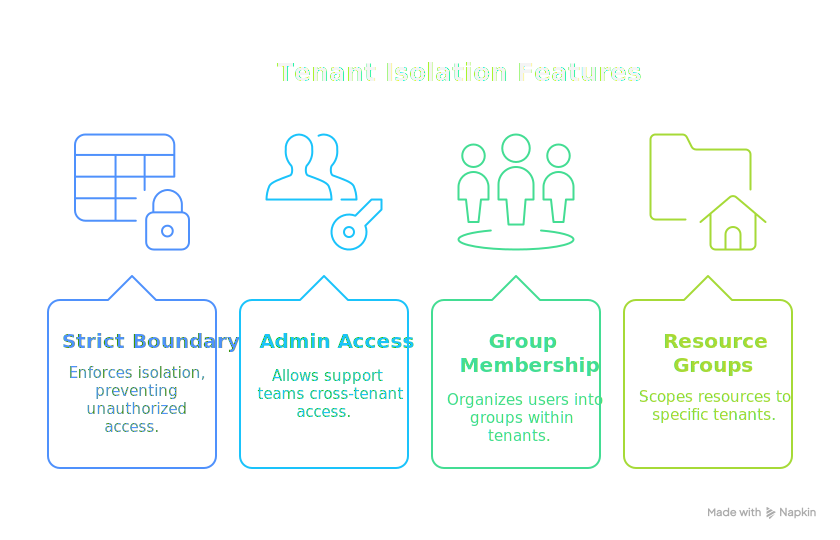
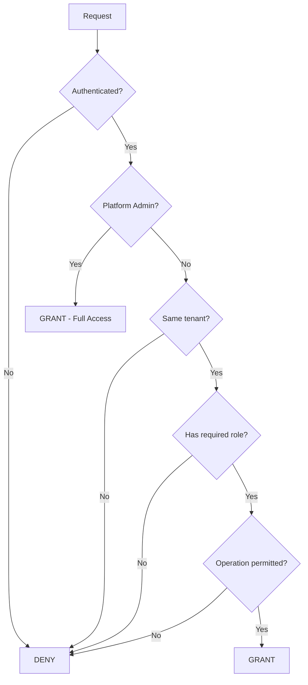

# Multi-Tenant SaaS

This example implements tenant isolation for a multi-tenant SaaS application. Users belong to organizations (tenants) and can only access resources within their own tenant, with special provisions for platform administrators who need cross-tenant access.

<div class="centered-image">

</div>

<SectionHeader icon="version" level={2}>Overview</SectionHeader>

Multi-tenant applications must enforce strict boundaries between organizations:

| Requirement                 | Implementation                                            |
|-----------------------------|-----------------------------------------------------------|
| **Tenant isolation**        | Resources tagged with tenant ID, enforced at policy level |
| **Role hierarchy**          | Owner > Admin > Member > Viewer per tenant                |
| **Cross-tenant access**     | Platform admins for support/operations                    |
| **Tenant-scoped resources** | Each resource belongs to exactly one tenant               |

<SectionHeader icon="settings" level={2}>Design</SectionHeader>

### Tenant Model

Each tenant (organization) has:

- <IconText icon="badge">A unique tenant ID encoded in resource MRNs</IconText>
- <IconText icon="group">Users with roles scoped to that tenant</IconText>
- <IconText icon="folder">Resources that belong to that tenant</IconText>

```
Resource MRN: mrn:saas:<tenant-id>:<resource-type>:<resource-id>
Example:      mrn:saas:acme-corp:project:website-redesign
```

### Access Decision Flow



<SectionHeader icon="security" level={2}>Complete PolicyDomain <a href="multi-tenant-saas/policydomain.yml" download title="Download policydomain.yml"><IconText icon="download" /></a></SectionHeader>

```yaml
apiVersion: iamlite.manetu.io/v1alpha4
kind: PolicyDomain
metadata:
  name: multi-tenant-saas
spec:
  # ============================================================
  # Policy Libraries
  # ============================================================
  policy-libraries:
    - mrn: &lib-utils "mrn:iam:library:utils"
      name: utils
      description: "Common utility functions"
      rego: |
        package utils

        import rego.v1

        # Check if request has a valid principal (authenticated)
        has_principal if {
            input.principal != {}
            input.principal.sub != ""
        }

    - mrn: &lib-tenant-helpers "mrn:iam:library:tenant-helpers"
      name: tenant-helpers
      description: "Multi-tenant helper functions"
      rego: |
        package tenant_helpers

        import rego.v1

        # Extract tenant ID from a resource MRN
        # mrn:saas:acme-corp:project:website -> acme-corp
        extract_tenant(mrn) := tenant if {
            parts := split(mrn, ":")
            parts[0] == "mrn"
            parts[1] == "saas"
            tenant := parts[2]
        }

        # Check if principal belongs to the given tenant
        is_tenant_member(principal, tenant_id) if {
            principal.mannotations.tenant_id == tenant_id
        }

        # Check if principal is a platform admin (cross-tenant access)
        is_platform_admin(principal) if {
            "mrn:iam:role:platform-admin" in principal.mroles
        }

        # Role hierarchy levels for comparison
        role_level("viewer") := 1
        role_level("member") := 2
        role_level("admin") := 3
        role_level("owner") := 4

        # Check if principal has at least the required role level
        has_role_level(principal, required_role) if {
            some role in principal.mannotations.tenant_roles
            role_level(role) >= role_level(required_role)
        }

        # Map operations to required role levels
        required_role_for_operation(operation) := "viewer" if {
            some suffix in {":read", ":list"}
            endswith(operation, suffix)
        }

        required_role_for_operation(operation) := "member" if {
            some suffix in {":create", ":update"}
            endswith(operation, suffix)
        }

        required_role_for_operation(operation) := "admin" if {
            some suffix in {":delete", ":manage"}
            endswith(operation, suffix)
        }

        required_role_for_operation(operation) := "owner" if {
            some suffix in {":transfer", ":billing"}
            endswith(operation, suffix)
        }

  # ============================================================
  # Policies
  # ============================================================
  policies:
    # Operation phase - require authentication
    - mrn: &policy-require-auth "mrn:iam:policy:require-auth"
      name: require-auth
      description: "Require authentication for all operations"
      dependencies:
        - *lib-utils
      rego: |
        package authz

        import rego.v1
        import data.utils

        # Tri-level: negative=DENY, 0=GRANT, positive=GRANT Override
        # Default deny - only grant if authenticated
        default allow = -1

        # Grant authenticated requests
        allow = 0 if utils.has_principal

    # Identity phase - any authenticated user proceeds
    - mrn: &policy-authenticated "mrn:iam:policy:authenticated"
      name: authenticated
      description: "Allow any authenticated user"
      dependencies:
        - *lib-utils
      rego: |
        package authz

        import rego.v1
        import data.utils

        default allow = false

        # Allow authenticated users
        allow if utils.has_principal

    # Resource phase - tenant isolation
    - mrn: &policy-tenant-isolation "mrn:iam:policy:tenant-isolation"
      name: tenant-isolation
      description: "Enforce tenant boundaries"
      dependencies:
        - *lib-tenant-helpers
      rego: |
        package authz

        import rego.v1
        import data.tenant_helpers

        default allow = false

        # Platform admins can access any tenant
        allow if {
            tenant_helpers.is_platform_admin(input.principal)
        }

        # Regular users must be in the same tenant
        allow if {
            # Extract tenant from resource
            resource_tenant := tenant_helpers.extract_tenant(input.resource.id)

            # Check principal is in same tenant
            tenant_helpers.is_tenant_member(input.principal, resource_tenant)

            # Check principal has required role for this operation
            required_role := tenant_helpers.required_role_for_operation(input.operation)
            tenant_helpers.has_role_level(input.principal, required_role)
        }

    # Resource phase - shared resources (cross-tenant by design)
    - mrn: &policy-shared-resources "mrn:iam:policy:shared-resources"
      name: shared-resources
      description: "Access control for shared/public resources"
      rego: |
        package authz

        import rego.v1

        default allow = false

        # Allow read access to shared resources for any authenticated user
        allow if {
            input.resource.annotations.shared == true
            endswith(input.operation, ":read")
        }

        allow if {
            input.resource.annotations.shared == true
            endswith(input.operation, ":list")
        }

        # Only the owning tenant can modify shared resources
        allow if {
            input.resource.annotations.shared == true
            input.principal.mannotations.tenant_id == input.resource.annotations.owner_tenant
        }

    # Resource phase - billing resources (owner only)
    - mrn: &policy-billing "mrn:iam:policy:billing"
      name: billing
      description: "Billing access control"
      dependencies:
        - *lib-tenant-helpers
      rego: |
        package authz

        import rego.v1
        import data.tenant_helpers

        default allow = false

        # Only tenant owners can access billing
        allow if {
            resource_tenant := tenant_helpers.extract_tenant(input.resource.id)
            tenant_helpers.is_tenant_member(input.principal, resource_tenant)
            tenant_helpers.has_role_level(input.principal, "owner")
        }

        # Platform admins can view billing for support
        allow if {
            tenant_helpers.is_platform_admin(input.principal)
            endswith(input.operation, ":read")
        }

  # ============================================================
  # Roles
  # ============================================================
  roles:
    # Tenant roles (assigned per tenant)
    - mrn: &role-tenant-viewer "mrn:iam:role:tenant-viewer"
      name: tenant-viewer
      description: "Read-only access within tenant"
      policy: *policy-authenticated

    - mrn: &role-tenant-member "mrn:iam:role:tenant-member"
      name: tenant-member
      description: "Standard member access within tenant"
      policy: *policy-authenticated

    - mrn: &role-tenant-admin "mrn:iam:role:tenant-admin"
      name: tenant-admin
      description: "Administrative access within tenant"
      policy: *policy-authenticated

    - mrn: &role-tenant-owner "mrn:iam:role:tenant-owner"
      name: tenant-owner
      description: "Full owner access including billing"
      policy: *policy-authenticated

    # Platform roles (cross-tenant)
    - mrn: &role-platform-admin "mrn:iam:role:platform-admin"
      name: platform-admin
      description: "Platform administrator with cross-tenant access"
      policy: *policy-authenticated

    - mrn: &role-platform-support "mrn:iam:role:platform-support"
      name: platform-support
      description: "Platform support with limited cross-tenant read access"
      policy: *policy-authenticated

  # ============================================================
  # Groups - Example tenant groups
  # ============================================================
  groups:
    # Acme Corp tenant groups
    - mrn: "mrn:iam:group:acme-corp:owners"
      name: acme-corp-owners
      description: "Acme Corp tenant owners"
      roles:
        - *role-tenant-owner
      annotations:
        - name: "tenant_id"
          value: "\"acme-corp\""
        - name: "tenant_roles"
          value: '["owner", "admin", "member", "viewer"]'

    - mrn: "mrn:iam:group:acme-corp:admins"
      name: acme-corp-admins
      description: "Acme Corp tenant administrators"
      roles:
        - *role-tenant-admin
      annotations:
        - name: "tenant_id"
          value: "\"acme-corp\""
        - name: "tenant_roles"
          value: '["admin", "member", "viewer"]'

    - mrn: "mrn:iam:group:acme-corp:members"
      name: acme-corp-members
      description: "Acme Corp team members"
      roles:
        - *role-tenant-member
      annotations:
        - name: "tenant_id"
          value: "\"acme-corp\""
        - name: "tenant_roles"
          value: '["member", "viewer"]'

    - mrn: "mrn:iam:group:acme-corp:viewers"
      name: acme-corp-viewers
      description: "Acme Corp read-only users"
      roles:
        - *role-tenant-viewer
      annotations:
        - name: "tenant_id"
          value: "\"acme-corp\""
        - name: "tenant_roles"
          value: '["viewer"]'

    # Globex Corp tenant groups
    - mrn: "mrn:iam:group:globex-corp:members"
      name: globex-corp-members
      description: "Globex Corp team members"
      roles:
        - *role-tenant-member
      annotations:
        - name: "tenant_id"
          value: "\"globex-corp\""
        - name: "tenant_roles"
          value: '["member", "viewer"]'

    # Platform team
    - mrn: "mrn:iam:group:platform-team"
      name: platform-team
      description: "Platform administrators"
      roles:
        - *role-platform-admin

  # ============================================================
  # Resource Groups
  # ============================================================
  resource-groups:
    # Default tenant resources
    - mrn: &rg-tenant "mrn:iam:resource-group:tenant"
      name: tenant
      description: "Tenant-scoped resources"
      default: true
      policy: *policy-tenant-isolation

    # Shared resources
    - mrn: &rg-shared "mrn:iam:resource-group:shared"
      name: shared
      description: "Cross-tenant shared resources"
      policy: *policy-shared-resources

    # Billing resources
    - mrn: &rg-billing "mrn:iam:resource-group:billing"
      name: billing
      description: "Billing and subscription resources"
      policy: *policy-billing

  # ============================================================
  # Resources - Route by MRN pattern
  # ============================================================
  resources:
    - name: billing-resources
      description: "Route billing resources"
      selector:
        - "mrn:saas:.*:billing:.*"
        - "mrn:saas:.*:subscription:.*"
        - "mrn:saas:.*:invoice:.*"
      group: "mrn:iam:resource-group:billing"

    - name: shared-templates
      description: "Route shared templates"
      selector:
        - "mrn:saas:shared:.*"
      group: "mrn:iam:resource-group:shared"

  # ============================================================
  # Operations
  # ============================================================
  operations:
    - name: all-operations
      selector:
        - ".*"
      policy: *policy-require-auth
```

<SectionHeader icon="test" level={2}>Test Cases</SectionHeader>

### Test 1: Member Can Read Own Tenant Resources <a href="multi-tenant-saas/input-1-member-read.json" download title="Download input-1-member-read.json"><IconText icon="download" /></a>

An Acme Corp member can read resources in their tenant:

```json
{
  "principal": {
    "sub": "alice@acme.com",
    "mroles": ["mrn:iam:role:tenant-member"],
    "mgroups": ["mrn:iam:group:acme-corp:members"],
    "mannotations": {
      "tenant_id": "acme-corp",
      "tenant_roles": ["member", "viewer"]
    }
  },
  "operation": "project:read",
  "resource": {
    "id": "mrn:saas:acme-corp:project:website-redesign",
    "group": "mrn:iam:resource-group:tenant"
  }
}
```

**Expected**: <DecisionChip decision="grant" />

### Test 2: Member Can Create in Own Tenant <a href="multi-tenant-saas/input-2-member-create.json" download title="Download input-2-member-create.json"><IconText icon="download" /></a>

An Acme Corp member can create resources in their tenant:

```json
{
  "principal": {
    "sub": "alice@acme.com",
    "mroles": ["mrn:iam:role:tenant-member"],
    "mgroups": ["mrn:iam:group:acme-corp:members"],
    "mannotations": {
      "tenant_id": "acme-corp",
      "tenant_roles": ["member", "viewer"]
    }
  },
  "operation": "project:create",
  "resource": {
    "id": "mrn:saas:acme-corp:project:new-project",
    "group": "mrn:iam:resource-group:tenant"
  }
}
```

**Expected**: <DecisionChip decision="grant" /> (members can create)

### Test 3: Member Cannot Delete (Admin Required) <a href="multi-tenant-saas/input-3-member-delete-denied.json" download title="Download input-3-member-delete-denied.json"><IconText icon="download" /></a>

An Acme Corp member cannot delete resources:

```json
{
  "principal": {
    "sub": "alice@acme.com",
    "mroles": ["mrn:iam:role:tenant-member"],
    "mgroups": ["mrn:iam:group:acme-corp:members"],
    "mannotations": {
      "tenant_id": "acme-corp",
      "tenant_roles": ["member", "viewer"]
    }
  },
  "operation": "project:delete",
  "resource": {
    "id": "mrn:saas:acme-corp:project:old-project",
    "group": "mrn:iam:resource-group:tenant"
  }
}
```

**Expected**: <DecisionChip decision="deny" /> (delete requires admin role)

### Test 4: Admin Can Delete <a href="multi-tenant-saas/input-4-admin-delete.json" download title="Download input-4-admin-delete.json"><IconText icon="download" /></a>

An Acme Corp admin can delete resources:

```json
{
  "principal": {
    "sub": "bob@acme.com",
    "mroles": ["mrn:iam:role:tenant-admin"],
    "mgroups": ["mrn:iam:group:acme-corp:admins"],
    "mannotations": {
      "tenant_id": "acme-corp",
      "tenant_roles": ["admin", "member", "viewer"]
    }
  },
  "operation": "project:delete",
  "resource": {
    "id": "mrn:saas:acme-corp:project:old-project",
    "group": "mrn:iam:resource-group:tenant"
  }
}
```

**Expected**: <DecisionChip decision="grant" />

### Test 5: Cross-Tenant Access Denied <a href="multi-tenant-saas/input-5-cross-tenant-denied.json" download title="Download input-5-cross-tenant-denied.json"><IconText icon="download" /></a>

An Acme Corp member cannot access Globex Corp resources:

```json
{
  "principal": {
    "sub": "alice@acme.com",
    "mroles": ["mrn:iam:role:tenant-member"],
    "mgroups": ["mrn:iam:group:acme-corp:members"],
    "mannotations": {
      "tenant_id": "acme-corp",
      "tenant_roles": ["member", "viewer"]
    }
  },
  "operation": "project:read",
  "resource": {
    "id": "mrn:saas:globex-corp:project:secret-project",
    "group": "mrn:iam:resource-group:tenant"
  }
}
```

**Expected**: <DecisionChip decision="deny" /> (tenant boundary violation)

### Test 6: Platform Admin Cross-Tenant Access <a href="multi-tenant-saas/input-6-platform-admin.json" download title="Download input-6-platform-admin.json"><IconText icon="download" /></a>

A platform admin can access any tenant's resources:

```json
{
  "principal": {
    "sub": "ops@saas-platform.com",
    "mroles": ["mrn:iam:role:platform-admin"],
    "mgroups": ["mrn:iam:group:platform-team"],
    "mannotations": {}
  },
  "operation": "project:read",
  "resource": {
    "id": "mrn:saas:acme-corp:project:website-redesign",
    "group": "mrn:iam:resource-group:tenant"
  }
}
```

**Expected**: <DecisionChip decision="grant" /> (platform admin bypasses tenant boundaries)

### Test 7: Only Owner Can Access Billing <a href="multi-tenant-saas/input-7-member-billing-denied.json" download title="Download input-7-member-billing-denied.json"><IconText icon="download" /></a>

A member cannot access billing:

```json
{
  "principal": {
    "sub": "alice@acme.com",
    "mroles": ["mrn:iam:role:tenant-member"],
    "mgroups": ["mrn:iam:group:acme-corp:members"],
    "mannotations": {
      "tenant_id": "acme-corp",
      "tenant_roles": ["member", "viewer"]
    }
  },
  "operation": "billing:read",
  "resource": {
    "id": "mrn:saas:acme-corp:billing:subscription",
    "group": "mrn:iam:resource-group:billing"
  }
}
```

**Expected**: <DecisionChip decision="deny" /> (billing requires owner role)

### Test 8: Owner Can Access Billing <a href="multi-tenant-saas/input-8-owner-billing.json" download title="Download input-8-owner-billing.json"><IconText icon="download" /></a>

A tenant owner can access billing:

```json
{
  "principal": {
    "sub": "ceo@acme.com",
    "mroles": ["mrn:iam:role:tenant-owner"],
    "mgroups": ["mrn:iam:group:acme-corp:owners"],
    "mannotations": {
      "tenant_id": "acme-corp",
      "tenant_roles": ["owner", "admin", "member", "viewer"]
    }
  },
  "operation": "billing:read",
  "resource": {
    "id": "mrn:saas:acme-corp:billing:subscription",
    "group": "mrn:iam:resource-group:billing"
  }
}
```

**Expected**: <DecisionChip decision="grant" />

### Test 9: Shared Resources Cross-Tenant Read <a href="multi-tenant-saas/input-9-shared-resources.json" download title="Download input-9-shared-resources.json"><IconText icon="download" /></a>

Any authenticated user can read shared resources:

```json
{
  "principal": {
    "sub": "alice@acme.com",
    "mroles": ["mrn:iam:role:tenant-member"],
    "mgroups": ["mrn:iam:group:acme-corp:members"],
    "mannotations": {
      "tenant_id": "acme-corp",
      "tenant_roles": ["member", "viewer"]
    }
  },
  "operation": "template:read",
  "resource": {
    "id": "mrn:saas:shared:template:standard-contract",
    "group": "mrn:iam:resource-group:shared",
    "annotations": {
      "shared": true,
      "owner_tenant": "platform"
    }
  }
}
```

**Expected**: <DecisionChip decision="grant" /> (shared resources allow cross-tenant read)

<SectionHeader icon="version" level={2}>Key Concepts Demonstrated</SectionHeader>

### <IconText icon="badge">1. Tenant ID Embedded in MRNs</IconText>

Resource MRNs include the tenant ID, making tenant extraction straightforward:

```
mrn:saas:acme-corp:project:website
         ^^^^^^^^^ tenant ID
```

### <IconText icon="layers">2. Role Hierarchy with Numeric Levels</IconText>

Instead of listing specific roles for each operation, we use a numeric hierarchy:

```rego
role_level("viewer") := 1
role_level("member") := 2
role_level("admin") := 3
role_level("owner") := 4
```

This allows `has_role_level(principal, "member")` to return true for admins and owners too.

### <IconText icon="security">3. Tenant Isolation as Default</IconText>

The default resource group uses tenant isolation. Every resource is protected by tenant boundaries unless explicitly placed in a different group (like shared or billing).

### <IconText icon="lock">4. Cross-Tenant Access Pattern</IconText>

Platform admins have a dedicated check that bypasses tenant isolation:

```rego
allow if {
    tenant_helpers.is_platform_admin(input.principal)
}
```

### <IconText icon="inventory">5. Annotations for Tenant Context</IconText>

Rather than encoding roles in MRNs, we use principal annotations:

```yaml
annotations:
  - name: "tenant_id"
    value: "\"acme-corp\""
  - name: "tenant_roles"
    value: '["member", "viewer"]'
```

<SectionHeader icon="build" level={2}>Extending This Example</SectionHeader>

### Adding Tenant Quotas

Add quota checking using resource annotations:

```rego
allow if {
    count_projects := input.context.tenant_project_count
    quota := input.principal.mannotations.project_quota
    count_projects < quota
}
```

### Adding Tenant-Scoped API Keys

Create a scope for API keys that limits operations:

```yaml
scopes:
  - mrn: "mrn:iam:scope:api-key"
    name: api-key
    policy: "mrn:iam:policy:api-key-restrictions"
```

### Adding Audit Logging

Enhance the policy to include audit-relevant metadata:

```rego
# Add to allow rule
audit_context := {
    "tenant_id": resource_tenant,
    "cross_tenant": tenant_helpers.is_platform_admin(input.principal),
    "role_used": input.principal.mannotations.tenant_roles[0]
}
```
