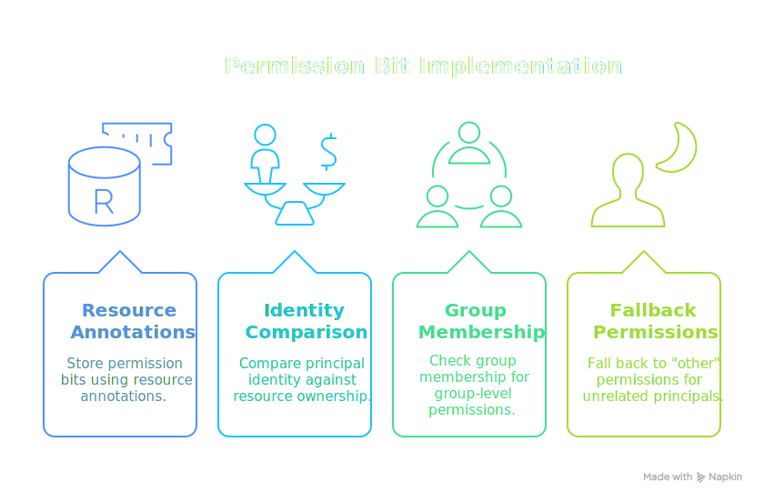
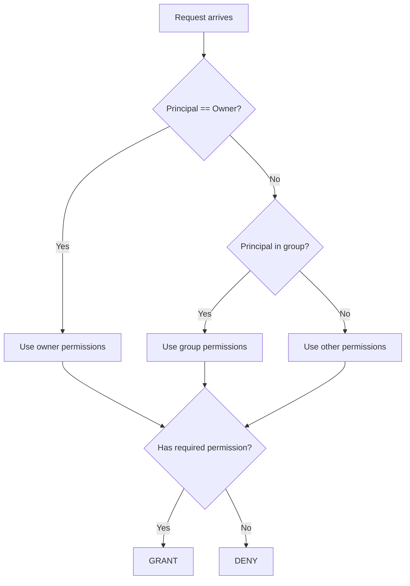

# Unix Filesystem Permissions

This example demonstrates how to implement classic Unix-style permission bits using MPE's annotation system. Just like Unix files have `rwxrwxrwx` permissions for owner, group, and other, this PolicyDomain models read/write access for three permission classes.

<div class="centered-image">

</div>

<SectionHeader icon="version" level={2}>Overview</SectionHeader>

In Unix filesystems, every file has:

- <IconText icon="badge">An **owner** (a specific user)</IconText>
- <IconText icon="group">A **group** (a named group of users)</IconText>
- <IconText icon="tune">**Permission bits** for owner, group, and other (everyone else)</IconText>

We'll model this using:

- <IconText icon="inventory">`resource.owner` — The principal who owns the resource</IconText>
- <IconText icon="group">`resource.annotations.group` — The MRN of the owning group</IconText>
- <IconText icon="settings">`resource.annotations.mode` — Permission bits encoded as an object</IconText>
- <IconText icon="badge">`principal.mgroups` — Groups the principal belongs to</IconText>

<SectionHeader icon="settings" level={2}>Design</SectionHeader>

### Permission Model

Each resource has a `mode` annotation containing permission bits:

```json
{
  "owner": { "read": true, "write": true },
  "group": { "read": true, "write": false },
  "other": { "read": true, "write": false }
}
```

This is equivalent to Unix mode `0644` (owner: rw, group: r, other: r).

### Access Decision Flow



<SectionHeader icon="security" level={2}>Complete PolicyDomain <a href="unix-filesystem/policydomain.yml" download title="Download policydomain.yml"><IconText icon="download" /></a></SectionHeader>

```yaml
apiVersion: iamlite.manetu.io/v1beta1
kind: PolicyDomain
metadata:
  name: unix-filesystem
spec:
  # ============================================================
  # Policy Libraries - Reusable helper functions
  # ============================================================
  policy-libraries:
    - mrn: &lib-utils "mrn:iam:library:utils"
      name: utils
      description: "Common utility functions"
      rego: |
        package utils

        import rego.v1

        # Check if request has a valid principal (authenticated)
        has_principal if {
            input.principal != {}
            input.principal.sub != ""
        }

    - mrn: &lib-unix-perms "mrn:iam:library:unix-perms"
      name: unix-perms
      description: "Unix permission checking utilities"
      rego: |
        package unix_perms

        import rego.v1

        # Determine which permission class applies to this principal
        # Returns: "owner", "group", or "other"
        permission_class(principal, resource) := "owner" if {
            principal.sub == resource.owner
        }

        permission_class(principal, resource) := "group" if {
            principal.sub != resource.owner
            resource.annotations.group in principal.mgroups
        }

        permission_class(principal, resource) := "other" if {
            principal.sub != resource.owner
            not resource.annotations.group in principal.mgroups
        }

        # Check if the permission class has the required permission
        has_permission(mode, class, permission) if {
            mode[class][permission] == true
        }

        # Map operations to required permissions
        required_permission(operation) := "read" if {
            some suffix in {":read", ":list", ":get"}
            endswith(operation, suffix)
        }

        required_permission(operation) := "write" if {
            some suffix in {":write", ":create", ":update", ":delete"}
            endswith(operation, suffix)
        }

  # ============================================================
  # Policies
  # ============================================================
  policies:
    # Operation phase - require authentication for all file operations
    - mrn: &policy-require-auth "mrn:iam:policy:require-auth"
      name: require-auth
      description: "Require authentication for file operations"
      dependencies:
        - *lib-utils
      rego: |
        package authz

        import rego.v1
        import data.utils

        # Tri-level: negative=DENY, 0=GRANT, positive=GRANT Override
        # Default deny - only grant if authenticated
        default allow = -1

        # Grant authenticated requests
        allow = 0 if utils.has_principal

    # Identity phase - any authenticated user can attempt file operations
    # The actual permission check happens in the resource phase
    - mrn: &policy-authenticated-user "mrn:iam:policy:authenticated-user"
      name: authenticated-user
      description: "Allow any authenticated user to proceed to resource phase"
      dependencies:
        - *lib-utils
      rego: |
        package authz

        import rego.v1
        import data.utils

        default allow = false

        # Grant if authenticated
        allow if utils.has_principal

    # Resource phase - Unix permission bit checking
    - mrn: &policy-unix-permissions "mrn:iam:policy:unix-permissions"
      name: unix-permissions
      description: "Check Unix-style permission bits"
      dependencies:
        - *lib-unix-perms
      rego: |
        package authz

        import rego.v1
        import data.unix_perms

        default allow = false

        # Main permission check
        allow if {
            # Get the permission mode from the resource
            mode := input.resource.annotations.mode

            # Determine which class this principal falls into
            class := unix_perms.permission_class(input.principal, input.resource)

            # Get the required permission for this operation
            required := unix_perms.required_permission(input.operation)

            # Check if the permission is granted
            unix_perms.has_permission(mode, class, required)
        }

        # Superuser bypass - if principal has superuser role, always allow
        allow if {
            "mrn:iam:role:superuser" in input.principal.mroles
        }

  # ============================================================
  # Roles
  # ============================================================
  roles:
    # Regular user - relies on file permissions
    - mrn: &role-user "mrn:iam:role:user"
      name: user
      description: "Regular filesystem user"
      policy: *policy-authenticated-user

    # Superuser - bypasses permission checks (like root)
    - mrn: &role-superuser "mrn:iam:role:superuser"
      name: superuser
      description: "Superuser with full access (like root)"
      policy: *policy-authenticated-user

  # ============================================================
  # Groups - User groups for file permissions
  # ============================================================
  groups:
    - mrn: "mrn:iam:group:developers"
      name: developers
      description: "Development team"
      roles:
        - *role-user

    - mrn: "mrn:iam:group:admins"
      name: admins
      description: "System administrators"
      roles:
        - *role-superuser

    - mrn: "mrn:iam:group:finance"
      name: finance
      description: "Finance department"
      roles:
        - *role-user

    - mrn: "mrn:iam:group:hr"
      name: hr
      description: "Human resources"
      roles:
        - *role-user

  # ============================================================
  # Resource Groups
  # ============================================================
  resource-groups:
    - mrn: &rg-files "mrn:iam:resource-group:files"
      name: files
      description: "All filesystem resources"
      default: true
      policy: *policy-unix-permissions

  # ============================================================
  # Operations
  # ============================================================
  operations:
    - name: file-operations
      selector:
        - "file:.*"
      policy: *policy-require-auth
```

<SectionHeader icon="test" level={2}>Test Cases</SectionHeader>

### Test 1: Owner Read Access <a href="unix-filesystem/input-1-owner-read.json" download title="Download input-1-owner-read.json"><IconText icon="download" /></a>

The owner can read their own file with owner read permission:

```json
{
  "principal": {
    "sub": "alice",
    "mroles": ["mrn:iam:role:user"],
    "mgroups": ["mrn:iam:group:developers"]
  },
  "operation": "file:document:read",
  "resource": {
    "id": "mrn:fs:home:alice:document.txt",
    "owner": "alice",
    "group": "mrn:iam:resource-group:files",
    "annotations": {
      "group": "mrn:iam:group:developers",
      "mode": {
        "owner": { "read": true, "write": true },
        "group": { "read": true, "write": false },
        "other": { "read": false, "write": false }
      }
    }
  }
}
```

**Expected**: <DecisionChip decision="grant" /> (alice is owner, owner has read permission)

```bash
mpe test decision -b policydomain.yml -i input.json | jq .decision
# "GRANT"
```

### Test 2: Owner Write Access <a href="unix-filesystem/input-2-owner-write.json" download title="Download input-2-owner-write.json"><IconText icon="download" /></a>

The owner can write to their own file:

```json
{
  "principal": {
    "sub": "alice",
    "mroles": ["mrn:iam:role:user"],
    "mgroups": ["mrn:iam:group:developers"]
  },
  "operation": "file:document:write",
  "resource": {
    "id": "mrn:fs:home:alice:document.txt",
    "owner": "alice",
    "group": "mrn:iam:resource-group:files",
    "annotations": {
      "group": "mrn:iam:group:developers",
      "mode": {
        "owner": { "read": true, "write": true },
        "group": { "read": true, "write": false },
        "other": { "read": false, "write": false }
      }
    }
  }
}
```

**Expected**: <DecisionChip decision="grant" /> (alice is owner, owner has write permission)

### Test 3: Group Read Access <a href="unix-filesystem/input-3-group-read.json" download title="Download input-3-group-read.json"><IconText icon="download" /></a>

A group member can read a file with group read permission:

```json
{
  "principal": {
    "sub": "bob",
    "mroles": ["mrn:iam:role:user"],
    "mgroups": ["mrn:iam:group:developers"]
  },
  "operation": "file:document:read",
  "resource": {
    "id": "mrn:fs:home:alice:shared.txt",
    "owner": "alice",
    "group": "mrn:iam:resource-group:files",
    "annotations": {
      "group": "mrn:iam:group:developers",
      "mode": {
        "owner": { "read": true, "write": true },
        "group": { "read": true, "write": false },
        "other": { "read": false, "write": false }
      }
    }
  }
}
```

**Expected**: <DecisionChip decision="grant" /> (bob is in developers group, group has read permission)

### Test 4: Group Write Denied <a href="unix-filesystem/input-4-group-write-denied.json" download title="Download input-4-group-write-denied.json"><IconText icon="download" /></a>

A group member cannot write to a file without group write permission:

```json
{
  "principal": {
    "sub": "bob",
    "mroles": ["mrn:iam:role:user"],
    "mgroups": ["mrn:iam:group:developers"]
  },
  "operation": "file:document:write",
  "resource": {
    "id": "mrn:fs:home:alice:shared.txt",
    "owner": "alice",
    "group": "mrn:iam:resource-group:files",
    "annotations": {
      "group": "mrn:iam:group:developers",
      "mode": {
        "owner": { "read": true, "write": true },
        "group": { "read": true, "write": false },
        "other": { "read": false, "write": false }
      }
    }
  }
}
```

**Expected**: <DecisionChip decision="deny" /> (bob is in group, but group lacks write permission)

### Test 5: Other User Denied <a href="unix-filesystem/input-5-other-denied.json" download title="Download input-5-other-denied.json"><IconText icon="download" /></a>

A user not in the file's group falls back to "other" permissions:

```json
{
  "principal": {
    "sub": "charlie",
    "mroles": ["mrn:iam:role:user"],
    "mgroups": ["mrn:iam:group:finance"]
  },
  "operation": "file:document:read",
  "resource": {
    "id": "mrn:fs:home:alice:private.txt",
    "owner": "alice",
    "group": "mrn:iam:resource-group:files",
    "annotations": {
      "group": "mrn:iam:group:developers",
      "mode": {
        "owner": { "read": true, "write": true },
        "group": { "read": true, "write": false },
        "other": { "read": false, "write": false }
      }
    }
  }
}
```

**Expected**: <DecisionChip decision="deny" /> (charlie is not owner or in developers group, other has no read)

### Test 6: World-Readable File <a href="unix-filesystem/input-6-world-readable.json" download title="Download input-6-world-readable.json"><IconText icon="download" /></a>

Any authenticated user can read a world-readable file:

```json
{
  "principal": {
    "sub": "charlie",
    "mroles": ["mrn:iam:role:user"],
    "mgroups": ["mrn:iam:group:finance"]
  },
  "operation": "file:document:read",
  "resource": {
    "id": "mrn:fs:public:readme.txt",
    "owner": "system",
    "group": "mrn:iam:resource-group:files",
    "annotations": {
      "group": "mrn:iam:group:admins",
      "mode": {
        "owner": { "read": true, "write": true },
        "group": { "read": true, "write": true },
        "other": { "read": true, "write": false }
      }
    }
  }
}
```

**Expected**: <DecisionChip decision="grant" /> (other has read permission)

### Test 7: Superuser Override <a href="unix-filesystem/input-7-superuser.json" download title="Download input-7-superuser.json"><IconText icon="download" /></a>

A superuser can access any file regardless of permissions:

```json
{
  "principal": {
    "sub": "root",
    "mroles": ["mrn:iam:role:superuser"],
    "mgroups": ["mrn:iam:group:admins"]
  },
  "operation": "file:document:write",
  "resource": {
    "id": "mrn:fs:home:alice:locked.txt",
    "owner": "alice",
    "group": "mrn:iam:resource-group:files",
    "annotations": {
      "group": "mrn:iam:group:developers",
      "mode": {
        "owner": { "read": true, "write": false },
        "group": { "read": false, "write": false },
        "other": { "read": false, "write": false }
      }
    }
  }
}
```

**Expected**: <DecisionChip decision="grant" /> (superuser bypasses all permission checks)

### Test 8: Unauthenticated Access Denied <a href="unix-filesystem/input-8-unauth.json" download title="Download input-8-unauth.json"><IconText icon="download" /></a>

An unauthenticated request is denied at the operation phase:

```json
{
  "principal": {},
  "operation": "file:document:read",
  "resource": {
    "id": "mrn:fs:public:readme.txt",
    "owner": "system",
    "group": "mrn:iam:resource-group:files",
    "annotations": {
      "group": "mrn:iam:group:admins",
      "mode": {
        "owner": { "read": true, "write": true },
        "group": { "read": true, "write": true },
        "other": { "read": true, "write": false }
      }
    }
  }
}
```

**Expected**: <DecisionChip decision="deny" /> (no authentication)

<SectionHeader icon="version" level={2}>Key Concepts Demonstrated</SectionHeader>

### <IconText icon="library">1. Policy Libraries for Reusable Logic</IconText>

The `unix-perms` library contains helper functions that can be imported by any policy. This keeps the main policy clean and makes the logic testable in isolation.

### <IconText icon="inventory">2. Annotation-Based Permission Storage</IconText>

Instead of hardcoding permissions in policies, we store them as resource annotations. This allows:

- Different files to have different permissions
- Permission changes without policy updates
- Standard Unix permission semantics

### <IconText icon="layers">3. Three-Level Permission Hierarchy</IconText>

The `permission_class` function implements the Unix model:
1. Check if principal is owner
2. Check if principal is in the file's group
3. Fall back to "other" permissions

### <IconText icon="badge">4. Role-Based Superuser Bypass</IconText>

The superuser role bypasses all permission checks, similar to Unix root. This is implemented cleanly in the resource policy with an additional `allow` rule.

### <IconText icon="transform">5. Operation-to-Permission Mapping</IconText>

The `required_permission` function maps operations like `:read`, `:write`, `:delete` to the corresponding permission bits. This makes it easy to add new operations that map to existing permissions.

<SectionHeader icon="build" level={2}>Extending This Example</SectionHeader>

### Adding Execute Permission

To support execute permission (for running scripts):

```rego
required_permission(operation) := "execute" if {
    some suffix in {":execute", ":run"}
    endswith(operation, suffix)
}
```

Update the mode annotations to include execute:

```json
{
  "mode": {
    "owner": { "read": true, "write": true, "execute": true },
    "group": { "read": true, "write": false, "execute": true },
    "other": { "read": true, "write": false, "execute": false }
  }
}
```

### Adding Sticky Bit / SetUID Semantics

For special bits, add additional annotations:

```json
{
  "sticky": true,
  "setuid": false,
  "setgid": true
}
```

Then check these in the policy before allowing certain operations.

### ACL Extension

For Access Control Lists beyond owner/group/other:

```json
{
  "acl": [
    { "principal": "bob", "read": true, "write": true },
    { "principal": "mrn:iam:group:auditors", "read": true, "write": false }
  ]
}
```

Add a check in the policy that evaluates ACL entries before falling back to standard permissions.
