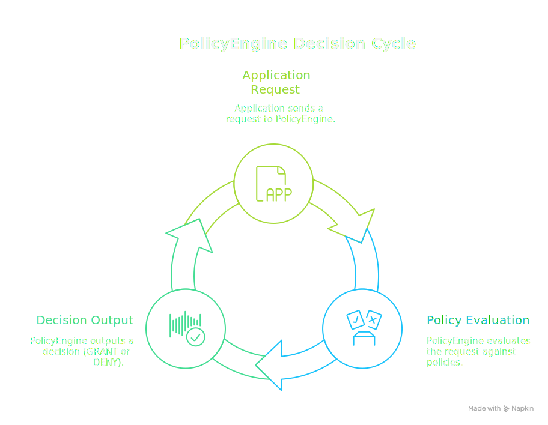
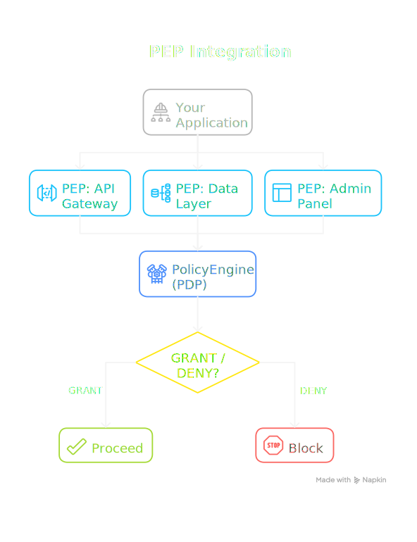
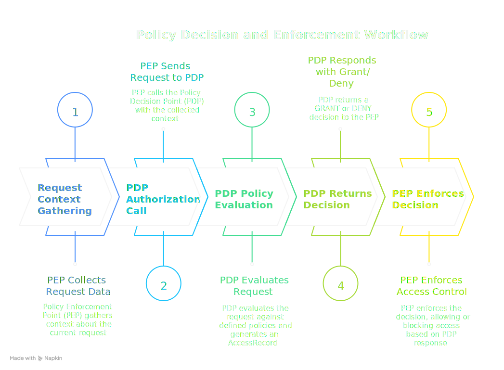
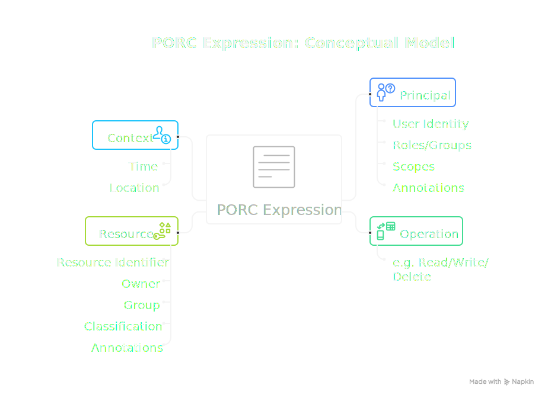
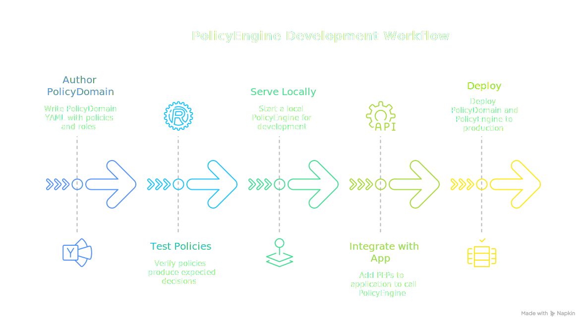
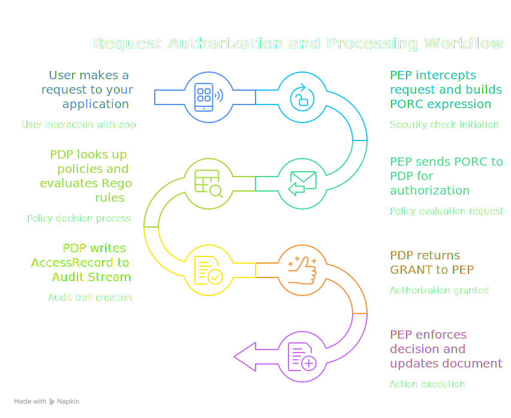
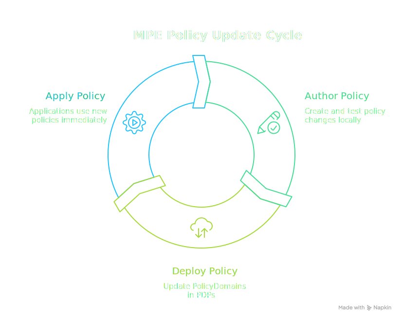
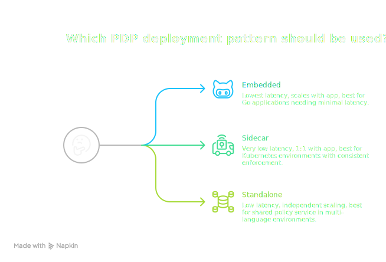
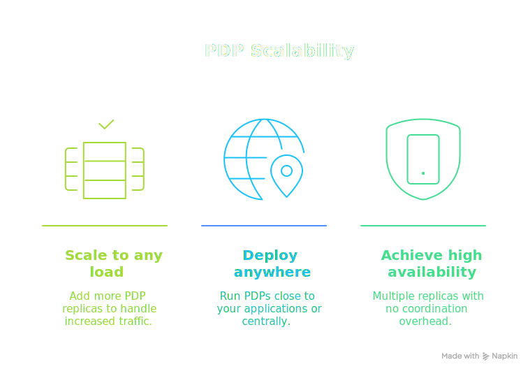

# How It Works

Before diving into installation and policy authoring, it helps to understand how the Manetu PolicyEngine fits into your application architecture. This page explains the core concepts you'll encounter throughout the documentation.

## The Big Picture

The Manetu PolicyEngine is an **authorization and governance service**—it answers the question "Is this action allowed?" Your application asks, the PolicyEngine answers. Every decision is policy-driven, observable, and auditable.

<div class="centered-image">

</div>

This separation is powerful: your application handles business logic while the PolicyEngine handles access control. Policies can be updated without changing application code.

## Key Concepts

### Policy Decision Point (PDP)

The **PDP** is the PolicyEngine itself. It:
- Receives authorization requests
- Evaluates them against policies
- Returns GRANT or DENY decisions
- Emits an [AccessRecord](/concepts/audit) for every decision

The PDP is stateless—it doesn't know your application's business logic. It only knows the policies you've defined and the information you send with each request.

Every decision generates a normalized **AccessRecord** that captures the complete evaluation context: the input PORC, the final decision, and details about each policy evaluated. This audit trail enables compliance reporting, anomaly detection, and forensic analysis. See [Audit & Access Records](/concepts/audit) for details.

### Policy Enforcement Point (PEP)

A **PEP** is code in your application that enforces access control. You create PEPs wherever you need to protect something. You might have one PEP or dozens—wherever your application needs to make an access control decision. 

<div class="centered-image">

</div>

Each PEP:

- **Gathers context** about the current request (who's asking, what they want, what resource is involved)
- **Calls the PDP** with that context
- **Enforces the decision** (proceeds if GRANT, blocks if DENY)

<div class="centered-image">

</div>

### PORC: The Authorization Request Format

When a PEP calls the PDP, it sends a **[PORC expression](/concepts/porc)**—a standardized format containing everything the PolicyEngine needs to make a decision:

<div class="centered-image">

</div>

The following is an example of what a PORC expression looks like:

```json
{
  "principal": {
    "sub": "alice@example.com",
    "mroles": ["mrn:iam:role:editor"]
  },
  "operation": "api:documents:update",
  "resource": "mrn:app:document:12345",
  "context": {
    "source_ip": "10.0.1.50"
  }
}
```

Your PEP constructs a PORC expression from whatever information is available (JWT tokens, request headers, database lookups) for every request that requires access control and sends it to the PDP.

### PolicyDomains: Where Policies Live

A **[PolicyDomain](/concepts/policy-domains)** is a bundle containing everything the PolicyEngine needs to make decisions:

- **[Policies](/concepts/policies)**: The actual rules written in Rego (OPA's policy language)
- **[Roles](/concepts/roles)**: Named collections of permissions for users
- **[Groups](/concepts/groups)**: Collections of roles for organizational structure
- **[Resource Groups](/concepts/resource-groups)**: Policy assignments for resource-based access
- **[Scopes](/concepts/scopes)**: Permission boundaries (like OAuth scopes)
- **[Operations](/concepts/operations)**: Routes requests to appropriate policies

You author PolicyDomains as YAML files (with embedded or external Rego code) and load them into the PolicyEngine. The PolicyDomain is an injected configuration that defines what policies exist, how roles map to policies, and how requests are routed.

## The Development Workflow

Here's how you'll typically work with the PolicyEngine:

<div class="centered-image">

</div>

1. **Author**: Write your PolicyDomain YAML with policies, roles, and other components
2. **Test**: Use `mpe test` to verify policies produce expected decisions
3. **Serve**: Run `mpe serve` to start a local PolicyEngine for development
4. **Integrate**: Add PEPs to your application that call the PolicyEngine
5. **Deploy**: Deploy your PolicyDomain and PolicyEngine to production

The [`mpe`](/reference/cli) CLI tool supports each step of this workflow.

## Putting It Together

Here's the complete picture of how a request flows through the system:

<div class="centered-image">

</div>

1. A user makes a request to your application
2. Your application's PEP intercepts it and builds a PORC expression
3. The PEP sends the PORC to the PolicyEngine (PDP)
4. The PDP uses its loaded PolicyDomain to look up the relevant policies and evaluate them
5. The PDP writes an AccessRecord capturing the decision and all evaluated policies
6. The PDP returns GRANT or DENY to the PEP
7. The PEP enforces the decision

:::info
The ordering of steps 5 and 6 is intentional: the audit trail is committed **before** the decision is returned. This ensures that a complete record exists before any action is taken on the outcome.
:::

## Why This Architecture Matters

The PEP/PDP separation provides several important benefits for modern applications:

### Decoupled Policy Updates

Because policies live outside your application code, you can update access control rules without recompiling or redeploying your applications:

<div class="centered-image">

</div>

:::tip Premium Feature: Dynamic Updates
In the Community Edition, the PDP loads policies at startup. The **Premium Edition** adds dynamic policy rollout with a sophisticated cache-coherency algorithm—policies are updated across all PDPs in real-time without any restarts, keeping policy management centralized while decisions scale out to the edge of your network.
:::

### Flexible Deployment Patterns

The PDP can be deployed in multiple configurations depending on your needs:

<div class="centered-image">

</div>

See [Deployment Architecture](/deployment/architecture) for more details.

### Horizontal Scalability

PDPs are stateless—they maintain no per-request state and make decisions based solely on the PORC input.

<div class="centered-image">

</div>

### Language-Agnostic Authorization

The [HTTP API](/integration/http-api) enables consistent authorization across all your services, regardless of implementation language:

All services share the same PolicyDomain, ensuring consistent access control rules across your entire architecture. When policies change, every service immediately enforces the updated rules.

## What You'll Learn Next

Now that you understand how the pieces fit together:

- **[Getting Started](/getting-started)** — Install the `mpe` CLI tool
- **[Quick Start](/quick-start)** — Create your first PolicyDomain and test it
- **[Integration](/integration)** — Build PEPs in your application

The rest of the documentation dives deeper into each component. The [Concepts](/concepts) section covers each PolicyDomain component in detail, and the [Reference](/reference/cli) provides complete CLI and schema documentation.
