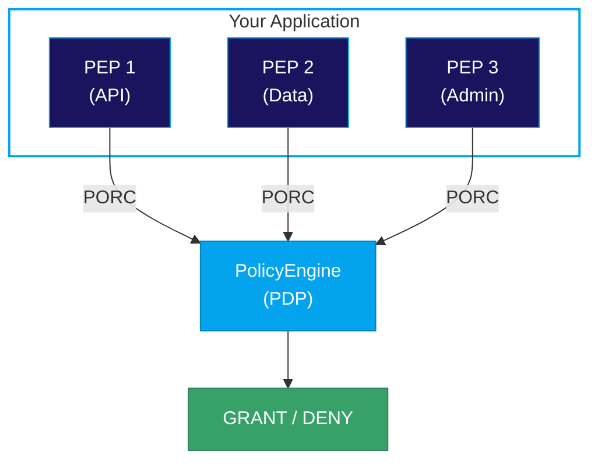

# Integration Overview

This section explains how to integrate the Manetu PolicyEngine into your application using the Policy Decision Point (PDP) and Policy Enforcement Point (PEP) architecture.

## Architecture

The Manetu PolicyEngine serves as a **Policy Decision Point (PDP)**—it evaluates policies and returns access control decisions. To integrate the PolicyEngine, you create one or more **Policy Enforcement Points (PEPs)** in your application that call the PDP.



## Key Components

<SectionHeader icon="pdp" level={3}>Policy Decision Point (PDP)</SectionHeader>

The **PDP** is the Manetu PolicyEngine itself. It:

- Receives authorization requests in PORC format
- Evaluates them against policies written in Rego
- Returns GRANT or DENY decisions
- Is stateless and can be scaled horizontally

The PDP knows nothing about your application's business logic—it only evaluates policies against the inputs it receives.

<SectionHeader icon="pep" level={3}>Policy Enforcement Point (PEP)</SectionHeader>

A **PEP** is code within your application that enforces access control. Each PEP is responsible for:

1. **Formulating a PORC expression** - Constructing the Principal, Operation, Resource, and Context from the current request
2. **Invoking the PDP** - Calling the PolicyEngine's authorization endpoint
3. **Handling the decision** - Deciding what to do when the PDP returns GRANT or DENY

## Integration Steps

### 1. Choose Your Integration Method

The PolicyEngine provides two integration options:

| Method                                          | Best For |
|-------------------------------------------------|----------|
| <IconText icon="code">[Embedded Go Library](/integration/go-library)</IconText> <FeatureChip variant="oss" label="OSS Only"/> | Go applications needing lowest latency |
| <IconText icon="api">[HTTP API](/integration/http-api)</IconText> | Non-Go applications or microservices architecture |

#### Considerations for Future Growth

When choosing an integration method, consider your long-term needs:

| Consideration | Embedded Go Library <FeatureChip variant="oss" label="OSS Only"/> | HTTP API |
|--------------|----------------------|----------|
| Latency | Lowest (in-process)  | Low (network call) |
| Language support | Go only              | Any language |
| Deployment | Single artifact      | Separate service |
| Premium Edition | Not available        | Required for Premium |

**Premium Edition Compatibility**: The [Premium Edition](/#open-source-and-premium-editions) requires integration via the gRPC/HTTP interface to enable enterprise features such as centralized audit and policy coordination. If you use the HTTP API, you can migrate to Premium by simply changing the endpoint URL. The embedded Go library is only available in the open source edition — it cannot connect to Premium services.

### 2. Build Your PORC Expressions

Learn how to construct proper authorization requests:

- [PORC Expressions](/concepts/porc) - Understanding the PORC structure (in Concepts)
- [Resource Resolution](/integration/resource-resolution) - Using MRN strings vs fully-qualified descriptors

### 3. Implement Your PEPs

Create enforcement points in your application that:

- Extract identity from authentication tokens
- Build PORC expressions from request context
- Call the PDP and handle decisions

See [Best Practices](/integration/best-practices) for implementation guidance.

## Quick Example

Here's a minimal PEP implementation:

```go
// 1. Build PORC expression
porc := map[string]interface{}{
    "principal": map[string]interface{}{
        "sub":    claims.Subject,
        "mroles": claims.Roles,
    },
    "operation": "api:documents:read",
    "resource":  "mrn:app:myservice:document:12345",
    "context":   map[string]interface{}{},
}

// 2. Call PDP
allowed, err := pdp.Authorize(ctx, porc)

// 3. Handle decision
if !allowed {
    return ForbiddenError
}
// Proceed with operation...
```

## Section Contents

- [Embedded Go Library](/integration/go-library) - Using the PolicyEngine as an embedded library
- [HTTP API](/integration/http-api) - Calling the PolicyEngine server via HTTP
- [Resource Resolution](/integration/resource-resolution) - MRN strings and resource metadata
- [Best Practices](/integration/best-practices) - Implementation guidelines

For understanding the PORC format itself, see [PORC Expressions](/concepts/porc) in the Concepts section.
