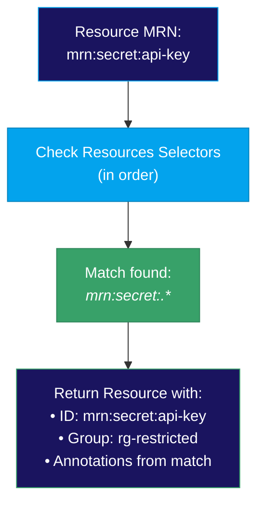
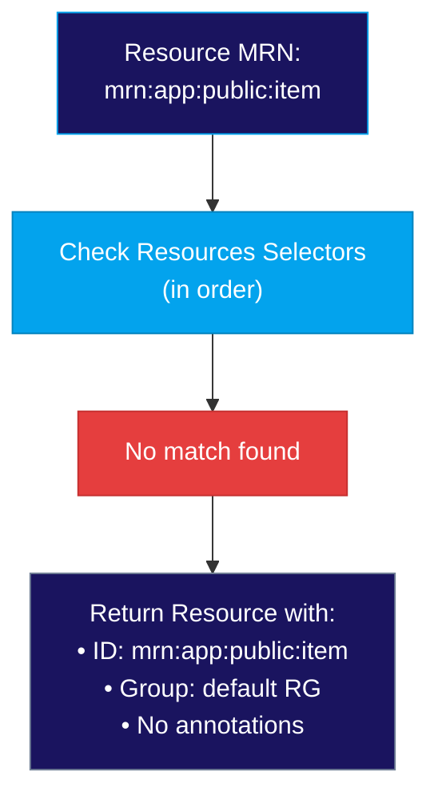

# Resources Schema

The `resources` section defines selector-based mappings from resource MRNs to resource groups. This feature was introduced in v1alpha4.

## Overview

Resources allow you to define patterns that match resource MRNs and route them to specific resource groups. This provides a more dynamic way to assign resources to groups compared to embedding the group reference directly in the PORC.

When a resource MRN is resolved:
1. The system first checks if any `resources` selector matches the MRN
2. If a match is found, the resource is assigned to the corresponding group
3. If no match is found, the resource falls back to the default resource group

## Schema

```yaml
resources:
  - name: string           # Required: Identifier for this resource mapping
    description: string    # Optional: Human-readable description
    selector:              # Required: Array of regex patterns
      - "pattern1"
      - "pattern2"
    group: string          # Required: Reference to a resource-group MRN
    annotations:           # Optional: Key-value metadata
      - name: string
        value: string      # JSON-encoded value
```

## Fields

| Field | Type | Required | Description |
|-------|------|----------|-------------|
| `name` | string | Yes | Unique identifier for this resource mapping |
| `description` | string | No | Human-readable description |
| `selector` | string[] | Yes | Array of regex patterns to match resource MRNs |
| `group` | string | Yes | MRN of the resource group to assign |
| `annotations` | Annotation[] | No | Additional metadata for matched resources |

## Selector Patterns

Selectors use regular expressions to match resource MRNs:

- Patterns are automatically anchored (^ and $ added if not present)
- Multiple selectors are OR'ed together
- First matching resource definition wins
- Use `.*` as a catch-all pattern

### Examples

```yaml
selector:
  - "mrn:data:sensitive:.*"      # Matches mrn:data:sensitive:doc123
  - "mrn:secret:.*"               # Matches mrn:secret:api-key
  - "mrn:vault:.*:credential:.*"  # Matches mrn:vault:prod:credential:db
```

## Annotations

Annotations are key-value pairs with JSON-encoded values:

```yaml
annotations:
  - name: classification
    value: "\"HIGH\""        # String value
  - name: audit_required
    value: "true"            # Boolean value
  - name: retention_days
    value: "365"             # Number value
  - name: tags
    value: "[\"pii\", \"financial\"]"  # Array value
```

## Complete Example

```yaml
apiVersion: iamlite.manetu.io/v1alpha4
kind: PolicyDomain
metadata:
  name: resource-routing-example
spec:
  policies:
    - mrn: &operation-default "mrn:iam:policy:operation-default"
      name: operation-default
      rego: |
        package authz
        default allow = 0  # operation policies use tri-state integers

    - mrn: &allow-all "mrn:iam:policy:allow-all"
      name: allow-all
      rego: |
        package authz
        default allow = true

    - mrn: &read-only "mrn:iam:policy:read-only"
      name: read-only
      rego: |
        package authz
        default allow = false
        allow { input.operation == "read" }

    - mrn: &no-access "mrn:iam:policy:no-access"
      name: no-access
      rego: |
        package authz
        default allow = false

  resource-groups:
    - mrn: &rg-public "mrn:iam:resource-group:public"
      name: public
      default: true           # Fallback for unmatched resources
      policy: *allow-all

    - mrn: &rg-internal "mrn:iam:resource-group:internal"
      name: internal
      policy: *read-only

    - mrn: &rg-restricted "mrn:iam:resource-group:restricted"
      name: restricted
      policy: *no-access

  resources:
    # Internal company documents
    - name: internal-docs
      description: "Internal documentation accessible read-only"
      selector:
        - "mrn:docs:internal:.*"
        - "mrn:wiki:company:.*"
      group: *rg-internal

    # Sensitive secrets and credentials
    - name: secrets
      description: "Secrets and credentials with no external access"
      selector:
        - "mrn:secret:.*"
        - "mrn:vault:.*:credential:.*"
        - "mrn:config:.*:apikey:.*"
      group: *rg-restricted
      annotations:
        - name: classification
          value: "\"MAXIMUM\""
        - name: audit_required
          value: "true"

    # PII data
    - name: pii-data
      description: "Personally identifiable information"
      selector:
        - "mrn:data:pii:.*"
        - "mrn:customer:.*:profile:.*"
      group: *rg-restricted
      annotations:
        - name: classification
          value: "\"HIGH\""
        - name: data_type
          value: "\"pii\""

  operations:
    - name: all
      selector:
        - ".*"
      policy: *operation-default
```

## Resolution Flow

### When a Match is Found



### When No Match is Found



## Best Practices

1. **Order matters**: Resources are evaluated in order; place more specific patterns first
2. **Always have a default**: Ensure one resource-group has `default: true` as a fallback
3. **Use meaningful names**: Resource names should describe what they match
4. **Document patterns**: Use descriptions to explain what each resource mapping covers
5. **Test selectors**: Verify regex patterns match expected MRNs before deployment

## Comparison with Resource Groups

| Aspect | Resource Groups | Resources |
|--------|-----------------|-----------|
| Assignment | Explicit in PORC | Pattern-based |
| Flexibility | Static | Dynamic |
| Schema Version | v1alpha3+ | v1alpha4+ |
| Use Case | Known resources | Pattern matching |

Use **resource-groups** when:
- Resources are explicitly tagged with their group
- The mapper knows the exact group at mapping time

Use **resources** when:
- Resources follow naming patterns
- You want centralized routing rules
- Resource groups should be assigned based on MRN structure
